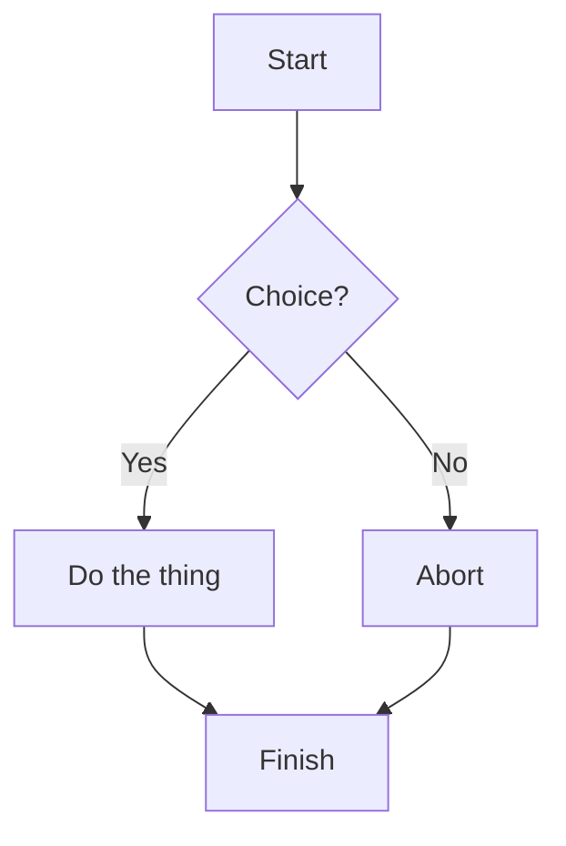
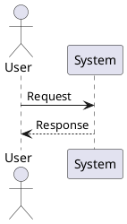

# 📘 MkDocs Framework — Cerulean Theme + Local Diagrams + Auto Nav + PDF Export

This repository provides a **ready-to-use MkDocs documentation framework** with the following key features:

- 🧭 **Auto-generated navigation** from folder structure using `mkdocs-gen-nav` (no `nav:` section needed).
- 🖼️ **Local-only diagram generation** for:
  - **PlantUML** (via `plantuml-markdown` (Markdown extension) + `tools/plantuml.jar` + Graphviz).
  - **Mermaid** (pre-rendered at build time via `mkdocs-mermaid2-plugin` + `@mermaid-js/mermaid-cli`).
- ✨ **Bootswatch – Cerulean** theme for a clean, classic UI.
- 📝 **PDF export** (per-page PDFs).
- 🪶 Additional useful plugins:
  - `mkdocs-minify-plugin` — reduces HTML size.
  - `mkdocs-git-revision-date-localized-plugin` — shows “last updated” date.
  - `mkdocs-glightbox` — modern lightbox for images.
- 🛠️ **GitHub Actions workflow** that installs dependencies, generates diagrams locally, builds the site, exports PDFs, and deploys to GitHub Pages.

> ⚠️ **No Kroki or external PlantUML servers are used.** All diagrams are rendered during the build, locally or in CI.

---

## 🚀 Quick Start (Local)

### 1. Install prerequisites

**Required**: Python (3.10+), Node.js (18+), Java (JDK 17+), Graphviz.

- **Ubuntu/Debian**
  ```bash
  sudo apt-get update
  sudo apt-get install -y python3 python3-venv python3-pip nodejs npm openjdk-17-jre graphviz
  ```

- **macOS (Homebrew)**
  ```bash
  brew install python@3.11 node openjdk graphviz
  ```

- **Windows (PowerShell + Chocolatey)**
  ```powershell
  choco install -y python nodejs.install openjdk graphviz
  ```

---

### 2. Create and activate a virtual environment
```bash
python -m venv .venv
source .venv/bin/activate        # Windows: .venv\Scripts\activate
```

---

### 3. Install dependencies

Install Python packages:
```bash
pip install -r requirements.txt
```

Install Mermaid CLI (Node):
```bash
npm install -g @mermaid-js/mermaid-cli
```

Download PlantUML jar:
```bash
bash scripts/get_plantuml.sh
```

---

### 4. Run locally
```bash
mkdocs serve
```
Visit [http://localhost:8000](http://localhost:8000).

---

### 5. Build the site + generate PDFs
```bash
mkdocs build
```
The output will be in `site/` with page PDFs under `site/pdf/`.

---

## 🧭 Navigation (mkdocs-gen-nav)

The **`mkdocs-gen-nav`** plugin auto-generates the sidebar navigation based on your `docs/` folder structure.

- No `nav:` section is required in `mkdocs.yml`.
- You **must** keep a `docs/index.md` file for the homepage.
- Control ordering using filename prefixes (e.g. `01-intro.md`, `02-architecture.md`).
- Nested folders become nested sections automatically.

Example structure:
```
docs/
├── index.md
└── diagrams/
    ├── mermaid.md
    └── plantuml.md
```
Produces:
```
Home
└── Diagrams
    ├── Mermaid
    └── PlantUML
```

---

## 🖼️ Local Diagram Rendering

### Mermaid
- Uses `mkdocs-mermaid2-plugin`.
- Rendered to SVG during `mkdocs build` via `@mermaid-js/mermaid-cli` (mmdc).
- No runtime dependency on a CDN or external services.

Example:
```markdown

```

### PlantUML
- Uses `plantuml-markdown` (Markdown extension) with `tools/plantuml.jar`.
- Renders SVG using local Java + Graphviz.
- Fully offline.

Example:
```markdown

```

---

## 📝 PDF Export

Each page is exported as a PDF using `mkdocs-pdf-export-plugin`.
- Output folder: `site/pdf/`
- PDF file name mirrors page slug.
- To combine PDFs into one file, set `combined: true` in `mkdocs.yml` (optional).

---

## 🧰 Plugins Overview

| Plugin                                 | Purpose                                                | Notes                                                  |
|----------------------------------------|---------------------------------------------------------|---------------------------------------------------------|
| `mkdocs-gen-nav`                       | Auto nav from folder structure                         | Removes need for `nav:` in config                       |
| `mkdocs-mermaid2-plugin`              | Pre-renders Mermaid diagrams                           | Requires Mermaid CLI                                   |
| `plantuml-markdown` (Markdown extension)             | Local PlantUML rendering                               | Uses tools/plantuml.jar                                |
| `mkdocs-pdf-export-plugin`          | Page PDFs                                              | Optional combined export                               |
| `mkdocs-minify-plugin`               | Smaller HTML                                          | Reduces page weight                                    |
| `mkdocs-git-revision-date-localized-plugin` | Shows last updated                                | Timeago format                                         |
| `mkdocs-glightbox`                   | Lightbox for images                                   | Good UX for diagrams, screenshots                       |

---

## 🏗️ CI/CD with GitHub Actions

A ready-to-use workflow is included in `.github/workflows/build.yml`. It:
1. Checks out the repo
2. Installs Python, Node, Java, and Graphviz
3. Installs Python and Node dependencies
4. Downloads PlantUML jar
5. Builds MkDocs site and generates PDFs
6. Uploads PDFs as an artefact
7. Deploys to GitHub Pages (gh-pages branch)

It also uses **caching** to speed up builds:
- pip cache
- npm cache
- PlantUML diagram cache (`.plantuml-cache`)

To enable deployment:
1. Go to **Settings → Pages**.
2. Set “Deploy from branch” to `gh-pages` and folder `/`.
3. Merge or push to `main` or `master`.

---

## 🗂️ Repo Structure

```
.
├── .github/workflows/build.yml     # CI/CD workflow
├── docs/                           # Documentation content
│   ├── index.md
│   └── diagrams/
│       ├── mermaid.md
│       └── plantuml.md
├── mkdocs.yml                       # MkDocs configuration
├── requirements.txt                # Python dependencies
├── scripts/get_plantuml.sh         # Helper to fetch PlantUML jar
├── tools/                          # PlantUML jar stored here
└── README.md
```

---

## 🧭 Version Pinning (optional but recommended)

For deterministic builds, you can pin versions of:
- `plantuml.jar` (download a specific version instead of `latest`)
- `@mermaid-js/mermaid-cli`
- Graphviz via package manager
- MkDocs plugins in `requirements.txt`

Also consider committing `tools/plantuml.jar` if allowed, to avoid fetching in CI.

---

## 🧼 Maintenance Tips

- Keep `.plantuml-cache` — it speeds up diagram rendering on repeated builds.
- Run `mkdocs build --clean` occasionally to clear stale files.
- Use `pre-commit` hooks (optional) to enforce linting and check diagram syntax.

---

## 🏁 Next Steps

- Start adding content under `docs/`.
- Use diagrams freely — everything renders locally.
- Optionally add a `CNAME` file if hosting on a custom domain.
- Review MkDocs plugins for further enhancements (e.g. tags, search boosting, blog support).

---

## 🧪 Tested With

- Python 3.11
- Node 20
- Graphviz 2.43+
- Java 17
- MkDocs 1.6

---

**Author:** *Generated base structure with GPT automation*  
**License:** MIT (edit as needed)


### Environment variables (used by plantuml-markdown)
- `PLANTUML_JAR` — path to your PlantUML jar (this repo uses `tools/plantuml.jar`).
- `PLANTUML_OUTPUT_FORMAT` — set to `svg` (optional; we configure `format: svg` in `mkdocs.yml`).

