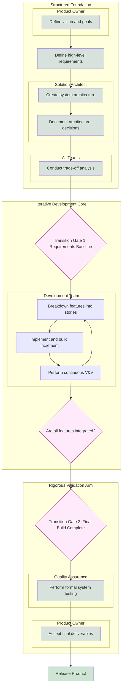

# Cornerstone framework flow

```mermaid
graph TD
    subgraph "Structured Foundation"
        subgraph "Product Owner"
            A[Define vision and goals];
        end
        subgraph "Solution Architect"
            B[Create system architecture];
            C[Document architectural decisions];
        end
        subgraph "All Teams"
            D[Conduct trade-off analysis];
        end
        A --> E[Define high-level requirements];
        E --> B;
        B --> C;
        C --> D;
    end
    
    D --> F{Transition Gate 1: Requirements Baseline};
    
    subgraph "Iterative Development Core"
        direction LR
        subgraph "Development Team"
            G[Breakdown features into stories];
            H[Implement and build increment];
            I[Perform continuous V&V];
        end
        F --> G;
        G --> H;
        H --> I;
        I --> G;
        I -.-> J{Are all features integrated?};
    end
    
    J --> K{Transition Gate 2: Final Build Complete};
    
    subgraph "Rigorous Validation Arm"
        subgraph "Quality Assurance"
            L[Perform formal system testing];
        end
        subgraph "Product Owner"
            M[Accept final deliverables];
        end
        K --> L;
        L --> M;
    end
    
    M --> N[Release Product];
    
    style A fill:#D8E2DC
    style B fill:#D8E2DC
    style C fill:#D8E2DC
    style D fill:#D8E2DC
    style E fill:#D8E2DC
    style F fill:#FEEAFA,stroke:#9F348E
    style G fill:#E8E8FF
    style H fill:#E8E8FF
    style I fill:#E8E8FF
    style J fill:#FEEAFA,stroke:#9F348E
    style K fill:#FEEAFA,stroke:#9F348E
    style L fill:#D8E2DC
    style M fill:#D8E2DC
    style N fill:#CEE5D3
```
