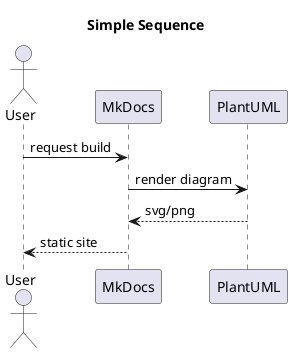

# PlantUML examples

```plantuml
@startuml
title Simple Sequence
actor User
participant "MkDocs" as M
participant "PlantUML" as P
User -> M: request build
M -> P: render diagram
P --> M: svg/png
M --> User: static site
@enduml
```
