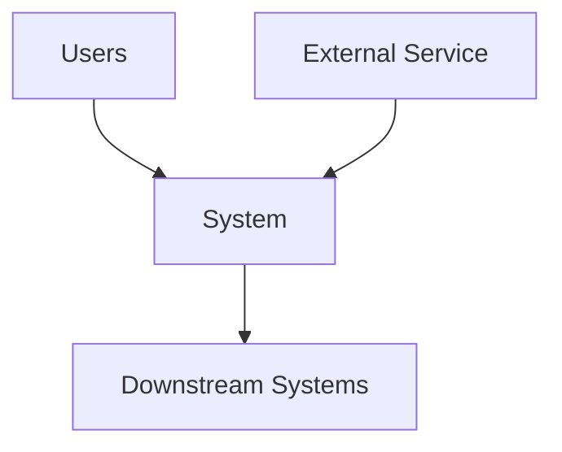

---

title: Architecture & Design Documentation
status: draft
version: 0.1
owner: Engineering
last_updated: 2026-01-05
------------------------

# Architecture & Design Documentation

This guide defines how we document architecture and design decisions so systems remain understandable, evolvable, and safe to change over time.

Architecture documentation is not about creating perfect diagrams or heavyweight documents. It is about making structure, intent, constraints, and trade-offs explicit at the right level of detail.

## Purpose

Architecture and design documentation exists to:

* Explain how the system is structured
* Make design intent and constraints explicit
* Support reasoning about change and impact
* Enable informed technical decision-making
* Preserve context beyond individual contributors

If a design decision cannot be explained clearly, it is probably not ready.

## Scope

This guide covers:

* System and software architecture documentation
* Significant design decisions and trade-offs
* Evolution of architecture over time

It does not replace detailed implementation documentation or code-level comments.

## Core principles

* Document decisions, not just diagrams
* Match detail to risk and longevity
* Prefer simple, stable views over exhaustive detail
* Keep documentation close to the code
* Update documentation when the architecture changes

## Architecture versus design

We distinguish between architecture and design to avoid confusion.

* Architecture describes the fundamental structure, boundaries, and responsibilities
* Design describes how a specific problem is solved within those boundaries

Architecture changes slowly. Design changes more frequently.

## When to write architecture documentation

Architecture documentation is required when:

* Introducing a new system or major component
* Changing system boundaries or responsibilities
* Adding cross-cutting concerns such as security, data persistence, or messaging
* Making decisions that constrain future design choices

For small, local changes, lightweight design notes are sufficient.

## Levels of documentation

We use multiple levels to keep documentation useful and navigable.

## System context

The system context shows what the system is and what it interacts with.

* External systems
* Users and actors
* High-level responsibilities
* Clear system boundary

This view should be stable and easy to understand by non-specialists.

## Container and component views

These views explain the internal structure at a high level.

* Major deployable units
* Responsibilities of each component
* Key communication paths

Avoid showing every class or function. Focus on responsibility and interaction.

## Deployment and runtime views

These views show how the system runs in real environments.

* Environments and nodes
* Network boundaries
* Data flows
* Scaling and resilience concerns

These views are critical for operability and incident response.

## Design documentation

Design documentation explains how a specific change or feature works.

A good design document:

* States the problem clearly
* Describes constraints and assumptions
* Explains the chosen approach
* Documents alternatives considered
* Identifies risks and mitigations

Design documents should be lightweight and time-bound.

## Architecture Decision Records

Significant architectural decisions must be captured explicitly.

* Use a consistent ADR format
* Record context, decision, and consequences
* Do not rewrite history after acceptance

ADRs complement diagrams by preserving reasoning.

## Diagrams as code

Diagrams should be treated as maintainable artefacts.

* Prefer text-based diagram formats
* Keep diagrams close to the documentation they support
* Review diagram changes alongside code changes

If a diagram cannot be kept in sync, remove it.

## Keeping documentation current

Architecture documentation must evolve with the system.

* Update docs when responsibilities change
* Review architecture docs during significant refactors
* Treat outdated architecture documentation as a defect

Trust in documentation is hard to rebuild once lost.

## Reviews and governance

Architecture documentation should be reviewed with intent.

* Does it clearly explain structure and boundaries?
* Are trade-offs and constraints explicit?
* Is the level of detail appropriate?
* Does it align with existing architecture principles?

The goal is clarity, not approval theatre.

## Common failure modes

Watch for:

* Overly detailed diagrams that rot quickly
* Missing rationale behind decisions
* Architecture frozen on paper but not in reality
* Documentation that mirrors code structure too closely
* Treating architecture docs as one-off deliverables

If you see these, simplify and refocus.

## Ownership and evolution

* Architecture documentation has clear ownership
* Updates are made via pull request
* Improvements are encouraged

This guide should evolve as our systems and practices evolve.

