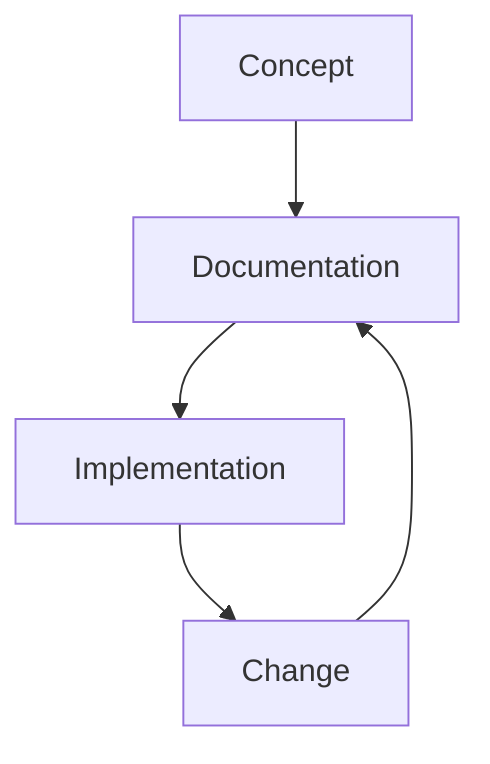

---

title: Documentation Standards
status: draft
version: 0.1
owner: Engineering
last_updated: 2026-01-05
------------------------

# Documentation Standards

This guide defines how we write, structure, maintain, and evolve documentation.

Documentation is part of the product. It is not an afterthought, a side task, or something that happens only when things go wrong. Good documentation reduces risk, accelerates onboarding, supports decision-making, and preserves intent over time.

These standards apply to all engineering documentation, regardless of format or audience.

## Purpose

Our documentation standards exist to:

* Make intent, decisions, and behaviour explicit
* Reduce reliance on tribal knowledge
* Support safe change and long-term maintenance
* Enable asynchronous collaboration
* Keep documentation trustworthy and current

If documentation is not used or trusted, it has failed.

## Core principles

* Documentation is owned, not abandoned
* Write for future readers, not present authors
* Prefer clarity over completeness
* Keep documentation close to the thing it describes
* Treat documentation as versioned artefacts

## Documentation as code

All substantive documentation should:

* Live in version control
* Be written in plain text formats (Markdown first)
* Be reviewed via pull request
* Change alongside the code or system it describes

This enables traceability, review, and controlled evolution.

## Documentation types

We use different document types for different purposes. Mixing them leads to confusion.

## Reference documentation

Reference documentation describes what *is*.

Examples:

* API specifications
* Configuration options
* Data schemas
* Interface definitions

Characteristics:

* Precise and unambiguous
* Minimal narrative
* Kept strictly in sync with implementation

## Conceptual documentation

Conceptual documentation explains *why* things exist and how they fit together.

Examples:

* Architecture overviews
* System context diagrams
* Design rationale

Characteristics:

* Focus on intent and trade-offs
* Stable over time
* Written for understanding, not step-by-step execution

## Procedural documentation

Procedural documentation explains *how* to do something.

Examples:

* Build and deployment steps
* Operational runbooks
* Onboarding guides

Characteristics:

* Action-oriented
* Clear prerequisites and outcomes
* Regularly validated against reality

## Decision records

Architectural and significant technical decisions must be documented explicitly.

* Use Architecture Decision Records where appropriate
* Capture context, decision, alternatives, and consequences
* Keep records immutable once accepted

The goal is not approval theatre, but preserved reasoning.

## Structure and layout

Documentation should follow a predictable structure.

* Clear title and purpose
* Audience identified implicitly or explicitly
* Logical sectioning
* Consistent headings
* Summary or orientation at the top for longer documents

Avoid long, unbroken walls of text.

## Language and tone

* Clear, direct, and neutral
* Active voice preferred
* Avoid marketing language and hype
* Avoid unnecessary jargon
* Explain acronyms on first use

Write as if the reader is capable but unfamiliar with local context.

## Diagrams

Diagrams are first-class documentation.

* Prefer diagrams as code
* Keep diagrams simple and focused
* One diagram per concern
* Diagrams must match reality

If a diagram cannot be kept up to date, remove it.

## Naming and organisation

* File and folder names should be descriptive and stable
* Avoid vague names like `misc` or `notes`
* Group documents by concern, not by author or date
* Keep paths short and navigable

Consistency matters more than perfection.

## Reviews and maintenance

Documentation changes follow the same review standards as code.

* Changes reviewed for clarity and correctness
* Reviewers consider the reader’s perspective
* Outdated documentation is treated as a defect

If documentation is wrong, fix it immediately.

## Keeping documentation current

Documentation should be updated:

* When behaviour changes
* When decisions are made
* When processes evolve
* When onboarding feedback highlights gaps

Stale documentation is worse than no documentation.

## Ownership

Every document should have a clear owner or owning group.

Ownership means:

* Keeping it accurate
* Responding to change requests
* Periodic review

Ownership does not mean exclusive authorship.

## Common failure modes

Watch for:

* Documents written once and never revisited
* Overly long documents no one reads
* Duplication with slight inconsistencies
* Documentation divorced from code
* Optimising for format over usefulness

If you see these patterns, simplify.

## Evolution of standards

* These standards are expected to evolve
* Improvements should be proposed via pull request
* Exceptions are allowed when explicit and justified

The standard exists to support the work, not constrain it.
