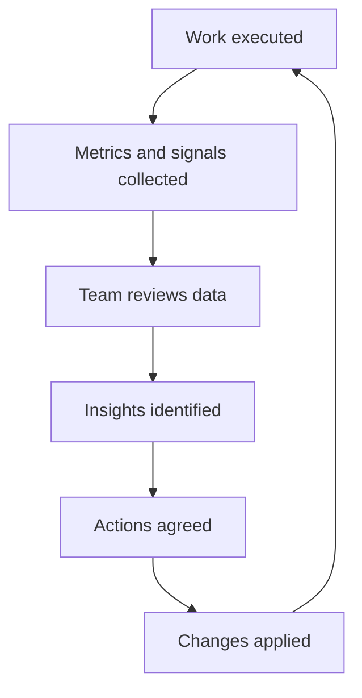

---

title: Metrics & Feedback Loop
status: draft
version: 0.1
owner: Engineering
last_updated: 2026-01-05
------------------------

# Metrics & Feedback Loop

This guide defines how we use metrics and feedback to understand how delivery is really working and how we improve it over time.

Metrics exist to support learning and decision-making. They are not targets, performance scores, or tools for individual judgement. Poorly used metrics damage trust and behaviour. Well-used metrics make problems visible early and create space to improve.

## Purpose

Our approach to metrics aims to:

* Make delivery health visible
* Identify bottlenecks and risks early
* Support continuous improvement
* Provide evidence for decisions and trade-offs
* Close the loop between intent and reality

If a metric does not inform action or learning, it should not be collected.

## Principles

* Metrics are for teams, not individuals
* Trends matter more than single data points
* Context always beats raw numbers
* Measure the system, not the people
* Use the smallest useful set of metrics

## Metric categories

We group metrics by what they tell us about the system.

## Flow and delivery

These metrics describe how work moves through the system.

* Lead time: time from work starting to work delivered
* Cycle time: time from work in progress to completion
* Work in progress: number of active items
* Throughput: completed items per time period

These help answer:

* Are we getting faster or slower?
* Where is work queuing?
* Are we overloading the system?

## Quality

These metrics describe how safe and reliable our output is.

* Defect escape rate
* Test coverage trends (not absolute targets)
* Build and test pass rate
* Flaky test frequency
* Rollback or hotfix frequency

These help answer:

* Are we paying down or accumulating risk?
* Where does quality break down?

## Stability and operability

These metrics describe how the system behaves in production.

* Deployment frequency
* Mean time to detect issues
* Mean time to recover
* Incident count and severity
* Alert noise ratio

These help answer:

* How resilient is the system?
* How disruptive are changes?

## Predictability

These metrics describe how well we meet expectations.

* Planned versus completed work
* Forecast accuracy over time
* Scope change rate during delivery

These help answer:

* How reliable are our plans?
* Where does uncertainty enter the system?

## People and ways of working

These signals are often qualitative rather than numeric.

* Team sentiment from retrospectives
* Onboarding feedback
* Review turnaround times
* Unplanned work frequency

These help answer:

* Is the way we work sustainable?
* Where is friction emerging?

## What we do not measure

We explicitly avoid:

* Individual productivity metrics
* Lines of code
* Story points as performance indicators
* Rankings or comparisons between engineers

These distort behaviour and reduce trust.

## Feedback loops

Metrics only matter if they feed back into action.

## Review cadence

Metrics should be reviewed at the right level and frequency.

* Daily: operational signals and blockers
* Weekly: flow and quality trends
* Sprint or iteration: improvement actions
* Quarterly: systemic issues and investment decisions

Avoid reviewing everything everywhere. Match cadence to decision type.

## Using metrics in retrospectives

In retrospectives, metrics are used to:

* Ground discussion in evidence
* Validate or challenge perceptions
* Identify experiments to try next

They are not used to assign blame or justify pre-made decisions.

## Experiments and learning

Improvements should be treated as experiments.

* State the hypothesis
* Define what success looks like
* Use metrics to observe impact
* Keep or revert based on evidence

Small, frequent experiments beat large, risky changes.

## Making metrics visible

Where possible:

* Dashboards are shared and accessible
* Definitions are documented
* Trends are shown over time
* Context is captured alongside data

A metric without explanation is a liability.

## Common failure modes

Watch for:

* Too many metrics
* Metrics collected but never discussed
* Optimising one metric while damaging others
* Using metrics to justify pressure rather than improvement
* Loss of qualitative feedback

If you see these, reset.

## Ownership and evolution

* Metric definitions are owned by the team
* Changes to metrics should be explicit
* Retire metrics that no longer drive insight

This guide should evolve as the team and system evolve.

