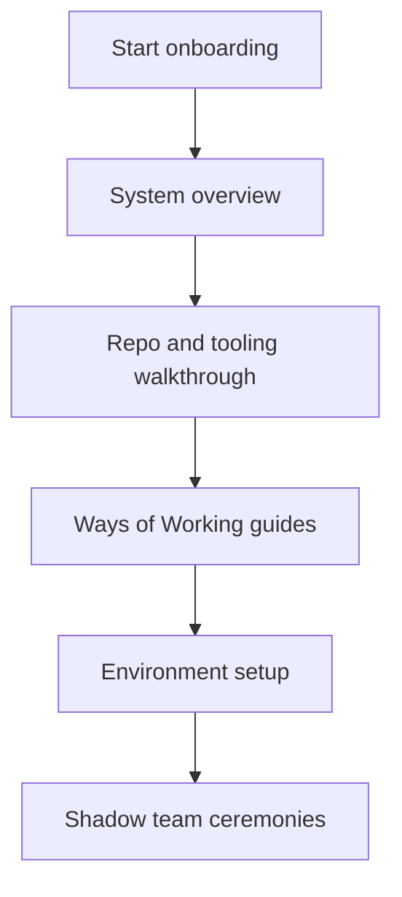
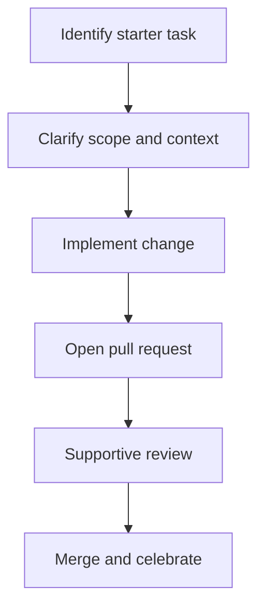

---

title: Engineering Onboarding Guide & Playbook
status: draft
version: 0.1
owner: Engineering
last_updated: 2026-01-05
------------------------

# Engineering Onboarding Guide & Playbook

This guide exists to help new team members become effective quickly, safely, and confidently.

Onboarding is not a single event or a checklist to rush through. It is a supported transition from outsider to trusted contributor, with clarity about expectations, systems, and ways of working.

This playbook defines what *good onboarding* looks like for both the new starter and the team.

## Objectives

Effective onboarding should:

* Reduce time to first meaningful contribution
* Build understanding of the system, not just the code
* Make expectations explicit
* Avoid reliance on tribal knowledge
* Establish trust and psychological safety early

## Shared responsibility

Onboarding is a team responsibility.

### The new starter owns:

* Asking questions early and often
* Following the documented setup and guides
* Making progress visible

### The team owns:

* Providing time, context, and support
* Answering questions without judgement
* Keeping onboarding documentation accurate

### The manager owns:

* Clear goals and priorities
* Regular check-ins
* Removing blockers

## Before day one

The following should be ready before the new starter arrives:

* Laptop and required hardware provisioned
* Accounts created (source control, CI, ticketing, documentation)
* Access to repositories and environments
* Onboarding buddy assigned
* Calendar invites for key ceremonies

If any of these are missing, fix that first. First impressions matter.

## First day focus

Day one is about orientation, not productivity.

### Expected outcomes

* Knows who is who and how to get help
* Can access core systems
* Understands what the team does and why
* Feels welcome and supported

### Do not expect

* Code contributions
* Deep technical understanding
* Full context retention

## First week focus

The goal of the first week is *context building*.

* High-level system overview
* Walkthrough of repositories and services
* Review of Ways of Working guides
* Environment setup completed
* Shadowing reviews, stand-ups, and planning

## Tooling and access checklist

A new starter should be able to:

* Clone repositories
* Build and run the system locally (where applicable)
* Run tests
* Raise a pull request
* View CI results
* Access documentation and diagrams

Any failure here is an onboarding defect, not a personal one.

## Ways of Working orientation

Every new starter should be explicitly pointed at:

* Process guide
* Code Review Guide
* Working Agreements & Team Norms
* Git and branching strategy
* CI/CD expectations
* Documentation and modelling toolchain

Do not assume prior knowledge, even for experienced engineers.

## First contribution

The first contribution should be:

* Small
* Low risk
* Clearly scoped
* Reviewed with extra care and explanation

Examples:

* Documentation fix
* Test improvement
* Minor refactor
* Small bug fix

The goal is learning the system and workflow, not proving competence.

## Onboarding buddy role

The buddy is not a manager.

They are responsible for:

* Being the first point of contact
* Explaining how things really work
* Helping navigate unwritten conventions
* Checking in regularly during the first few weeks

This role should be explicit and time-boxed.

## 30 / 60 / 90 day expectations

### First 30 days

* Comfortable with tooling and workflow
* Understands system at a high level
* Has made several small contributions

### First 60 days

* Owns small pieces of work end to end
* Participates actively in reviews and discussions
* Understands key architectural decisions

### First 90 days

* Delivers work with minimal supervision
* Identifies improvement opportunities
* Acts as a full team member

## Check-ins and feedback

Regular check-ins should cover:

* What is clear
* What is confusing
* Where documentation or process failed
* What support is missing

Feedback from onboarding should feed back into improving this guide.

## Common failure modes

Watch for:

* Overloading with information
* Assuming prior context
* Lack of clear starter tasks
* Silent struggling
* Treating onboarding as complete after week one

If you see these, intervene early.

## Evolution of this guide

* This playbook is a living document
* Changes should be proposed via pull request
* Feedback from new starters is prioritised

