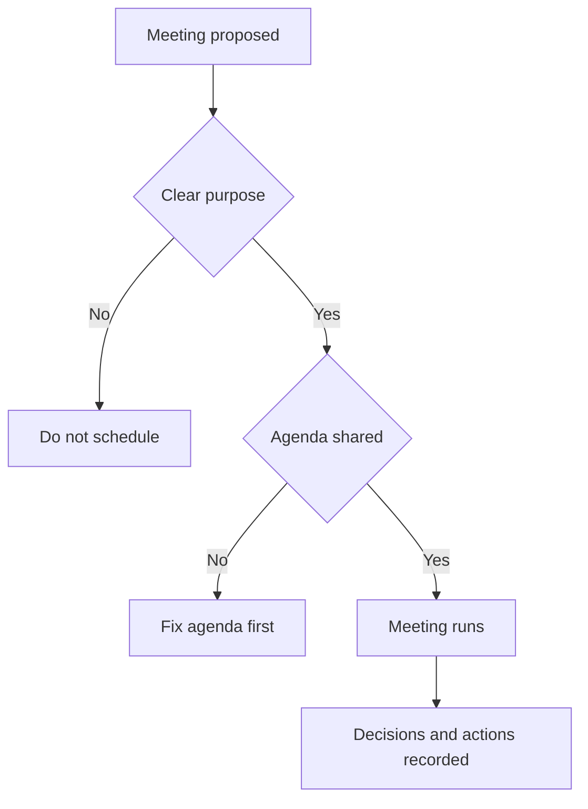
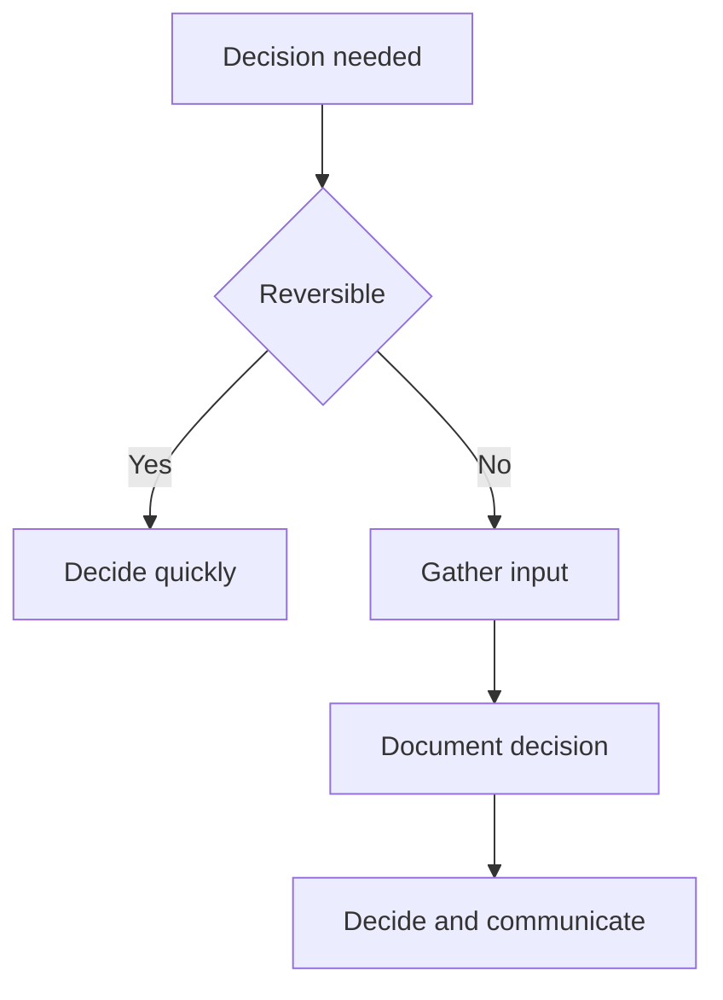

---

title: Working Agreements & Team Norms
status: draft
version: 0.1
owner: Engineering
last_updated: 2026-01-05
------------------------

# Working Agreements & Team Norms

This guide defines how we work together day to day.

Working agreements are explicit, shared expectations about behaviour, communication, and decision-making. They exist to reduce friction, ambiguity, and unspoken assumptions. They are not rules for control, but guardrails that help the team move faster with less stress.

These agreements apply to everyone equally, regardless of role or seniority.

## Purpose

Our working agreements aim to:

* Create psychological safety and trust
* Make collaboration predictable and fair
* Reduce coordination overhead
* Avoid reliance on heroics or tribal knowledge
* Enable sustainable delivery over time

If an agreement no longer serves these goals, it should be challenged and changed.

## Core principles

* Assume positive intent
* Optimise for team outcomes, not individual convenience
* Make work visible
* Prefer clarity over politeness when trade-offs matter
* Disagree openly, commit clearly

## Communication norms

### Default channels

* Async first where possible
* Written communication preferred for decisions and technical detail
* Meetings are for discussion, alignment, and decision-making, not information broadcast

### Response expectations

* Acknowledge messages within one working day, even if the full response comes later
* Say when you are blocked or overloaded
* Silence is not agreement

### Tone

* Direct, respectful, and factual
* Critique ideas and behaviours, not people
* Avoid sarcasm in written communication
* Emojis are acceptable if they add clarity, not pressure

## Meetings

### General rules

* Every meeting has an owner, agenda, and intended outcome
* Start on time, end on time
* Decline meetings that do not require your presence
* Capture decisions and actions in writing

### Typical meeting types

* Stand-up: coordination and blockers only
* Planning: scope, priority, and trade-offs
* Refinement: clarity and readiness, not commitment
* Review/demo: learning and feedback
* Retrospective: improvement, not blame

## Availability and focus time

* Core collaboration hours are agreed by the team
* Outside those hours, responses are best-effort
* Use calendar blocks or status messages to protect focus time
* Deep work is respected; interruptions should be intentional

## Decision-making

### Decision ownership

* Decisions should have a clear owner
* Input is encouraged from those affected or with relevant expertise
* Not all decisions require consensus

### Decision model

* Reversible decisions: bias for speed
* Irreversible or high-impact decisions: bias for alignment and documentation

## Disagreement and conflict

* Disagreement is expected and healthy
* Raise concerns early, not after the fact
* Use data, examples, and impact rather than opinion alone
* If consensus cannot be reached, the decision owner decides
* Once a decision is made, we commit and move forward

## Feedback

### Giving feedback

* Be timely
* Be specific and actionable
* Focus on behaviour and impact
* Give feedback in private when personal, in public when it benefits the team

### Receiving feedback

* Listen to understand, not to defend
* Ask clarifying questions
* Treat feedback as information, not judgement

## Ownership and accountability

* If you pick up work, you own it end to end
* Raise risks and blockers early
* Do not let work silently stall
* Ask for help before you are stuck

Accountability is about reliability, not blame.

## Working with code and change

* Small, incremental changes preferred
* Work is reviewed before merging
* Quality issues are addressed, not deferred indefinitely
* Broken builds are treated as urgent

(See Code Review Guide and CI/CD Guide for specifics.)

## Learning and improvement

* Retrospectives are blameless
* Actions from retros are tracked
* We share learnings openly, including mistakes
* Continuous improvement is part of normal work, not an extra task

## Exceptions and evolution

* These agreements are defaults, not rigid rules
* Exceptions are allowed when explicit and agreed
* This document should be reviewed periodically
* Changes require team discussion and agreement

