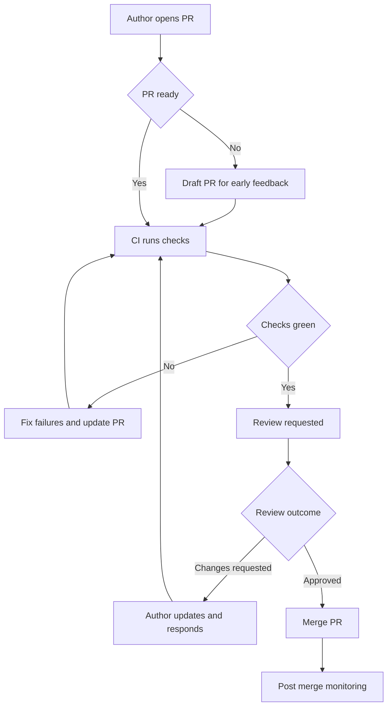
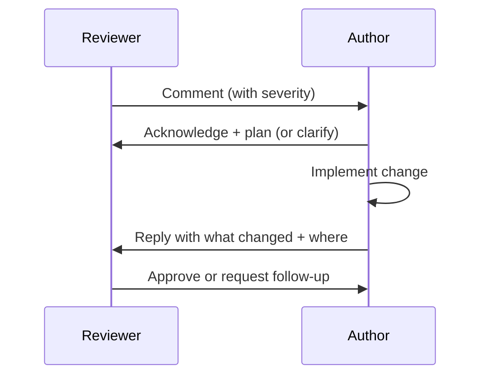

# Code Review Guide

Code review is how we keep quality up, risk down, and knowledge spread around the team, without relying on heroics.

This guide defines:
- What a good PR looks like
- What reviewers should look for
- How we handle feedback, approval, and merge
- How we keep reviews fast and useful

---

## Goals

A review should primarily:
- Catch defects early (logic, edge cases, security, reliability)
- Improve maintainability (clarity, naming, structure, tests)
- Confirm alignment (requirements, architecture, coding standards)
- Share context (so the code is not “owned” by one person)

A review is **not**:
- A platform for personal style preferences (unless it’s in our standards)
- A substitute for testing
- A chance to redesign the whole system mid-PR

---

## Roles and responsibilities

### Author (PR owner)
You own:
- Scope and clarity of the PR
- Tests and evidence
- Addressing comments (or explicitly disagreeing with a reason)
- Keeping it small enough to review

### Reviewer
You own:
- Reading it properly (not rubber-stamping)
- Identifying risk and asking the right questions
- Being specific and constructive
- Replying promptly (or saying when you can’t)

### Maintainer / Approver (if different)
You own:
- Merge decisions
- Enforcing repo quality gates
- Making sure the change fits the roadmap/architecture

---

## Review flow



## PR standards

### Keep PRs small

Aim for:

* One coherent change
* Minimal unrelated refactors
* No “while I’m here…” drive-bys (unless trivial and clearly separated)
* 
If it’s large:

* Split into stacked PRs (refactor first, behaviour change second)
* Or use feature flags to keep changes safe and incremental

### PR description must include

* **What**: short summary
* **Why**: link to work item / requirement / bug
* **How**: approach taken + anything non-obvious
* **Risk**: what could break, blast radius, rollback plan
* **Test evidence**: what you ran, results, screenshots/logs if relevant

Suggested template:

```text
## What
## Why (link)
## How
## Risk / Rollback
## Testing
## Notes for reviewer
```

### No sneaky changes

If the PR changes behaviour, it needs:

* Updated tests
* Updated docs if user/ops facing
* A clear explanation of the behaviour change

## Reviewer checklist

Use this as a mental pass. You don’t need to comment on every point, but you should *think* about them.

### 1) Correctness

* Does it do what the ticket says?
* Edge cases handled?
* Any off-by-one, null/None, overflow, timeouts, retries?
* Any concurrency or re-entrancy issues?

### 2) Design and maintainability

* Is the change easy to understand in 6 months?
* Naming sensible?
* Complexity kept under control?
* Clear separation of concerns?
* Are there new abstractions that are unnecessary (or missing)?

### 3) Tests

* Are tests present for new behaviour?
* Are they meaningful, not just “happy path”?
* Are they stable (no timing flakiness, external dependencies, randomness)?
* Do tests match the risk level of the change?

### 4) Security

* Secrets/keys/tokens not committed (ever)
* Input validation and bounds checks
* Auth/authz correct
* Avoid injection risks (SQL, shell, template, deserialisation)
* Dependencies: any new ones, and are they justified?

### 5) Operational concerns

* Logging: useful, not noisy, no sensitive data
* Metrics/tracing where appropriate
* Error handling: fails safe, no silent failures
* Backwards compatibility: APIs, schemas, configs
* Performance: any obvious hot path regressions?

### 6) Standards and consistency

* Follows coding standards
* Matches project patterns and existing conventions
* Docs updated where needed

## Comment types and tone

Be explicit about *severity*. It avoids back-and-forth.

Use labels:

* **BLOCKER**: must be fixed before merge (correctness, security, data loss, major design flaw)
* **MAJOR**: should be fixed before merge (maintainability, test gaps, risky patterns)
* **MINOR**: nice improvement (clarity, small refactor)
* **NIT**: tiny style/wording (only if genuinely helpful)

Examples:

* **BLOCKER**: “This can throw when `x` is null; we need a guard or input validation.”
* **MAJOR**: “We need a test for the retry/backoff behaviour, otherwise regressions are likely.”
* **MINOR**: “Could we rename `foo` to `customer_id` for clarity?”
* **NIT**: “Spelling in comment/log message.”

Tone rules:

* Talk about the code, not the person
* Ask questions when unsure (“Is there a reason we…?”)
* Prefer suggestions over commandments unless it’s a blocker
* Avoid sarcasm in written review comments (I know, tragic)

## Responding to review comments (author behaviour)

* Reply to every comment (even if it’s “Done”)
* If you disagree, explain *why (trade-off)*, don’t just ignore it
* If it’s a bigger discussion, move it to a quick chat, then summarise the outcome in the PR



## Approval rules

Default rule of thumb (adjust per repo):

* **1 approval** for low-risk changes (docs, small refactor, low blast radius)
* **2 approvals** for behaviour changes, shared modules, customer-impacting code
* **Domain approval** required when change affects:
  * security/auth
  * billing/finance logic
  * safety-critical behaviour
  * data schema/migrations
  * core platform/shared libraries

Never approve if:

* You don’t understand the change and it’s non-trivial
* CI is failing (unless explicitly allowed for a known non-blocking reason)
* There are unresolved **BLOCKER** comments

## Merge rules

* Prefer **squash merge** for feature work to keep history clean
* Prefer **rebase merge** where linear history is mandated
* Avoid “fix forward” unless you truly have to

Before merge:

* All required checks green
* Approvals met
* PR description complete
* No unresolved blockers

After merge:

* Monitor logs/alerts if relevant
* Ensure feature flags are tracked for removal
* Capture any follow-up tasks as tickets (not “remembered in your head”)

## Common review smells (things to pause on)

* Large PR with multiple unrelated changes
* “Quick fix” with no test changes
* Complex conditional logic with no explanation
* Copy/paste code where an existing helper exists
* New dependency introduced for a tiny convenience
* Silent catch/ignore of exceptions
* Retries without bounds, backoff, or idempotency
* Logging secrets or PII (even accidentally)

## Time expectations

* Reviewer should **acknowledge** within 1 working day (even if you can’t review yet)
* Author should keep PRs reviewable, and respond promptly
* If a PR sits idle, explicitly call it out in stand-up or the team channel

## Review guidance by PR size

* **XS (<100 lines)**: fast scan, correctness + tests
* **S (100–300)**: full review, ask design questions if needed
* **M (300–800)**: consider splitting; expect multiple passes
* **L (>800)**: almost always split; reviewers will miss things

## Tooling expectations (CI gates)

Typical gates (repo-specific):

* Formatting/lint
* Unit tests
* Integration tests (where applicable)
* Static analysis (incl. security scanning)
* Build/package step

If the pipeline doesn’t enforce it yet, the review should.

## Appendix: “What should I comment on?”

Comment when it:

* Prevents a bug
* Improves clarity for future readers
* Reduces risk or cost of change later
* Improves test coverage meaningfully
* Keeps us aligned with standards/architecture

Don’t comment when it’s:

* Pure personal preference and not in standards
* A redesign tangent unrelated to the ticket
* Something you can’t justify with impact

