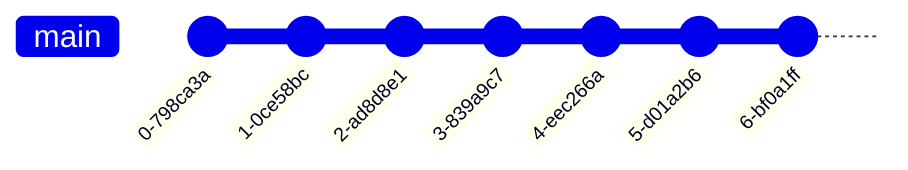
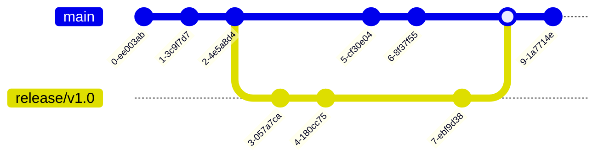

# The Ultimate Guide to Git Branching Strategies 🗺️

Effective management of code changes is critical for any development team. A robust Git branching strategy is essential for ensuring streamlined collaboration and the delivery of high-quality software.

In this guide, we will examine the most prevalent branching strategies, explore modern approaches, discuss common anti-patterns, and provide criteria for selecting the optimal strategy for your team.

## Why Your Team Needs a Branching Strategy 🚦

A well-defined branching strategy is fundamental for establishing an efficient and problem-free development environment. Key benefits include:

-   **Enhanced Collaboration**: Allows multiple developers to work on isolated features without interfering with each other's progress.
    
-   **Risk Mitigation**: Isolates new features or bug fixes, thereby protecting the main codebase from instability. The production branch remains clean and deployable.
    
-   **Organised Workflow**: Prevents complex merge scenarios by providing a clear structure for integrating changes.
    
-   **Quality Control**: Integrates with pull requests, code reviews, and CI/CD pipelines to ensure every change is tested and reviewed prior to deployment.
    

## Popular Git Branching Strategies Explained 🚀

Let's break down the most widely used strategies, complete with their pros, cons, and visual diagrams.

### 1\. GitFlow

Originally introduced by Vincent Driessen in 2010, GitFlow is a highly structured strategy designed for projects with formal release cycles and long-term maintenance needs.

-   **Popularity**: Still popular, especially in traditional enterprise and projects with strict release schedules.
    
-   **Age**: Introduced by Vincent Driessen in 2010.
    
-   **Use Cases/Who Used It**: Often used by teams with formal release cycles, long-term support requirements, and complex, versioned software (e.g., software vendors, some enterprise applications, embedded systems with distinct versions).
    

**How GitFlow Works:** GitFlow defines five core branches, each with a specific purpose:

-   `main`: Contains production-ready code. Every commit here is a stable release.
    
-   `develop`: The integration branch where new features are merged before going live.
    
-   `feature/*`: For building new functionality. Branches off from `develop` and merges back into it.
    
-   `release/*`: Used to prepare a new version for production. Created from `develop` and eventually merged into both `main` and `develop`.
    
-   `hotfix/*`: For urgent fixes on production. Created from `main`, then merged back into both `main` and `develop`.
    

    

**When to Use GitFlow:**

-   Your team follows scheduled release cycles.
    
-   You need to maintain multiple versions (e.g., patch v1.x while working on v2.x).
    
-   You have formal QA or staging environments.
    
-   Your project has complex release management or compliance requirements.
    

**Pros:**

-   Clear separation of concerns.
    
-   Ideal for parallel development across different product versions.
    
-   Structured workflow enforces discipline and quality control.
    
-   Predictable release cycles.
    

**Cons:**

-   Adds complexity, not ideal for small teams or fast-moving startups.
    
-   Not suited for continuous deployment.
    
-   Can result in long-lived branches, increasing merge conflicts.
    
-   Slows down delivery due to multiple approval stages.
    

### 2\. GitHub Flow

GitHub Flow is the minimalist cousin of GitFlow, designed for teams that ship fast and often, especially those embracing continuous deployment.

-   **Popularity**: Very popular, especially in web development and SaaS.
    
-   **Age**: Gained prominence with GitHub's rise, early 2010s.
    
-   **Use Cases/Who Used It**: Widely adopted by many web startups, SaaS companies, and open-source projects that practice continuous delivery.
    

**How GitHub Flow Works:** The workflow is refreshingly straightforward:

1.  Create a feature branch from `main`.
    
2.  Push commits to the feature branch.
    
3.  Open a pull request for code review and automated tests.
    
4.  Once approved, merge back to `main`.
    
5.  Deploy immediately (optional but encouraged). Everything in `main` should always be production-ready.
    

    

**When to Use GitHub Flow:**

-   Your team practices continuous deployment.
    
-   You have strong automated testing in place.
    
-   You ship frequent, small releases.
    
-   You're working in a small to mid-sized team.
    

**Pros:**

-   Simple and intuitive to adopt.
    
-   Perfect for rapid iteration and fast feedback loops.
    
-   Plays well with CI/CD pipelines.
    
-   Encourages frequent integration, reducing big-bang merges.
    

**Cons:**

-   Not designed for multiple production versions or LTS support.
    
-   In large teams, it can result in frequent merge conflicts.
    
-   No formal release staging or QA branching.
    
-   Requires strong test automation.
    

### 3\. GitLab Flow

GitLab Flow is a hybrid strategy that builds on GitFlow and GitHub Flow, integrating environments and deployment workflows. It's particularly useful in projects with clear DevOps pipelines.

-   **Popularity**: Popular among teams using GitLab.
    
-   **Age**: Introduced by GitLab in 2014.
    
-   **Use Cases/Who Used It**: Teams heavily integrated with GitLab's CI/CD, often in cloud-native development, aiming for a balance between simplicity and structured deployments.
    

**How GitLab Flow Works:** There are two common patterns:

-   **Production Branch Model**: Developers create feature branches from `main` or `develop`, merge back, and then tag releases and deploy from `main` to environments.
    
-   **Environment-Based Model**: Each environment (e.g., `pre-prod`, `staging`, `production`) has a dedicated branch. Merges promote changes from lower to higher environments.
    

    

**When to Use GitLab Flow:**

-   You want to map branches to environments or deployments.
    
-   You use GitLab CI/CD pipelines and want tight integration.
    
-   Your team needs flexibility but also structure between releases.
    

**Pros:**

-   Tightly integrates with CI/CD and DevOps tooling.
    
-   Supports both continuous delivery and versioned releases.
    
-   Encourages better traceability.
    

**Cons:**

-   Can be confusing for beginners due to multiple models.
    
-   Needs strict discipline to avoid inconsistencies across environment branches.
    

### 4\. Environment Branching

In this strategy, each deployment environment (like `dev`, `qa`, `staging`, `prod`) has its own branch. Code progresses through the pipeline by merging from one environment branch to the next.

-   **Popularity**: Declining, often considered an anti-pattern in modern contexts.
    
-   **Age**: Older practice, predates widespread modern CI/CD.
    
-   **Use Cases/Who Used It**: Primarily found in legacy systems or environments with very manual deployment processes, where strict control over environment progression is needed, or in highly regulated environments with specific audit requirements.
    

    

**When to Use Environment Branching:**

-   You're working with legacy systems or manual promotion processes.
    
-   Your CI/CD tooling is limited or non-existent.
    
-   You want explicit control over what gets pushed to each environment.
    

**Pros:**

-   Very explicit control over deployments.
    
-   Simple to understand in legacy or manual release workflows.
    

**Cons:**

-   High risk of divergence between environments.
    
-   Code may behave differently if not carefully synchronised.
    
-   Difficult to scale with modern CI/CD practices.
    
-   Often considered an anti-pattern in modern DevOps setups.
    

### 5\. Trunk-Based Development (TBD)

Trunk-Based Development is the go-to for high-performing teams that deploy multiple times a day. It's simple on the surface but demands real discipline. The idea? Everyone works off a single, main branch (`main` or `trunk`), with no long-lived feature branches.

-   **Popularity**: Growing rapidly, especially in high-performing tech companies.
    
-   **Age**: Conceptually old (pre-Git), gained modern prominence in the early 2010s with the rise of CI/CD.
    
-   **Use Cases/Who Used It**: Adopted by companies like Google, Amazon, Microsoft, and other tech giants focused on high-frequency deployments and large-scale continuous integration. Ideal for SaaS products.
    

**How Trunk-Based Development Works:**

-   There's one main branch (`main` or `trunk`). All development happens here.
    
-   Developers commit directly to `main`, often multiple times per day.
    
-   Changes are small, incremental, and backed by automated tests.
    
-   Incomplete features are hidden behind feature flags, allowing code to ship without being user-visible.
    

    

**When to Use Trunk-Based Development:**

-   Your team follows continuous integration religiously.
    
-   You have a strong automated testing setup (unit + integration + end-to-end).
    
-   You're building SaaS products or anything that updates frequently.
    
-   Your team is experienced with feature flagging and CI/CD tools.
    

**Pros:**

-   No more painful merges, everyone works on the same code path.
    
-   Encourages true continuous integration and early bug discovery.
    
-   Delivers the fastest feedback loops from dev to prod.
    
-   Simplifies the workflow.
    

**Cons:**

-   Requires robust testing to avoid breaking production.
    
-   Not ideal for large, monolithic features (unless behind flags).
    
-   You'll need to manage feature flags carefully to avoid technical debt.
    
-   Demands a high level of discipline across the team.
    

### 6\. Release Branching

If your product has long-term users, multiple versions in the wild, and strict release schedules, Release Branching is a powerful choice. It helps isolate each major release for bug fixing and updates without slowing down future development.

-   **Popularity**: Moderate, used for specific release needs.
    
-   **Age**: Common practice since version control systems became widespread.
    
-   **Use Cases/Who Used It**: Software vendors, embedded systems, or any project requiring long-term support for specific versions and scheduled releases. Often seen in products with on-premise deployments.
    

**How Release Branching Works:**

-   When a version is ready for stabilisation, a `release` branch is created from the mainline (`main` or `develop`).
    
-   All bug fixes and release-specific tweaks go into this branch.
    
-   Meanwhile, the mainline stays open for ongoing feature development.
    
-   Once finalised, the release branch is tagged and deployed. Hotfixes can be applied directly to this release branch if needed.
    

    

**When to Use Release Branching:**

-   You support multiple product versions simultaneously (e.g., v1.x, v2.x).
    
-   Your releases are tied to deadlines (quarterly, client-based, etc.).
    
-   You need to provide long-term support or hotfixes for older versions.
    
-   You have a formal stabilisation and QA process before every release.
    

**Pros:**

-   Clean isolation between feature development and stabilisation.
    
-   Supports parallel development and maintenance efforts.
    
-   Great for version tracking and rollback.
    
-   Ideal for products requiring long-term support (LTS).
    

**Cons:**

-   Can get complex with many active branches.
    
-   Requires disciplined merge practices to sync fixes back into `main`.
    
-   Easy to fall into branch proliferation.
    

### 7\. Feature Branching

Feature Branching is perhaps the most widely used and easiest-to-understand strategy. It's the default mental model for most developers: create a branch for each new piece of work, build in isolation, and merge back when done.

-   **Popularity**: Very popular, often the default starting point for new projects and teams.
    
-   **Age**: Core concept in modern distributed version control.
    
-   **Use Cases/Who Used It**: Used by almost all teams, often as the base layer for other flows (e.g., GitHub Flow is Feature Branching with specific rules). Applicable across all project types and sizes.
    

**How Feature Branching Works:**

-   Start by branching off from `main` (or `develop`) to work on a specific feature or bug fix.
    
-   Commit changes to this branch until the work is complete.
    
-   Once reviewed and tested, the branch is merged back, typically via a pull request.
    
-   Branches are usually named descriptively (e.g., `feature/login-form`, `bugfix/payment-error`).
    

**When to Use Feature Branching:**

-   Your team is new to Git workflows.
    
-   You want to isolate features or experiments without risk to mainline stability.
    
-   You value clear ownership of features or fixes.
    
-   Your project has medium complexity, without too many parallel changes.
    

**Pros:**

-   Provides clear isolation between features.
    
-   Super easy to adopt and understand.
    
-   Encourages better code reviews through pull request workflows.
    
-   Offers a flexible foundation for more advanced strategies.
    

**Cons:**

-   Can result in long-lived branches if not merged frequently.
    
-   Integration challenges when multiple feature branches diverge for too long.
    
-   Potential for merge conflicts, especially on fast-moving teams.
    

### 8\. Forking Workflow

The Forking Workflow is built for scale, safety, and distributed collaboration, making it the default model for open-source contributions on platforms like GitHub.

-   **Popularity**: Dominant for open-source projects.
    
-   **Age**: Gained prominence with GitHub's widespread adoption.
    
-   **Use Cases/Who Used It**: The standard for public open-source projects (e.g., Linux kernel, React, Kubernetes) and often for internal projects with strict security or contribution models where contributors are not directly trusted with write access to the main repository.
    

**How Forking Workflow Works:**

-   A contributor forks the main repository, creating their copy on the server.
    
-   They clone their fork locally, create a feature or fix branch, and commit changes.
    
-   Once ready, they open a pull request back to the original repository (the "upstream").
    
-   Maintainers review, request changes, and decide whether to merge.
    

**When to Use Forking Workflow:**

-   You're running an open-source project with external contributors.
    
-   You want strict control over what enters the main codebase.
    
-   Your team is distributed or made up of untrusted/external developers.
    
-   You expect a high volume of pull requests from the community.
    

**Pros:**

-   No write access required for contributors, keeps your main branch safe.
    
-   Full control stays with project maintainers.
    
-   Scales beautifully with large numbers of contributors.
    
-   The de facto standard for open-source collaboration.
    

**Cons:**

-   Slightly more complex setup for new contributors.
    
-   Overkill for small, trusted internal teams.
    
-   Requires understanding of `origin` vs. `upstream` remotes.
    

### 9\. One Flow

One Flow is a simplified alternative to GitFlow, aiming to reduce its complexity while retaining some of its benefits for release management. It typically uses only `main` and feature branches, with releases managed by tagging `main`.

-   **Popularity**: Niche but growing as a simpler alternative to GitFlow.
    
-   **Age**: Emerged as a refinement of GitFlow.
    
-   **Use Cases/Who Used It**: Teams seeking a more lightweight release management approach than GitFlow, often smaller to mid-sized teams moving towards continuous delivery.
    

**How One Flow Works:**

-   All development happens on short-lived feature branches, branched off `main`.
    
-   Features are merged into `main` via pull requests.
    
-   `main` is always deployable.
    
-   Releases are created by tagging `main` at a stable point. Hotfixes are typically done on a new branch from `main` and then merged back.
    
```mermaid
gitGraph
  commit msg: "Initial"

  %% feature/alpha off main
  branch feature/alpha
  checkout feature/alpha
  commit msg: "Alpha 1"
  commit msg: "Alpha 2"

  %% release Alpha
  checkout main
  merge feature/alpha tag: "v1.0"

  %% feature/beta off post-v1.0 main
  branch feature/beta
  checkout feature/beta
  commit msg: "Beta 1"

  %% release Beta
  checkout main
  merge feature/beta tag: "v1.1"


 ```   
    

**When to Use One Flow:**

-   You want a simpler model than GitFlow but still need clear release tagging.
    
-   You practice continuous integration and want `main` to always be stable.
    
-   Your team prefers fewer long-lived branches.
    

**Pros:**

-   Simpler than GitFlow.
    
-   Maintains a clean release history with tags.
    
-   Good for teams moving towards continuous delivery.
    

**Cons:**

-   Less explicit separation for hotfixes compared to GitFlow.
    
-   Requires discipline to keep `main` always deployable.
    

### 10\. Ship / Show / Ask

This is less of a strict branching model and more of a philosophy for merging feature branches, often used in conjunction with Trunk-Based Development or GitHub Flow. It governs the pull request (PR) process.

-   **Popularity**: Growing, especially within TBD contexts.
    
-   **Age**: More recent, philosophical approach.
    
-   **Use Cases/Who Used It**: Teams practicing Trunk-Based Development, aiming to optimise their code review process based on the risk and impact of changes.
    

**How Ship / Show / Ask Works:**

-   **Ship**: Small, low-risk changes are committed directly to `main` (or merged via PR with minimal review), relying heavily on automated tests and feature flags. This is common in TBD.
    
-   **Show**: Changes are pushed to a feature branch, a PR is opened, and the code is "shown" to teammates for feedback, but formal approval isn't strictly required before merging. It's about visibility.
    
-   **Ask**: For larger, riskier, or more complex changes, a formal PR is opened, requiring explicit review and approval from one or more teammates before merging.
    
```mermaid
gitGraph
  commit msg: "Initial"

  %% Ship: quick change, merge straight back
  branch feature/small-change
  commit msg: "Small Change"
  checkout main
  merge feature/small-change tag: "Ship: direct merge or quick PR"

  %% Show: get feedback first, then merge
  branch feature/show-feedback
  commit msg: "Show Change"
  checkout main
  merge feature/show-feedback tag: "Show: merge after feedback"

  %% Ask: formal approval required
  branch feature/ask-approval
  commit msg: "Big Change"
  checkout main
  merge feature/ask-approval tag: "Ask: merge after review & approval"

 ```   
    

**When to Use Ship / Show / Ask:**

-   You want to optimise your PR workflow based on change risk and complexity.
    
-   You're implementing Trunk-Based Development and need guidelines for direct commits vs. PRs.
    
-   You trust your team's judgment and automated tests.
    

**Pros:**

-   Speeds up delivery for low-risk changes.
    
-   Encourages continuous integration and smaller commits.
    
-   Tailors the review process to the change's impact.
    

**Cons:**

-   Requires strong team trust and a mature testing culture.
    
-   Can be challenging to define "small" vs. "large" changes consistently.
    

### 11\. Mainline Development with Release Trains

This approach is an evolution of Trunk-Based Development, particularly suited for very large organisations or products with many independent teams contributing to a single codebase, and where releases happen on a predictable, fixed cadence.

-   **Popularity**: Niche, for very large-scale enterprises.
    
-   **Age**: Evolved from TBD for large organizations.
    
-   **Use Cases/Who Used It**: Large organizations like some divisions of Microsoft, Google, or other companies with hundreds or thousands of developers on a single codebase and fixed release cadences (e.g., large-scale operating systems, complex enterprise software suites).
    

**How Mainline Development with Release Trains Works:**

-   **Mainline (Trunk)**: All teams commit frequently to a single `main` branch. This branch is always kept in a releasable state, relying heavily on feature flags.
    
-   **Release Trains**: At a predefined time (e.g., every two weeks, monthly), a "release train" branch is cut from `main`. This branch becomes the candidate for the next release.
    
-   **Stabilisation**: Only bug fixes for that specific release are allowed on the release train branch. No new features.
    
-   **Deployment**: The release train branch goes through final testing and is deployed.
    
-   **Merge Back**: Critical bug fixes from the release train are merged back into `main`.
    
```mermaid
    gitGraph
        commit msg: "C1"
        commit msg: "C2"
        commit msg: "C3"
        branch release-train/2025.07
        commit msg: "RT Bugfix 1"
        commit msg: "RT Bugfix 2"
        checkout main
        commit msg: "C4"
        commit msg: "C5"
        checkout release-train/2025.07
        commit msg: "RT Final Test"
        checkout main
        merge release-train/2025.07
        branch release-train/2025.08
        commit msg: "RT 2 Bugfix 1"
        checkout main
        commit msg: "C6"
 ```   
    

**When to Use Mainline Development with Release Trains:**

-   Very large organisations with many teams contributing to a single product.
    
-   Products with fixed, time-based release cycles.
    
-   When managing complex dependencies across features.
    
-   You have a mature CI/CD pipeline and extensive automated testing.
    

**Pros:**

-   Provides predictable release cadences.
    
-   Enforces continuous integration.
    
-   Scales well for large development efforts.
    
-   Clear separation of feature development and release stabilisation.
    

**Cons:**

-   Requires extremely high discipline and automation.
    
-   Heavy reliance on feature flags can introduce complexity.
    
-   Not suitable for small teams or projects with infrequent releases.
    

## Automated Backporting / Cherry-Picking 🤖

Even with the best branching strategy, sometimes you need to bring specific commits from one branch to another without merging the entire branch. This is where backporting and cherry-picking come in.

-   **Cherry-Picking**: This Git command allows you to pick a specific commit from one branch and apply it to another. It's useful for:
    
    -   Applying a hotfix from a `hotfix` branch to `main` and `develop` in GitFlow.
        
    -   Bringing a small, isolated bug fix from a release branch back to `main`.
        
    -   Applying a feature from a `feature` branch to another `feature` branch for testing purposes.
        
    
    **How it works**:
    
    1.  `git checkout <target-branch>`
        
    2.  `git cherry-pick <commit-hash>`
        
-   **Backporting**: This is the process of applying a patch or feature from a newer version of software to an older version. While cherry-picking is the _mechanism_, backporting is the _intent_. It's critical for maintaining multiple release lines.
    
    **Automating Backports**: For complex projects with many releases, manual cherry-picking can become tedious and error-prone. Automation can help:
    
    -   **CI/CD Pipeline Integration**: Configure your CI/CD system to automatically propose cherry-picks or merge requests for bug fixes from release branches back to `main` or `develop`. Tools like GitLab and GitHub Actions can be scripted for this.
        
    -   **Git Hooks**: Custom Git hooks can be set up to remind developers or even attempt automated cherry-picks on certain merge events.
        
    -   **Dedicated Tools**: Some larger organisations build custom tooling or use commercial solutions that manage backports across multiple release lines.
        
    
    **Key Considerations for Backporting**:
    
    -   **Conflict Resolution**: Automated backports still often require manual conflict resolution, especially if the codebases have diverged significantly.
        
    -   **Testing**: Always thoroughly test backported changes, as the context of the code might be different in the older branch.
        
    -   **Consistency**: Ensure a clear policy on _what_ gets backported (e.g., only bug fixes, no new features) to maintain branch integrity.
        

## Advanced Merge Strategies: Rebase vs. Merge --squash 🔄

Beyond the basic `git merge`, Git offers other powerful ways to integrate changes, each with implications for your repository's history.

-   **`git rebase`**:
    
    -   **Purpose**: Rewrites commit history by moving or combining a sequence of commits to a new base commit. It essentially replays your changes on top of the target branch, creating a linear history.
        
    -   **How it works**: If you're on `feature-branch` and run `git rebase main`, Git takes your commits from `feature-branch` that aren't on `main`, puts them aside, fast-forwards `feature-branch` to `main`, and then reapplies your commits.
        
    -   **Pros**: Creates a clean, linear history that is easier to read and follow. Avoids "merge commits" that can clutter the graph.
        
    -   **Cons**: Rewrites history, which can be problematic if the rebased commits have already been pushed to a shared remote repository. Requires more care and understanding, especially for collaborative branches.
        
    -   **When to use**: Ideal for cleaning up your local feature branch before merging into `main` (e.g., `git pull --rebase` to keep your local branch up-to-date, or `git rebase -i` to squash/reorder commits before a final merge). **Never rebase commits that have been pushed to a shared branch.**
        
-   **`git merge --squash`**:
    
    -   **Purpose**: Combines all commits from a feature branch into a _single_ new commit on the target branch, without recording the original branch's history.
        
    -   **How it works**: When merging `feature-branch` into `main` with `--squash`, Git applies all changes from `feature-branch` as if they were one large commit. It doesn't create a merge commit, but rather stages the changes for a new commit on `main`.
        
    -   **Pros**: Keeps the `main` branch history clean and concise, showing features as single, atomic changes. Useful for integrating small, self-contained features or bug fixes.
        
    -   **Cons**: Loses the detailed commit history of the feature branch. Can make debugging harder if you need to pinpoint specific changes within the squashed feature.
        
    -   **When to use**: Often used for merging feature branches into a `main` branch in a Trunk-Based Development or GitHub Flow setup where a clean, high-level history is preferred.
        

## How to Select Your Strategy 🎯

Choosing the right branching strategy isn't a one-size-fits-all decision. It depends on how your team works, what you're building, and how often you ship. Here are some key factors to guide your choice:

-   **Team Size & Experience**:
    
    -   **Small teams (2-5 developers)**: GitHub Flow or Trunk-Based Development often work best due to fewer branches and faster iteration.
        
    -   **Larger teams**: GitFlow or Release Branching provides the structure needed for coordination, especially across multiple squads.
        
    -   **New teams**: Start with Feature Branching or GitHub Flow – simple and easy to grasp.
        
    -   **Mature teams**: Can evolve toward Trunk-Based or GitFlow as tooling and CI/CD processes mature.
        
-   **Release Frequency**:
    
    -   **Deploying daily or multiple times per day?** Go with GitHub Flow, Trunk-Based, Ship/Show/Ask, or Mainline Development with Release Trains. They're designed for speed.
        
    -   **Shipping on a schedule (e.g., quarterly releases)?** GitFlow, One Flow, or Release Branching gives you the stability and process control you need.
        
-   **Product Complexity & Maintenance Needs**:
    
    -   **Simple apps or MVPs**: Keep it lightweight with GitHub Flow or Feature Branching.
        
    -   **Complex, enterprise-grade systems with long-term support**: Benefit from GitFlow's or Release Branching's separation of concerns and version management capabilities.
        
-   **Compliance Requirements**:
    
    -   If you're in a regulated industry (finance, healthcare, defence), you'll likely need the formal approval gates and documentation trail offered by GitFlow or Release Branching.
        
-   **Tooling & CI/CD Maturity**:
    
    -   Teams with robust CI/CD pipelines and extensive automated testing can more easily adopt Trunk-Based Development or Mainline Development.
        
    -   Teams with limited CI/CD might lean towards strategies with more manual gates like Environment Branching (though it's generally an anti-pattern for modern setups).
        

## Git Branching Anti-Patterns to Avoid 🚫

While Git offers immense flexibility, some practices can lead to chaos and frustration. Here are common anti-patterns to steer clear of:

-   **Branch per Developer**: This happens when each developer has a single, long-lived branch where all their work resides.
    
    -   **Why it's bad**: Leads to massive, infrequent merges, making conflict resolution a nightmare. It defeats the purpose of continuous integration and makes code reviews difficult.
        
    -   **Instead**: Encourage small, frequent commits to feature branches (or directly to `main` in TBD) and regular merging/rebase from the mainline.
        
-   **Branch per Component/Module**: Creating a separate branch for each logical component or module of your application.
    
    -   **Why it's bad**: If components are interdependent, this leads to complex synchronisation issues, broken builds, and a fragmented view of the overall system. It's a sign of poor architectural decomposition or over-branching.
        
    -   **Instead**: Focus on feature-based branching, even if a feature touches multiple components. For truly independent components, consider a monorepo strategy with careful dependency management, or separate repositories.
        
-   **Long-Lived Feature Branches (without rebase/merge discipline)**: While feature branches are good, letting them live for weeks or months without integrating changes from the mainline.
    
    -   **Why it's bad**: High risk of merge conflicts, stale code, and difficulty integrating into the main codebase.
        
    -   **Instead**: Encourage frequent merging/rebasing from `main` (or `develop`) into the feature branch, and aim for short-lived branches (days, not weeks).
        
-   **No Branching Strategy at All**: The "wild west" approach where developers create branches haphazardly or commit directly to `main` without any rules.
    
    -   **Why it's bad**: Pure chaos, frequent broken builds, difficult to track changes, and no quality gates.
        
    -   **Instead**: Even a simple strategy like GitHub Flow is better than no strategy. Define and document your team's approach.
        
-   **Environment Branching (in modern contexts)**: As discussed earlier, using separate branches for `dev`, `QA`, `prod` etc., and promoting code by merging between them.
    
    -   **Why it's bad**: Leads to divergence, makes it hard to trace changes, and doesn't scale with modern CI/CD.
        
    -   **Instead**: Use CI/CD pipelines to deploy from a single, stable `main` branch to different environments, relying on tags or specific commits for releases.
        

## Monorepo-Specific Considerations 🌳

While many branching strategies apply to both single repositories and monorepos, the unique characteristics of monorepos introduce specific considerations:

-   **Increased Reliance on Trunk-Based Development**: Monorepos often thrive on TBD. With many teams contributing, long-lived feature branches can quickly lead to merge conflicts across numerous interdependent packages. Frequent, small commits to `main` (with feature flags) are crucial.
    
-   **Atomic Commits Across Packages**: Changes that span multiple packages within the monorepo should ideally be committed atomically to `main`. This ensures that the entire codebase remains consistent and buildable at all times.
    
-   **Build System Importance**: A robust build system (e.g., Bazel, Nx, Lerna) is paramount. It must be able to:
    
    -   Efficiently build only affected packages.
        
    -   Manage dependencies between packages.
        
    -   Run tests only for changed code and its dependents. This allows fast CI/CD cycles even with a large codebase.
        
-   **Feature Flagging**: Essential for deploying incomplete features to `main` without impacting production users, especially when features span multiple packages and teams.
    
-   **Code Ownership and Review**: Clear guidelines on code ownership and streamlined review processes are critical to prevent bottlenecks in a high-volume monorepo.
    

## Managing External Dependencies with Git Submodules (e.g., RTOS, IP Stack) 🧩

For embedded applications, it's common to pull in external components like an RTOS (Real-Time Operating System) or an IP stack from separate, often third-party, repositories. Git submodules provide a way to manage these external dependencies within your main project repository.

A Git submodule allows you to embed one Git repository inside another Git repository as a subdirectory. It records the specific commit (SHA-1) of the external repository that your main project uses.

**How Git Submodules Work:**

1.  **Adding a Submodule**: `git submodule add <repository-url> <path/to/submodule>` This clones the external repository into the specified path and adds an entry to your `.gitmodules` file and a special "gitlink" entry to your index.
    
2.  **Cloning a Project with Submodules**: `git clone --recurse-submodules <main-repository-url>` Or, after cloning the main repository: `git submodule init` (to initialise local configuration files) `git submodule update` (to clone the submodules into their respective directories)
    
3.  **Updating a Submodule**: To update a submodule to a newer version (a different commit) of its external repository: `cd <path/to/submodule>` `git pull origin <branch-name>` (or `git checkout <new-commit-hash>`) `cd ../..` (back to main repo root) `git add <path/to/submodule>` (to record the new submodule commit) `git commit -m "Updated submodule X to new version"`
    

**Managing Submodules in an Embedded Application (RTOS/IP Stack Example):**

-   **Isolation**: The RTOS or IP stack lives in its own repository, allowing independent development, versioning, and bug fixing by its maintainers (who might be a third party or a separate internal team).
    
-   **Reproducibility**: Your main embedded application repository pins the exact version (commit SHA) of the RTOS/IP stack it was built and tested against. This ensures that anyone cloning your project gets the exact same versions of all dependencies, crucial for embedded development.
    
-   **Controlled Updates**: You decide _when_ to update the RTOS or IP stack. You pull changes into the submodule, test them thoroughly within your application's context, and only then commit the submodule's new SHA to your main repository. This prevents unexpected breaking changes from external updates.
    
-   **Branching Strategy Impact**: Your main application's branching strategy (`main`, `feature` branches, etc.) now also dictates how updates to submodules are integrated. For example, a new RTOS version might be integrated on a `feature` branch, thoroughly tested, and then merged into `main` like any other feature.
    

**Pros of Git Submodules for External Dependencies:**

-   **Strong Version Pinning**: Guarantees exact dependency versions, critical for reproducible builds in embedded systems.
    
-   **Clear Separation**: Keeps external components separate from your application code.
    
-   **Controlled Integration**: You explicitly choose when to pull in updates.
    

**Cons of Git Submodules:**

-   **Complexity**: Can be tricky to manage, especially for new users. Operations like cloning, updating, and branching can require specific submodule commands.
    
-   **Detached HEAD**: Working directly within a submodule often puts it in a detached HEAD state, which can be confusing.
    
-   **Branching Challenges**: If the submodule repository has its own complex branching, managing which submodule branch corresponds to which main project branch can be difficult.
    
-   **No Dependency Resolution**: Git submodules simply point to a commit; they don't resolve transitive dependencies or manage build order like package managers.
    

For embedded applications, while submodules offer precise version control, alternative approaches like package managers (if available for your ecosystem, e.g., PlatformIO for embedded) or simple copy-pasting (for very stable, infrequent updates) are sometimes considered to avoid submodule complexity. However, for actively developed external components, submodules remain a common and effective solution.

## Metrics for Success 📊

To truly understand if your chosen branching strategy is effective, it's crucial to track relevant metrics. These metrics provide objective data to inform continuous improvement and architectural decisions.

-   **Merge Conflict Rate**:
    
    -   **Definition**: The frequency or percentage of merges that result in conflicts requiring manual resolution.
        
    -   **Why it matters**: High conflict rates indicate long-lived branches, large changes being integrated infrequently, or insufficient communication/collaboration. It directly impacts developer productivity and morale.
        
    -   **Goal**: Aim for a low conflict rate, ideally close to zero, especially on `main` or `develop` branches.
        
-   **Lead Time for Changes (Cycle Time)**:
    
    -   **Definition**: The total time from when a code change is first committed until it is successfully deployed to production.
        
    -   **Why it matters**: A key DevOps metric. Shorter lead times indicate a more efficient and agile development process, allowing faster feedback and quicker delivery of value. Branching strategies that promote continuous integration (like TBD) typically lead to shorter lead times.
        
    -   **Goal**: Continuously reduce lead time.
        
-   **Deployment Frequency**:
    
    -   **Definition**: How often your team deploys code to production.
        
    -   **Why it matters**: High deployment frequency is a hallmark of high-performing teams. It indicates that your branching strategy and CI/CD pipeline enable rapid, low-risk releases.
        
    -   **Goal**: Increase deployment frequency, ideally to multiple times per day for mature teams.
        
-   **Change Failure Rate / Rollback Frequency**:
    
    -   **Definition**: The percentage of deployments that result in a failure (e.g., outage, degradation) requiring a rollback or hotfix.
        
    -   **Why it matters**: A high failure rate suggests issues with quality gates (testing, reviews) within your branching strategy or CI/CD.
        
    -   **Goal**: Maintain a very low change failure rate.
        
-   **Branch Lifetime**:
    
    -   **Definition**: The average duration that a feature or topic branch exists before being merged or closed.
        
    -   **Why it matters**: Longer branch lifetimes correlate with higher merge conflict rates and increased integration risk.
        
    -   **Goal**: Keep branch lifetimes short, especially for feature branches (e.g., less than a few days).
        
-   **Pull Request (PR) Metrics**:
    
    -   **PR Size**: Number of lines changed or files affected per PR. Smaller PRs are generally easier to review and merge.
        
    -   **PR Review Time**: Time from PR creation to approval. Long review times can indicate bottlenecks or large PRs.
        
    -   **PR Merge Rate**: Percentage of PRs that are eventually merged.
        

By regularly monitoring these metrics, teams can gain objective insights into the health of their branching strategy and identify areas for improvement.

## The Power of Communication in Git Workflows 🗣️

No matter how perfect your branching strategy is on paper, its success hinges on clear and consistent communication within your team.

-   **Before You Start**: Discuss the scope of your work with teammates, especially if you anticipate touching shared areas of the codebase. A quick chat can prevent hours of merge conflict resolution.
    
-   **During Development**:
    
    -   **Frequent Updates**: Keep your team informed about your progress on a feature branch.
        
    -   **Early Warnings**: If you encounter significant refactoring or complex changes that might impact others, communicate early.
        
    -   **Pair Programming/Mob Programming**: These practices inherently improve communication and reduce branching issues by having multiple eyes on the same code.
        
-   **During Code Review (Pull Requests)**:
    
    -   **Clear Descriptions**: Write concise and informative pull request descriptions.
        
    -   **Constructive Feedback**: Provide clear, actionable feedback during reviews.
        
    -   **Open Dialogue**: Use PR comments for discussion, not just approvals.
        
-   **Conflict Resolution**:
    
    -   **Don't Suffer Alone**: If you hit a major merge conflict, ask for help! Often, the person who introduced the conflicting change can help resolve it quickly.
        
    -   **Communicate Intent**: When resolving conflicts, understand the intent behind both sets of changes to ensure the correct resolution.
        
-   **Documentation**: Your branching strategy and workflow rules should be clearly documented and easily accessible (e.g., in your project's `README` or a dedicated "development guidelines" document). Review and update it regularly.
    

## Common Migration Paths Between Strategies 🔄

Teams often evolve their branching strategies as their size, project complexity, and release cadence change. Understanding these common migration paths can help anticipate future needs and plan for transitions effectively.

### 1\. From Feature Branching / GitHub Flow to Trunk-Based Development (TBD)

-   **Reasons for Migration:**
    
    -   **Increased Deployment Frequency:** As teams mature and aim for continuous delivery (deploying multiple times a day), the overhead of merging many feature branches becomes a bottleneck. TBD, with its focus on small, frequent commits to `main`, is ideal for this.
        
    -   **Reduced Merge Conflicts:** With more developers and faster iteration, long-lived feature branches lead to frequent and complex merge conflicts. TBD minimizes this by keeping the `main` branch constantly integrated.
        
    -   **Improved Feedback Loops:** TBD enables faster feedback from CI/CD pipelines, as changes are integrated into the main line more quickly.
        
-   **Typical Triggers:** Growth in team size, adoption of DevOps principles, desire for faster time-to-market.
    

### 2\. From GitFlow to GitHub Flow / One Flow / Trunk-Based Development

-   **Reasons for Migration:**
    
    -   **Reduced Complexity:** GitFlow's numerous long-lived branches (develop, release, hotfix) can be complex to manage for teams that don't need its full structure.
        
    -   **Faster Delivery:** GitFlow's formal release cycles can slow down delivery for teams aiming for continuous deployment. Simpler flows like GitHub Flow or TBD enable much faster releases.
        
    -   **Less Manual Overhead:** The multiple merge steps and branch management in GitFlow can be manual and error-prone. Modern flows often rely more heavily on automation.
        
-   **Typical Triggers:** Shift towards continuous delivery, simplification of release processes, smaller team size, or a desire to reduce operational overhead.
    

### 3\. From Environment Branching (Anti-Pattern) to GitHub Flow / Trunk-Based Development

-   **Reasons for Migration:**
    
    -   **Eliminating Divergence:** Environment branching often leads to different codebases in different environments, making debugging and consistency a nightmare.
        
    -   **Enabling CI/CD:** Modern CI/CD pipelines are designed to deploy a single artifact from a single, stable branch (`main`) to various environments, rather than merging between environment-specific branches.
        
    -   **Improved Traceability:** It's harder to trace specific changes through multiple environment branches. A single source of truth (`main`) with clear deployments is more transparent.
        
-   **Typical Triggers:** Adoption of modern DevOps practices, struggles with environment consistency, desire for automated deployments.
    

### 4\. From Feature Branching (Basic) to GitHub Flow (with PRs and CI)

-   **Reasons for Migration:**
    
    -   **Formalizing Code Review:** Basic feature branching might not enforce code reviews. GitHub Flow explicitly integrates pull requests as a mandatory step.
        
    -   **Automated Quality Gates:** Adding CI/CD to run tests on every pull request ensures higher code quality before merging.
        
-   **Typical Triggers:** Desire to improve code quality, reduce bugs, and increase team collaboration through structured reviews.
    

### Key Considerations During Migration:

-   **Pilot Program:** Start with a small team or project to test the new strategy before rolling it out widely.
    
-   **Training:** Provide comprehensive training to the entire team on the new workflow, including Git commands and best practices.
    
-   **Tooling Alignment:** Ensure your CI/CD tools, code hosting platform, and other development tools support the new strategy.
    
-   **Clear Communication:** Explain _why_ the change is happening, the expected benefits, and address any concerns from the team.
    
-   **Feature Flags:** These are often crucial when moving to faster, more integrated strategies like TBD, as they allow incomplete features to be merged without impacting production.
    

## Comparison Table 📊

Here's a quick comparison of the main strategies:

Strategy

Complexity

Release Cadence

Best For

Key Feature

**GitFlow**

High

Scheduled / Formal

Large teams, multiple versions, strict releases

Dedicated branches for features, releases, hotfixes

**GitHub Flow**

Low

Continuous / Rapid

Small-mid teams, frequent deployments

Single `main` branch, short-lived feature branches

**GitLab Flow**

Medium

Flexible / CI/CD

Teams using GitLab, environment mapping

Integrates with CI/CD, environment branches (optional)

**Trunk-Based Development**

Low

Continuous / Daily

High-performing teams, continuous delivery

Single `main` (trunk), feature flags

**Release Branching**

Medium

Scheduled / LTS

Multiple product versions, formal QA

Dedicated branches for specific releases

**Feature Branching**

Low

Flexible

New teams, isolated development

Branch per feature, merge via PR

**Forking Workflow**

Medium

Flexible

Open-source projects, external contributors

Forking for contributions, strict control

**One Flow**

Medium

Continuous / Tagged

Simpler GitFlow alternative, clear releases

`main` + feature branches, tagged releases

**Ship / Show / Ask**

Low

Continuous / Rapid

TBD teams, risk-based PR workflow

Flexible PR process based on change risk

**Mainline Dev. (Release Trains)**

High

Fixed Cadence

Very large organisations, complex products

Mainline + periodic release train branches

## Evolution of Strategies 📈

Your team's branching strategy isn't set in stone. As your team grows, matures, and your product evolves, your workflow might need to adapt. Here's a common path of evolution:

1.  **Starting Simple (Feature Branching / GitHub Flow)**:
    
    -   New or small teams often begin here. They are easy to understand and implement, allowing teams to get comfortable with Git and pull requests.
        
    -   `Feature Branching` provides clear isolation.
        
    -   `GitHub Flow` pushes towards continuous integration and deployment.
        
2.  **Adding Structure (GitFlow / One Flow / Release Branching)**:
    
    -   As a team grows, releases become more formal, or multiple product versions need support, more structure might be required.
        
    -   `GitFlow` is a natural progression for teams needing strict release cycles and hotfix management.
        
    -   `One Flow` offers a lighter alternative to GitFlow, maintaining release clarity without as much overhead.
        
    -   `Release Branching` becomes crucial if you need to support older versions while developing new features.
        
3.  **Embracing Speed & Automation (Trunk-Based Development / Mainline Development)**:
    
    -   For teams aiming for high-frequency deployments and true continuous delivery, the focus shifts to minimal branching and maximum automation.
        
    -   `Trunk-Based Development` is the pinnacle of this, requiring significant investment in automated testing and feature flagging.
        
    -   `Mainline Development with Release Trains` is the enterprise-scale version of TBD, managing many teams and fixed release cadences.
        

This evolution isn't linear for every team. Sometimes, a smaller team might jump straight to TBD if they have a strong DevOps culture and robust automation from day one. The key is to **start simple, iterate, and adapt** as your needs change. Regular retrospectives on your workflow can help identify when it's time to evolve.

## Final Thoughts 🏁

Choosing a Git branching strategy is ultimately about finding the right balance between structure and flexibility, and tailoring it to how your team works. Consider your team size, experience level, release cadence, and product complexity when making the call.

Start simple. Pick the strategy that meets your current needs without overcomplicating things. Establish clear guidelines, evolve as your team matures, and most importantly, be consistent. The best branching strategy is the one your team understands and follows every day.

At the end of the day, your branching strategy isn't just a technical detail; it's a core part of how your team collaborates, reviews, and ships software. Choose wisely, implement intentionally, and you'll turn version control from a source of chaos into a well-oiled machine. Happy coding! 💻


