# Software Development Process Flow – End-to-End

This document describes an end-to-end process flow for a software development team.  
It covers **requirements definition**, **feature creation**, **sprint development**, **code quality gates**, **test & verification**, and **system integration testing** — with **feedback loops at every stage**.

---

## 🧭 Process Overview

The overall process follows these steps:
1. **Requirements** are created by the Product Manager and reviewed.
2. **Features** are defined by the Architect, reviewed by the team, and accepted.
3. The software team refines features into **user stories**.
4. Delivery happens in **3-week sprints** using feature branches.
5. Before merging a feature branch:
   - All stories must be complete.
   - The build must compile and pass unit tests and static analysis.
   - Code review must be approved.
6. Once merged, a **build is created for T&V**.
7. **Test & Verification (T&V)** and **System Integration Testing (SIT)** provide structured feedback loops.
8. Rework can happen **at any stage** based on review findings, bugs, or changes in upstream requirements.

---

## 📊 High-level Flow (Mermaid)

---

## 🧑‍🤝‍🧑 Responsibilities & Hand-offs (PlantUML Activity)

---

## 🧱 Feature & Requirement Lifecycle (PlantUML State)

---

## 🧪 CI, T&V and SIT Feedback Loops (Mermaid Sequence)

```mermaid
sequenceDiagram
    participant PM as Product Manager
    participant Arch as Architect
    participant Dev as Developer
    participant Rev as Reviewer
    participant CI as CI Pipeline
    participant TnV as Test & Verification
    participant SIT as System Integration
    participant RM as Release Manager

    %% --- Requirement loop ---
    loop Until all Features for Requirement are closed
        PM->>Arch: Submit requirement for review
        Arch-->>PM: Approve & sign-off

        %% --- Multiple features per requirement ---
        par One or more Features
            Arch->>Arch: Define Feature
            Arch->>Dev: Provide feature spec
            Arch->>Arch: T-shirt size feature

            %% --- User story loop for this feature ---
            loop Until all User Stories for Feature are complete
                Dev->>Dev: Create user story
                Dev->>Arch: Submit for review
                Arch-->>Dev: Approve or request changes
                Dev->>Dev: Implement & test
                Dev->>CI: Push for CI
                CI-->>Dev: Results (pass/fail)
            end

            Dev->>Rev: Submit Feature PR for review
            loop Until approved
                Rev-->>Dev: Review comments / fixes
            end
            Rev-->>CI: Approve → trigger final CI build
            CI-->>TnV: Build for T&V
            TnV-->>TnV: Execute verification
            alt Bugs found
                TnV-->>Dev: Defect tickets
                loop Until passed
                    Dev->>CI: Fix & rebuild
                    CI->>TnV: Retest
                end
            end
            TnV-->>SIT: Promote to SIT
            SIT-->>SIT: Integration testing
            alt SIT issues found
                SIT-->>Dev: SIT defects
                loop Until SIT passes
                    Dev->>CI: Fix & rebuild
                    CI->>SIT: Retest
                end
            end
            SIT-->>RM: Feature accepted
            Arch->>Arch: Mark Feature closed
        and Another feature (parallel)
            Arch->>Arch: Define additional Feature
            note right of Arch: Same process repeats for each Feature<br>until all are complete
        end
    end

    %% --- Requirement closure ---
    Arch->>Arch: All Features closed → Requirement closed ✅

```

---

## 📝 Commentary & Rationale

- **Feedback loops** are intentionally present in *every phase*, not just testing.  
- **Requirements & features** have review cycles to ensure downstream teams work with clarity and stable inputs.  
- **Feature gates** before merge protect `main` and keep builds stable.
- **T&V** and **SIT** are treated as structured gates, not chaotic bug hunts.
- **Rework is planned**, not a surprise — stories or tasks can be created from findings and re-run through the process.
- This model aligns well with ADO/Jira workflows, CI/CD pipelines, and regulated development environments.

---

## 📌 Suggested Practice

| Stage | Trigger | Feedback Loop |
|-------|---------|---------------|
| Requirement | Ambiguity, scope, missing acceptance | Back to PM for revision |
| Feature | Technical feasibility or unclear scope | Back to Architect |
| Dev | Build, static analysis, unit test failure | Developer fixes before merge |
| Code Review | Review comments | Developer updates |
| T&V | Defects found | Rework through sprint |
| SIT | Integration issues | Rework through sprint |

---

**Author:** Internal Engineering Team  
**Version:** 1.0  
**Date:** October 2025

```mermaid
sequenceDiagram
    participant PM as Product Manager
    participant Arch as Architect
    participant Dev as Developer
    participant Rev as Reviewer
    participant VCS as Git Host
    participant CI as CI Pipeline
    participant TnV as Test & Verification
    participant SIT as System Integration
    participant RM as Release Manager

    %% === Requirement lifecycle ===
    loop Until all Features for Requirement are closed
        PM->>Arch: Submit requirement for review
        loop Until requirement accepted
            alt Needs changes
                Arch-->>PM: Feedback / requested changes
                PM->>Arch: Revise and resubmit
            else Acceptable
                Arch-->>PM: Recommend sign-off
            end
        end
        PM->>PM: Requirement SIGN-OFF ✅

        %% === Feature lifecycle ===
        par One or more Features
            Arch->>Arch: Define Feature
            Arch->>Arch: T-shirt size Feature
            Arch->>Dev: Provide feature specification

            %% === User story development ===
            loop Until all User Stories for Feature are complete
                par Parallel user stories
                    Dev->>Dev: Create user story
                    Dev->>Arch: Submit user story for review
                    alt Changes required
                        Arch-->>Dev: Feedback / rework
                        Dev->>Arch: Resubmit user story
                    else Accepted
                        Arch-->>Dev: Approve user story
                    end
                    Dev->>Dev: Implement story (develop, unit test, static analysis)
                    Dev->>VCS: Push to feature branch
                    VCS-->>CI: Trigger CI build & checks
                    CI->>CI: Compile + run unit tests + static analysis
                    CI-->>Dev: Results (pass/fail)
                    alt CI fails
                        Dev->>Dev: Fix and re-push
                    else Pass
                        Dev-->>Rev: Ready for PR inclusion
                    end
                and Another user story
                    note right of Dev: Stories can be implemented<br>in parallel during sprints
                end
            end

            Dev->>Dev: All user stories for feature complete ✅

            %% === Review and merge ===
            Dev->>VCS: Open pull request (feature)
            VCS-->>Rev: Notify for code review
            loop Until approved
                Rev-->>Dev: Review comments / changes
                Dev->>Rev: Push updates
            end
            Rev-->>CI: Approve → trigger pre-merge CI checks
            alt Checks pass
                Dev->>VCS: Merge to main
            else Checks fail
                CI-->>Dev: Fix required → re-push
                Dev->>VCS: Push fixes
                VCS-->>CI: Re-run checks
                Dev->>VCS: Merge to main
            end

            %% === Test & Verification stage ===
            VCS-->>CI: Create T&V build
            CI->>TnV: Deliver build for testing
            TnV-->>TnV: Execute T&V tests
            alt Bugs found
                TnV-->>Dev: Raise defect tickets
                loop Until T&V passes
                    Dev->>Dev: Diagnose and implement fix
                    Dev->>VCS: Push fix to feature branch
                    VCS-->>CI: Trigger CI build & checks
                    CI->>CI: Compile + unit tests + static analysis
                    CI-->>Dev: Results (pass/fail)
                    alt CI fails
                        Dev->>Dev: Correct issue & re-push
                    else Pass
                        Dev->>Rev: Request review for fix
                        loop Until approved
                            Rev-->>Dev: Review comments / changes
                            Dev->>Rev: Push updates
                        end
                        Rev-->>CI: Approve → trigger pre-merge checks
                        CI-->>Dev: Verify checks passed
                        Dev->>VCS: Merge fix to main
                    end
                    VCS-->>CI: Rebuild main
                    CI->>TnV: Deliver build for retest
                    TnV-->>TnV: Execute regression tests
                end
            end

            %% === SIT stage ===
            TnV-->>SIT: Promote build to SIT
            SIT-->>SIT: Execute integration testing
            alt SIT issues found
                SIT-->>Dev: Raise SIT defect tickets
                loop Until SIT passes
                    Dev->>Dev: Diagnose and implement fix
                    Dev->>VCS: Push fix to feature branch
                    VCS-->>CI: Trigger CI build & checks
                    CI->>CI: Compile + unit tests + static analysis
                    CI-->>Dev: Results (pass/fail)
                    alt CI fails
                        Dev->>Dev: Correct issue & re-push
                    else Pass
                        Dev->>Rev: Request review for fix
                        loop Until approved
                            Rev-->>Dev: Review comments / changes
                            Dev->>Rev: Push updates
                        end
                        Rev-->>CI: Approve → trigger pre-merge checks
                        CI-->>Dev: Verify checks passed
                        Dev->>VCS: Merge fix to main
                    end
                    VCS-->>CI: Rebuild main
                    CI->>SIT: Deliver build for retest
                    SIT-->>SIT: Execute regression tests
                end
            end

            SIT-->>RM: Feature accepted / ready for release
            Arch->>Arch: Mark Feature closed
        and Another feature
            note right of Arch: Requirements may have<br>multiple features progressing<br>in parallel
        end
    end

    %% === Requirement closure ===
    Arch->>Arch: All Features closed → Requirement closed ✅

```

