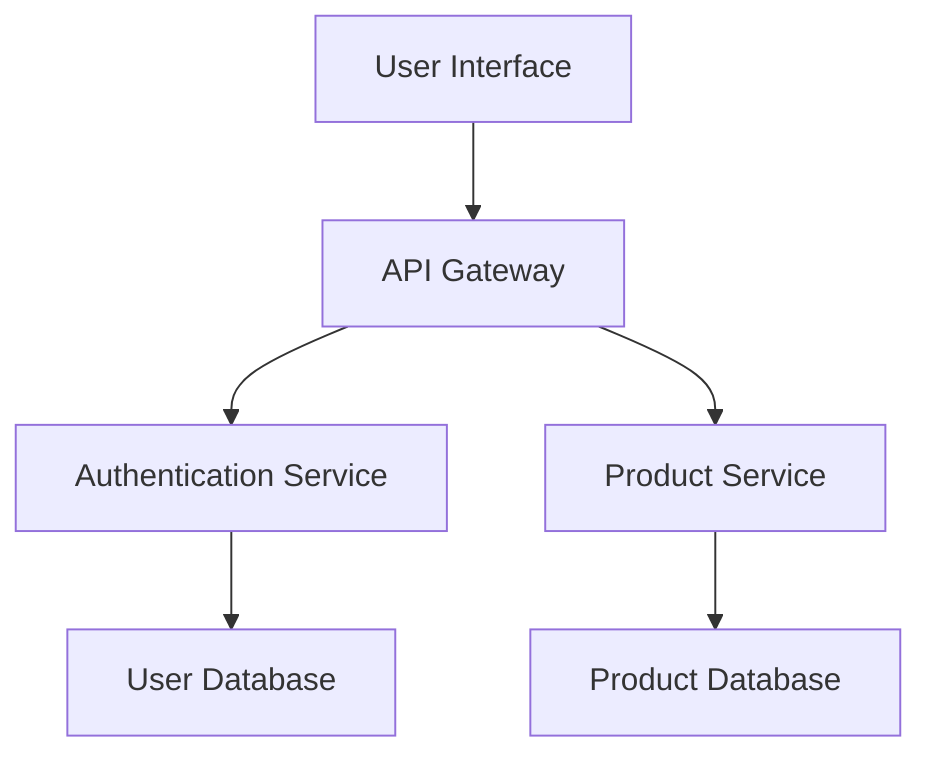
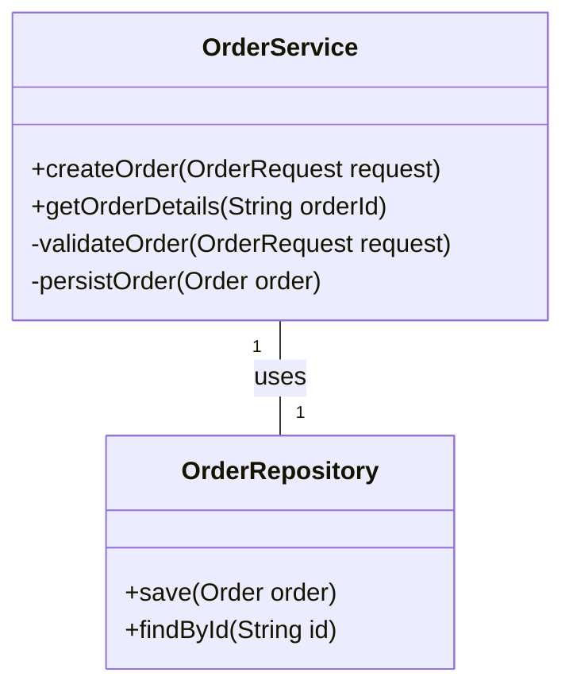

# 💻 Software Design Specification: [System/Module Name]

This document specifies the architectural and detailed design for the [System/Module Name]. It describes how the software will be structured, how its components will interact, and how it will fulfill the defined requirements.

---

## 1. Introduction

### 1.1 Purpose

The purpose of this Software Design Specification (SDS) is to describe the design of the [System/Module Name]. It serves as a blueprint for implementation, providing sufficient detail for developers to build the software and for testers to verify its correctness.

### 1.2 Scope

This document covers the design aspects of [briefly describe the scope, e.g., "the entire [System Name] software," or "the [Module Name] within [System Name]"]. It directly addresses the requirements outlined in [link to System-Level Requirements or Detailed Requirements document].

### 1.3 Definitions and Acronyms

[List any software-specific terms, definitions, or acronyms used in this document.]

## 2. Architectural Design

This section provides a high-level overview of the software architecture, showing major components and their relationships.

### 2.1 Overall Architecture

[Describe the chosen architectural style (e.g., Microservices, Layered, Event-Driven). Provide a high-level overview of the system's structure.]

*Reference C4 Model Context/Container Diagrams here if applicable.*

### 2.2 Major Components / Subsystems

[Identify and briefly describe the main logical or physical components of the software. For each, state its primary responsibilities.]

* **[Component A]:** [Description of responsibilities]
* **[Component B]:** [Description of responsibilities]
* ...

### 2.3 Data Flow and Interactions

[Describe how data flows through the system and how major components interact. Use diagrams where helpful.]

### 2.4 External Interfaces

\[Describe any interfaces with external systems, hardware, or other software components outside the immediate scope of this design. Refer to ICDs if available.]

* **\[External System X] Interface:** \[Description, e.g., "REST API for payment processing."]

* **\[Hardware Component Y] Interface:** \[Description, e.g., "SPI communication with sensor."]

## 3. Detailed Design

This section delves into the internal design of individual components or modules. For each significant component or module identified in Section 2, provide the following details:

### 3.1 \[Component/Module Name] Design

#### 3.1.1 Purpose & Responsibilities

\[Detailed description of what this component does and its specific responsibilities.]

#### 3.1.2 Internal Structure

\[Describe the internal breakdown of the component into smaller sub-components, classes, or functions. Use diagrams (e.g., class diagrams, sequence diagrams) as needed.]

#### 3.1.3 Data Structures

\[Specify the key data structures, objects, or data models used within this component, including their fields, types, and relationships.]

#### 3.1.4 Algorithms

\[Describe any complex or critical algorithms used within the component. Provide pseudocode or flowcharts if necessary.]

#### 3.1.5 Error Handling & Fault Tolerance

\[How will this component handle errors, exceptions, and unexpected conditions? What are its fault tolerance mechanisms?]

#### 3.1.6 State Management (if applicable)

\[Describe how the component manages its internal state and any state transitions.]

### 3.2 \[Another Component/Module Name] Design

\[Repeat Section 3.1 for other significant components/modules.]

## 4. Interface Design (Internal APIs)

\[Define the specific APIs or interfaces exposed by components for internal use by other components within the system.]

* **\[API Name]:** \[e.g., `ProductService.getProductDetails(productId)`]

  * **Purpose:** \[Briefly describe.]

  * **Input Parameters:** \[Name, Type, Description]

  * **Return Value:** \[Type, Description]

  * **Error Codes/Exceptions:** \[List and describe.]

## 5. Non-Functional Requirements (Design Considerations)

How does this design address the non-functional requirements (performance, security, scalability, maintainability, etc.)?

### 5.1 Performance

\[How is performance considered in the design? (e.g., caching strategies, asynchronous processing, efficient algorithms).]

### 5.2 Scalability

\[How is the design scalable? (e.g., stateless components, horizontal scaling, load balancing).]

### 5.3 Security

\[How does the design enforce security? (e.g., authentication, authorization, input validation, encryption, secure communication).]

### 5.4 Maintainability

\[How does the design promote maintainability? (e.g., modularity, clear separation of concerns, coding standards, documentation).]

### 5.5 Testability

\[How does the design facilitate testing? (e.g., dependency injection, clear interfaces, logging).]

## 6. Data Design

\[If applicable, describe the persistent data storage design.]

### 6.1 Database Schema / Data Model

\[Provide the logical or physical database schema, including tables, relationships, and key fields. Or describe the data model for NoSQL databases.]

### 6.2 Data Flow & Storage

\[Describe how data is stored, retrieved, and managed by the system.]

## 7. Security Considerations

\[Detailed breakdown of security aspects beyond non-functional requirements, if needed. (e.g., threat modeling, access control mechanisms, data protection policies).]

## 8. Deployment Considerations

\[How will the software be deployed? (e.g., deployment units, environment requirements, dependencies).]

## 9. Testing Considerations

\[How does this design facilitate testing at various levels (unit, integration, system)? What specific testability features are included?]

## 10. Traceability

This section notes how this design traces back to requirements and forward to implementation and testing.

* **Traces from:** \[Link to System-Level Requirements and Detailed Requirements]

* **Traces to:** \[Link to Source Code Repositories, Test Plans]

## 11. Open Issues / Future Work

\[Any known design limitations, unresolved issues, or planned future enhancements.]

## 12. References

\[List any other documents (e.g., requirements, ADRs, external specifications) referenced in this design document.]
