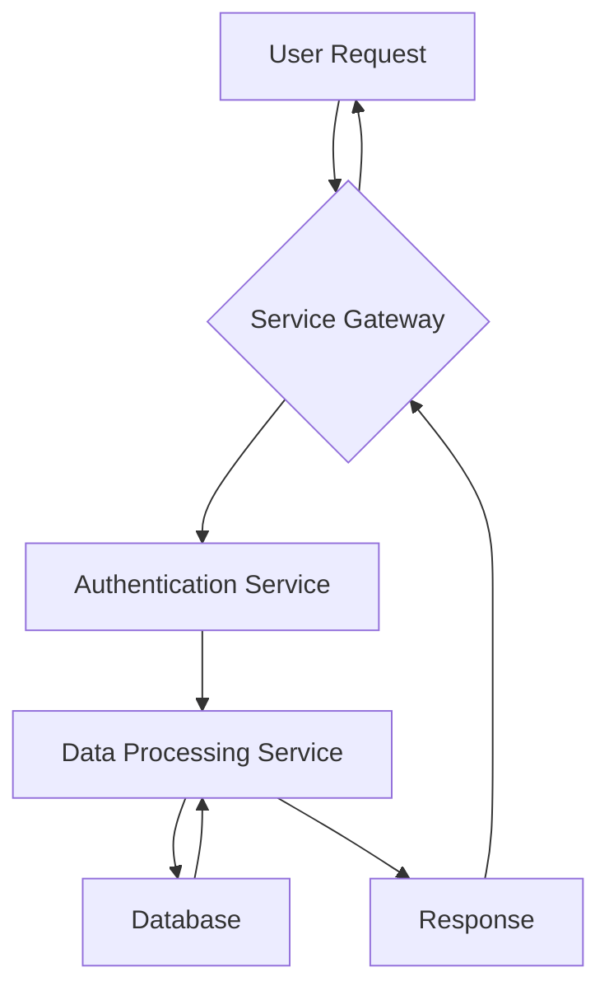

# 📝 RFC/Design Proposal: [Short, Descriptive Title of Proposal]

This document serves as a Request for Comments (RFC) or a Design Proposal for [briefly describe the area or problem this proposal addresses]. Its purpose is to present a proposed solution, explore its implications, and gather feedback from relevant stakeholders to inform a final decision.

---

## 1. Introduction

### 1.1 Purpose of this Document

The purpose of this RFC/Proposal is to [e.g., "propose a new approach for X," "detail a significant change to Y," "seek consensus on Z"]. It aims to provide sufficient context and detail to enable informed discussion and decision-making.

### 1.2 Background / Context

Provide a brief overview of the current situation, the system context, or the existing design that this proposal aims to change or augment. Why is this proposal necessary now? What led to this idea?

### 1.3 Problem Statement (if applicable)

If this proposal is addressing a specific problem, clearly articulate it here. What pain points, limitations, or inefficiencies does the current state have?

## 2. Proposed Solution / Design

Clearly describe the proposed solution or design. Be as specific as possible, including:

* **High-level overview:** What is the core idea?
* **Detailed description:** Explain how it works, including key components, interactions, and data flows.
* **Diagrams:** Use Mermaid, PlantUML, or other diagramming tools to illustrate the design (e.g., sequence diagrams, component diagrams).
* **Technical details:** Any specific technologies, algorithms, or patterns involved.

## 3. Rationale and Justification

Explain *why* this proposed solution is the best choice. What are its key advantages? How does it address the problem statement or achieve the desired outcomes?

* \[Benefit 1]

* \[Benefit 2]

* \[Alignment with strategy/principles]

## 4. Alternatives Considered

Describe other approaches or solutions that were considered but ultimately not chosen. For each alternative, briefly explain its pros and cons, and why it was rejected in favor of the proposed solution.

* **Alternative 1: \[Name of Alternative]**

  * *Pros:*

  * *Cons:*

  * *Reason for Rejection:*

* **Alternative 2: \[Name of Alternative]**

  * *Pros:*

  * *Cons:*

  * *Reason for Rejection:*

## 5. Implications and Consequences

What are the anticipated impacts of adopting this proposal? Consider both positive and negative consequences across various aspects:

* **Technical Impact:** (e.g., performance, scalability, maintainability, security, complexity, technical debt)

* **Operational Impact:** (e.g., deployment, monitoring, support, incident management)

* **Team Impact:** (e.g., learning curve, new skills needed, changes to workflow)

* **Business Impact:** (e.g., cost, time-to-market, user experience, compliance)

* **Risks:** Any new risks introduced or existing risks mitigated.

## 6. Open Questions / Areas for Discussion

List any specific questions or areas where the author is seeking particular feedback or discussion points from reviewers/stakeholders.

* \[Question 1]

* \[Question 2]

## 7. Next Steps

What is the expected process for this RFC/Proposal?

* \[e.g., "Comments due by YYYY-MM-DD."]

* \[e.g., "Review meeting scheduled for YYYY-MM-DD."]

* \[e.g., "Decision to be made by YYYY-MM-DD."]

* \[e.g., "If approved, initiate implementation phase and create relevant tasks/stories."]

* \[e.g., "If rejected, document reasons and explore alternative approaches."]

* \[e.g., "Communicate final decision to all relevant stakeholders."]

## 8. References

\[List any documents, research, or external resources referenced in this proposal.]
