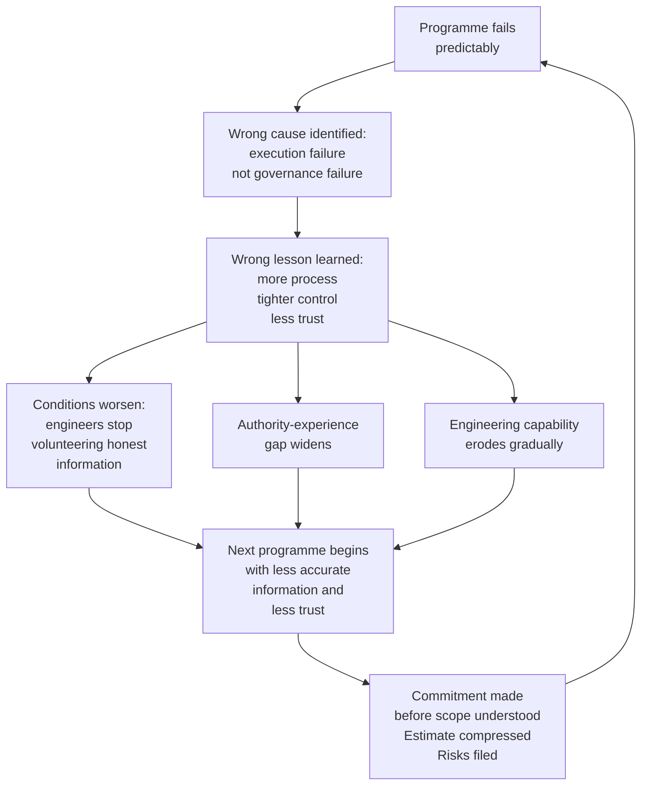

# Firmitas: A Framework for Sustainable Engineering Delivery

**Document:** 06 — Chapter 5: The Learning That Doesn't Happen
**Book section:** Part One — Why Programmes Fail

---

# Chapter 5 — The Learning That Doesn't Happen

Every organisation that runs the failure cycle described in the previous chapters believes it learns from it.

The lessons-learned exercise is commissioned. The post-mortem is conducted. The retrospective is held. The findings are documented. The recommendations are presented. The process improvements are agreed. The next programme begins with the improvements in place.

And fails in the same way.

This is not a coincidence. It is the predictable output of a learning system that is identifying the wrong cause and therefore producing the wrong lesson. The organisation is learning. It is just not learning the thing that would change the outcome.

---

## What the organisation concludes

When a programme fails in the way described in Chapter 1, the organisation's diagnostic process almost always arrives at one of a small set of conclusions. The team underestimated the complexity. The risks were not escalated in time. The requirements were not well enough defined. The programme needed better project management. The engineering team did not deliver what they committed to.

Each of these conclusions has enough surface validity to be credible. The requirements were not well enough defined — true, in the sense that the hardware-software interface ambiguities were never resolved. The risks were not escalated in time — true, in the sense that the three red items never generated the decisions they required. The engineering team did not deliver what they committed to — true, in the sense that the programme missed the contracted date.

But each conclusion locates the cause in the wrong place. The requirements were not well enough defined because a governance structure that had the authority and the client relationship to resolve the ambiguities did not do so. The risks were not escalated in time because the escalation mechanism — the programme board risk review — received the escalation and did not act on it. The engineering team did not deliver what they committed to because the commitment was not theirs — it was handed to them, already made, by people who were not in the room when the work was assessed.

The misattribution is not dishonest. It is structural. The diagnostic process that produces these conclusions is the same governance structure that produced the failure. The people conducting the lessons-learned exercise are working within the same organisational system, with the same authority structures, the same incentives, and the same cultural norms that shaped the failure in the first place. They are looking at the programme from inside the system that produced it, and they are seeing what that system allows them to see.

What the system does not allow them to see clearly is that the failure was governance failure rather than execution failure. Because seeing that would require the governance layer to conclude that the governance layer failed — and governance layers are not, in general, designed to reach that conclusion about themselves.

---

## The wrong lesson and its consequences

The wrong lesson produces a specific and predictable set of responses.

More process is added. Risk register templates are revised. Escalation protocols are strengthened. Gate reviews are made more frequent. Status reporting is enhanced. Programme management capability is reviewed. A lessons-learned library is created so that future programmes can benefit from the experience.

None of these responses address the cause. The cause was that the governance structure had the authority to act on accurate, timely information and did not. Adding more process to a governance structure that does not act on the information it receives produces more information that is not acted on. It does not change the governance behaviour. It changes the volume and format of the information while leaving the response to it unchanged.

The consequences of the wrong lesson extend beyond the next programme.

The first consequence is that the next programme begins under tighter control. The conclusion that the team underestimated the complexity, or did not escalate the risks, or did not deliver what they committed to, produces a response of increased oversight, more frequent reporting, and less latitude for engineering judgement. The team that failed — in the organisation's narrative — requires closer management.

The second consequence is that trust in engineering estimates decreases. The programme failed. The engineering team produced the estimates. The estimates, in the organisation's narrative, were wrong — because the programme did not deliver to them. The fact that the original honest estimate of seventeen months was closer to the actual outcome than the committed date of fourteen months is not visible in this narrative, because the honest estimate was replaced by the compressed plan before the programme formally began.

The third consequence is that the authority-experience gap widens. The governance layer that did not act on the risk register concludes that the risk register needs to be better, not that the governance layer's response to it needs to change. The engineering layer that produced the honest estimate and was overridden concludes — rationally — that honest estimates are not valued, and adjusts its behaviour accordingly.

The fourth and most damaging consequence is that the engineers who held the accurate information and were overridden begin, gradually, to stop volunteering it. Not through obstruction or disengagement, but through the accumulated experience of having been right, and having been neither acknowledged nor heard. The engineer who flags a risk, watches it get noted and filed, watches the programme fail in exactly the way the risk predicted, and then watches the failure attributed to execution rather than governance, has learned something important about the value of flagging risks in this organisation. They will still do their jobs. They will still produce estimates. But the estimates will be less honest, the risks will be less specific, and the information the organisation most needs will be less available than it was before the cycle ran.

This is how capable engineering organisations progressively lose access to the capability that would allow them to improve. Not through dramatic failures or mass departures, but through the slow erosion of the conditions that make honest information safe to surface.

---

## The compounding cycle

The failure cycle described in Chapter 3 does not simply repeat. It compounds. Each iteration produces conditions that make the next iteration more likely to fail and harder to recover from.

The compounding effect has a specific character that is worth understanding. It is not rapid. An organisation does not lose its engineering capability in one programme or two. The erosion is slow enough that it is not visible as a trend until it has been running for some time. Individual programmes fail for specific, identifiable reasons. The pattern connecting those reasons — the same misattribution, the same wrong lesson, the same tightening of control, the same erosion of trust — becomes visible only when someone looks across multiple programmes rather than within each one.

By the time the pattern is visible, the capability loss is significant. The engineers who held the institutional knowledge of why previous architectures were designed as they were have moved on. The culture of honest risk escalation that existed before the first compounding cycle has been replaced by a culture of managed optimism. The governance structure that was already insulated from delivery reality is now further insulated by a layer of reporting designed to show progress rather than to surface problems.

The organisation is not failing dramatically. It is failing gradually, in ways that feel manageable at each stage, until the accumulated cost of many cycles of the wrong lesson becomes impossible to ignore.

---

## What learning would actually look like

The contrast with an organisation that learns correctly from programme failure is instructive, not because it is common — it is not — but because it illustrates what the diagnostic process would need to be capable of producing in order to generate the right lesson.

A governance structure that learns correctly from the programme in Chapter 1 would ask different questions in the lessons-learned exercise.

Not: why did the engineering team not escalate the risks in time? But: why did the escalation mechanism — the programme board risk review at week three — receive the escalation and not generate the decisions it required?

Not: why were the requirements not well enough defined? But: who had the authority and the client relationship to resolve the hardware-software interface ambiguities, and why did that resolution not happen in the window where it could have changed the outcome?

Not: why did the engineering team not deliver what they committed to? But: who made the commitment, on what information, and what was the relationship between that commitment and the honest engineering assessment that was produced three weeks later?

These questions are harder to ask from inside the governance structure, because they locate the cause in the governance structure rather than in the execution layer. They require a willingness to examine the governance decisions — the decision to note the risk register rather than act on it, the decision to confirm the delivery date rather than surface the gap, the decision to move to task status rather than stay on the three red items until the decisions they required had been made — as the primary cause of the failure rather than as the context in which the execution failure occurred.

That willingness is rare. But it is not impossible. And in the organisations where it exists, the lessons-learned exercise produces something different: not more process, but changed governance behaviour. Not revised templates, but different conversations in programme reviews. Not tighter control, but clearer decision authority. Not less trust in engineering estimates, but better conditions for honest estimation.

The outcome, over subsequent programmes, is measurably different. Not perfect — complex programmes will always carry risk and uncertainty and will sometimes fail for reasons that could not have been predicted. But the specific, preventable failure described in Part One — the failure of accurate information to reach the people who could act on it, the commitment made before the work was understood, the risk register filed rather than acted on — becomes less common. And when it does occur, the organisation is more likely to identify the real cause and less likely to compound it with the wrong lesson.

---

## The original claim

Part One has now described the specific structural mechanism that Firmitas is built to address.

Engineering programmes fail when the people who make delivery commitments are not the people who have to keep them. When the gap between honest engineering assessment and commercial commitment is treated as a fact to be suppressed rather than a risk to be managed. When the governance structure receives accurate, timely information about programme risk and does not generate the decisions that information requires. When the failure that results is attributed to execution rather than governance. And when the lesson drawn from that failure makes the next one more likely — by adding process without changing behaviour, by tightening control without aligning authority with knowledge, by reducing trust in engineering judgement without examining the conditions that produced the judgement it distrusts.

This is not a description of incompetent organisations or bad people. It is a description of a structural problem that affects capable organisations with well-intentioned people across every sector, at every scale, producing outcomes that nobody wanted and that could have been avoided if the system had been designed differently.

The people closest to the work almost always know what is wrong. The question is whether the system allows that knowledge to reach the people who can act on it — and whether those people, when they receive it, have the operational understanding and the governance discipline to treat it as the decision request it is rather than the reporting artefact it is so often mistaken for.

Firmitas is the structural response to that question. Not a process to be installed. Not a methodology to be adopted. A framework built on an explicit philosophy about where knowledge lives, who should own commitments, how governance should treat risk information, and what leadership actually means in the context of systems that consistently produce outcomes their participants did not intend.

Part Two describes that framework. Every element of it connects back to what Part One has described. The principles are not values. They are structural positions. The governance model is not a preference. It is the direct response to a specific governance failure. The estimation approach, the risk register treatment, the delivery model, the team design — each is built around the specific failure mechanism that the programme in Chapter 1 so faithfully illustrated.

The framework cannot prevent all programme failures. Complex systems operating under genuine uncertainty will always produce some outcomes that could not have been predicted or prevented. What the framework is designed to prevent is the specific, common, and entirely avoidable failure of accurate information not reaching the people who need to act on it — and of the people who needed to act on it not doing so.

That failure is not inevitable. It is structural. Structural problems have structural solutions.

Part Two is the solution.

---

*End of Chapter 5*
