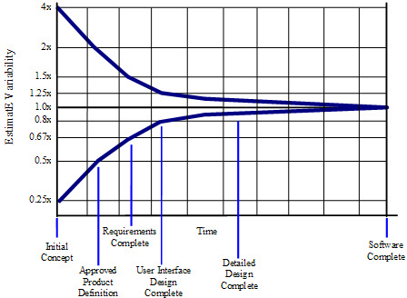

# Firmitas: A Framework for Sustainable Engineering Delivery

**Document:** 03 — Chapter 2: Estimation: Why It Fails and What Honest Looks Like
**Book section:** Part One — Why Programmes Fail

---

# Chapter 2 — Estimation: Why It Fails and What Honest Looks Like

The programme in Chapter 1 failed at the moment a commitment was made without an honest estimate. It was compounded at the moment the honest estimate arrived and was not used.

Understanding why requires understanding what estimation actually is, what it can and cannot achieve, what corrupts it, and what the governance layer's response to it reveals about the system surrounding the programme.

Estimation is not a precise science. It is a structured act of professional judgement — the best available assessment, at a specific point in time, of what a specific programme requires given what is currently known about it. The quality of an estimate depends on who produces it, what information they have access to, and the environment in which they are working. All three of these factors are shaped by the system surrounding the programme, not just by the capability of the individuals doing the estimating.

This is the point most often missed in how organisations respond to estimation failures. When a programme overruns its estimate, the failure is attributed to the estimate. The process is improved. The template is revised. The governance is tightened. None of this addresses the cause — because in most cases the estimate was not the failure. The environment that shaped the estimate, and the governance response to it, was.

---

## The cone of uncertainty

Before examining what corrupts estimation, it is necessary to establish what honest estimation can achieve — and specifically, to be precise about the relationship between how well a programme is understood and how accurately it can be estimated.

The cone of uncertainty describes that relationship. At the beginning of a programme — before requirements are defined, before architecture is established, before the key technical risks have been investigated — the uncertainty in any estimate is large. Not because the estimators are incompetent, but because the programme is genuinely not yet understood well enough to be estimated precisely. The honest acknowledgement of this state is a wide range. A precise single-point estimate at this stage is not an accurate estimate. It is manufactured precision applied to genuine uncertainty. The uncertainty does not disappear because the governance layer demands a number. It becomes invisible — and invisible uncertainty is the most dangerous kind.

As the programme progresses — as requirements are defined, architecture is established, and the major technical risks are resolved — the cone narrows. The range between the optimistic and pessimistic cases reduces. By the time the programme is well understood and the significant risks have been investigated, estimates can be substantially more precise.

The governance implication is direct. Demanding a precise single-point estimate before requirements are defined is not discipline. It is the demand for certainty that the programme's current state cannot support. The honest response to such a demand is a range — this is what we know, this is what we do not yet know, and this is the range within which the outcome is likely to sit given the current state of understanding.

Most organisations do not accept range estimates. They accept single-point estimates because single-point estimates can be put in a project plan and tracked against. The consequence is that engineers produce single-point estimates that reflect either genuine precision — when it exists — or manufactured precision that does not, while the uncertainty the cone represents is transferred silently to the risk register or absorbed into the programme's eventual overrun.

The cone of uncertainty does not disappear because the organisation refuses to acknowledge it. It persists as hidden risk until it surfaces as visible cost. The programme in Chapter 1 was at the wide end of the cone when the committed date was set. Nobody acknowledged the width. The uncertainty was assumed away rather than managed. By month six, it had become an eight-month overrun.

---

## What corrupts estimation — the management side

### More detail produces false precision, not accuracy

Detailed task-level estimates feel more rigorous than high-level ones. A plan with two hundred line items appears to have been carefully considered. It is not necessarily more accurate than a plan with twenty.

Estimation accuracy is determined by how well the scope is understood — not by how granular the task breakdown is. A detailed estimate built on poorly understood scope is precisely wrong rather than approximately right. The false precision of a comprehensive task plan gives the governance layer confidence it has not earned. The plan appears rigorous. The underlying assumptions on which the granular estimates rest have not been validated.

As McConnell documents in *Software Estimation*, the estimate that feels most precise is often the least reliable, because its precision has been constructed from detail on top of uncertainty that has not been resolved. The wide end of the cone cannot be narrowed by decomposing tasks more finely. It can only be narrowed by resolving the underlying uncertainty — by doing the work of defining requirements, validating the architecture, and investigating the key technical risks.

A high-level range estimate grounded in genuine scope understanding is more useful to programme governance than a detailed task plan built on scope assumptions. Precision that does not reflect reality is not a virtue. It is a liability that obscures the work still required to earn it.

### Estimates are not commitments

Many organisations treat the act of asking for an estimate and receiving one as the creation of a commitment. The engineering team has produced a number. They are now accountable for delivering to it — regardless of what changes after the estimate was made, regardless of whether the conditions it depended on were met, regardless of whether scope changed or identified risks were managed.

This conflation is one of the primary incentives for producing estimates that are known to be wrong but are defensible. If the estimate will become the commitment regardless of its content, the rational response is to produce a number the team believes it can be held to rather than one that honestly represents what the work requires.

Estimation and commitment are not the same act. An estimate is the best current assessment of what a programme requires given current understanding. A commitment is an agreement to deliver a specific outcome under specific conditions — a subject addressed fully in Chapter 9. Treating estimates as commitments destroys the conditions for honest estimation, because engineers who know their estimate will be used as a commitment calibrate it to what they can commit to rather than what they honestly assess.

### Past performance is not this programme

Estimation by analogy — this programme is similar to the last one, so it will take a similar amount of time — is one of the most common sources of optimistic baselines. Historical data provides useful context. It is not a substitute for assessment of the specific programme.

The differences between programmes matter at least as much as the similarities. A different team composition changes the estimate. A different regulatory environment changes it. A different level of integration complexity changes it. The estimate that does not account for what is different about this programme from the one being used as the analogue is an estimate of the past programme applied to the present one. It will be wrong by the amount the two programmes differ — which is usually more than the people making the analogy have acknowledged.

### Parallel working does not compress timelines proportionally

The belief that adding teams or running work streams in parallel reduces the overall timeline in direct proportion to the resource added is persistent and wrong. Adding people to a programme increases coordination overhead, creates integration risk at every interface, and introduces dependencies that serial working avoids.

Brooks identified this in 1975: adding people to a late programme makes it later. The communication overhead between team members grows non-linearly with headcount. The integration cost between parallel work streams is not captured in the estimates for the individual streams. The timeline compression from parallelisation is always less than the resource increase suggests — and at high levels of parallelisation, the coordination overhead can increase rather than reduce overall duration. Five decades after *The Mythical Man-Month*, this dynamic continues to produce the same failures in programmes that add resource in response to slippage without understanding what the addition will cost them.

---

## What corrupts estimation — the engineering side

### The estimate covers what is known, not what exists

Engineers estimate the work they can see — the tasks they understand, the components they know how to build, the integrations they have done before. They systematically underestimate — not through carelessness but because it is structurally invisible — the work that is not yet known. The integration effort across discipline boundaries. The rework that ambiguous requirements will produce. The time required to validate assumptions about third-party components. The coordination overhead of working across teams that have different cadences and different assumptions about shared interfaces.

The known work is estimable. The unknown work is where most overruns live. An estimate that does not explicitly account for what is not yet known — that does not build in investigation time for open questions and contingency for the risks that will materialise — is an estimate of the programme the team currently imagines, not the programme that exists. The gap between the two is the overrun.

### The happy path is not the most likely path

Estimates produced by imagining how the work will proceed when everything goes well describe a programme that does not exist. Complex engineering programmes do not follow the happy path. Integration failures. Specification ambiguities requiring rework. Architectural assumptions that turn out to be wrong. These are not edge cases. They are the predictable reality of building complex systems under uncertainty.

An estimate based on the happy path is an estimate of best case, not most likely. The most likely case accounts for the variation that programmes of this type reliably experience. In the three-point model described in the next section, best case and most likely are different numbers — because best case requires specific conditions to hold that do not always hold.

### Non-functional requirements are not secondary

Estimates in software and firmware development frequently focus on functional delivery — the capabilities and behaviours the system must provide. Performance, security, reliability, maintainability, testability, and regulatory compliance are treated as properties that will be addressed once the functionality is in place.

This is not a planning approach. It is a deferred cost accumulation strategy. Non-functional requirements are not properties that can be added to a completed system without significant rework. They are properties of the architecture and the implementation choices made throughout development. A system built without explicit consideration of its performance requirements will not meet those requirements without redesign. A system built without explicit consideration of testability will be expensive and slow to verify.

An estimate that omits non-functional requirements is an estimate of a prototype. The cost of the gap between the prototype and the product is paid during validation and in operation — substantially later and substantially more expensively than it would have been paid during development.

### The estimate does not state its conditions

This is the most consequential engineering-side estimation failure — and the most common. Engineers produce estimates that are honest given their current understanding but do not make explicit what that understanding depends on.

The estimate assumes the interface specification is as currently documented. It assumes the third-party component behaves as the supplier claims. It assumes the test environment will be available when the integration phase begins. These are conditions — things that must be true for the estimate to hold. When they are not stated, the estimate appears unconditional. The governance layer accepts it as unconditional. When the conditions are not met and the estimate proves wrong, the engineering team appears to have failed to deliver what they committed to.

Stating conditions explicitly is precisely what the three-point estimate with attached risks achieves. The estimate is honest given current understanding. The conditions that understanding depends on are stated. The risks that would invalidate the conditions are named and priced. The governance layer knows what it is accepting — not just a number but the conditions and risks that give the number its meaning. When the governance layer accepts the number and not the conditions, as happened in Chapter 1, the commitment it has made is not the commitment the estimate described.

---

## The estimation environment

All of the corruptions described above are influenced by the environment in which estimation occurs. The most important environmental variable is not the capability of the estimators. It is whether the environment makes honest estimation rational.

In an environment where honest estimates are accepted, used as the basis for planning, and supported with the conditions they require, engineers produce honest estimates. The conditions that make the estimate achievable are addressed. The risks are managed. The estimate proves accurate not because the estimators were prescient but because the system was designed to make it accurate.

In an environment where honest estimates are challenged, compressed, and overridden, engineers learn that honesty is not what the environment rewards. They calibrate to what the environment will accept. The calibration may be toward inflation — produce a higher number that will survive the inevitable compression and still be achievable. Or it may be toward the committed date — produce whatever number gets the programme board to proceed.

Neither calibration produces a useful estimate. Both produce numbers that look like estimates but are responses to governance pressure. And the programme is managed against those numbers — which is why it fails in the way Chapter 1 describes.

---

## What good estimation looks like

Good estimation is a continuous process of narrowing the cone — of replacing uncertainty with understanding through investigation, validation, and the progressive resolution of open questions.

At the early stages, an honest estimate is a range. It acknowledges the width of the cone at that point. It identifies the specific investigations that will narrow it — the requirements work that will resolve scope ambiguity, the architectural spikes that will validate technical assumptions, the supplier evaluations that will confirm or refute dependency claims. It commits to a review point at which, once those investigations are complete, the estimate will be updated.

As the programme progresses and the cone narrows, the estimate becomes more precise. At the point where the programme is well enough understood to support a three-point estimate, that estimate is produced. Best case is what happens if the specific conditions that enable it are all met — and those conditions must be stated explicitly, not assumed. Most likely is the realistic professional judgement of what the programme will take given the variation that programmes of this type experience. Worst case is what happens if the named risks materialise — and those risks must be named specifically.

The governance layer's response to estimation at each stage should match the stage. At the wide end of the cone, accept the range, fund the investigations that will narrow it, and treat the range as honest current information. At a later stage, accept the three-point estimate with its conditions and risks, make the decisions the conditions require, and govern the programme against the most likely case — not the best case presented as the plan.

---

## When the estimation environment breaks down

When an engineering team operates in a governance environment that compresses estimates, treats them as commitments, and applies pressure to reduce numbers that were produced honestly, a specific and predictable consequence follows.

In some teams, the response is to produce numbers that are higher than the honest estimate — because experience has taught the team that honest numbers will be reduced, and the reduced number needs to be achievable. Management commonly refers to this as sandbagging.

It is worth naming this directly. In low-trust environments where estimates are routinely overridden, some teams do build protection into their numbers as rational self-protection. This is not dishonesty. It is adaptation to an environment that has made honest estimation systematically unrewarding. The team is behaving rationally in the system they are in.

What matters is what that adaptation costs. Each inflated estimate reinforces the governance layer's belief that engineering estimates cannot be trusted. The governance layer applies more pressure. The next estimate is more inflated. The cycle compounds. Over time, the governance layer and the engineering team lose the ability to have an honest conversation about what a programme requires, because neither side trusts the numbers the other produces. The programme is managed on fictions. The outcome is determined by that, not by the capability of the people involved.

The correct response is not more pressure. It is a different environment — one in which honest estimates are accepted, the conditions they depend on are managed, and the gap between a commercial commitment and an honest estimate is treated as a risk to be managed rather than a number to be suppressed.

When that environment exists, the inflated numbers stop. Not because engineers have been challenged into honesty but because honesty has become the rational response. And the programme can be governed against reality rather than against a plan that was manufactured to avoid it.
