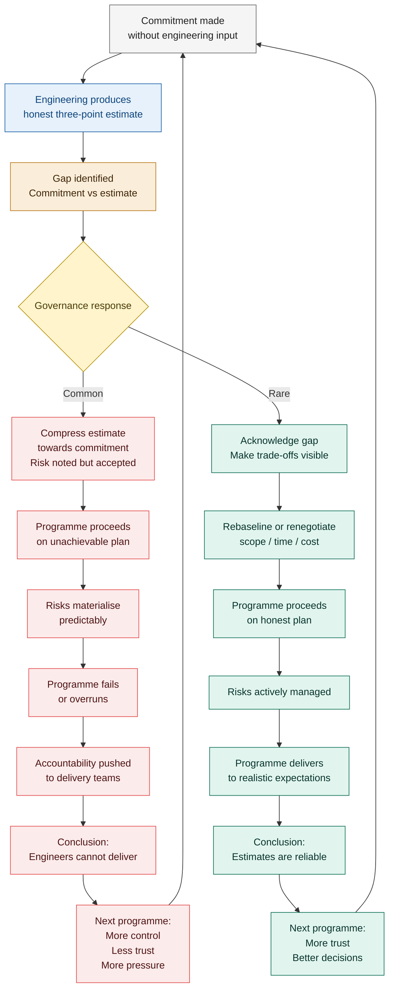

## The Commitment That Wasn't Theirs

At some point in the life of almost every engineering programme, a date is set that the engineering team did not set.

It may arrive as a contract commitment, agreed by the commercial team before engineering was consulted. It may arrive as a board-level announcement, made for strategic or political reasons, that the product will be available by a specific quarter. It may arrive as a customer expectation, established in pre-sales conversations that engineering was not part of, which hardened into a contractual obligation before anyone thought to check whether it was achievable.

However it arrives, the effect is the same. The programme begins with a commitment that was made by people who will not have to keep it, handed to people who had no part in making it, presented as a fixed constraint within which delivery must occur.

This is the single most common structural cause of engineering programme failure. Not incompetence. Not insufficient process. Not inadequate tools or methodologies. The commitment that arrived already made, from above, before the work was understood.

---

### The reverse-engineered plan

When a date is set before the scope is understood, planning does not produce a plan. It produces a rationalisation.

The planning process runs backwards. The date is fixed. The scope is known, approximately. The task is to construct a sequence of activities that will connect the current state to the required outcome by the required date. This is not planning. It is the construction of a narrative that makes the date look achievable. And in most organisations, the people doing the constructing know it.

The reverse-engineered plan has several distinguishing characteristics that experienced engineers recognise immediately.

Contingency is absent or minimal. Every task is estimated at best case. Dependencies are shown as sequential when they are actually parallel, or as parallel when they are actually sequential, depending on which arrangement produces the right end date. Risks appear on the risk register but are not reflected in the plan - the plan assumes they will be managed away, not that they will materialise and require time to address. Integration phases are compressed to whatever space remains after the development tasks have been allocated. Testing is scheduled for the end, with whatever time is left.

The plan, when complete, shows delivery on the required date. Everyone in the planning exercise knows the plan is not achievable as written. Nobody says so clearly, because saying so would require challenging the date, and challenging the date would require either a difficult internal conversation or a difficult client conversation, neither of which anyone is incentivised to initiate.

The plan is presented to programme governance. It is approved. The programme begins.

At some point - usually between months three and six, depending on the complexity of the programme and the severity of the compression - the plan encounters the work. The work does not conform to the plan's assumptions. The integration phase that was allocated three weeks requires eight. The third-party dependency that was assumed to be available turns out to need qualification. The test environment that was scheduled to be ready at month four is ready at month six.

Each individual divergence from the plan is reported as a delay. Each delay is treated as an execution failure. The plan was achievable. The team has not achieved it. The corrective response is pressure, increased reporting frequency, and questions about whether the team is the right team.

None of this addresses the cause. The plan was not achievable. It was never achievable. It was constructed to show a date, not to reflect a reality.

---

### The iron triangle ignored

Every engineering programme operates within three constraints: time, cost, and quality. These three constraints are related. Changing one changes the others. This relationship is not controversial - it is one of the oldest and most consistently validated observations in engineering programme management.

Delivering faster costs more, because you need more resource in parallel, or you need to buy time through shortcuts that will cost you later. Delivering cheaper takes longer, because you have less resource. Delivering faster and cheaper requires accepting lower quality - fewer features, more defects, more technical debt, a system that is less maintainable and less resilient than one built with adequate time and resource.

These trade-offs are real. They are not negotiable. The physics of complex systems does not make exceptions for commercial commitments.

Most programme governance structures behave as though the triangle does not apply to them. The client wants it delivered on the original date, within the original budget, to the original scope and quality. The programme board does not want to have the conversation about trade-offs. The commercial team does not want to tell the client that the scope is not achievable in the time for the money. Nobody wants to be the person who says that something has to give.

The result is that all three constraints are nominally maintained while the programme quietly compromises on quality in ways that are never formally acknowledged. Features are descoped without being formally removed from the requirements. Testing is compressed without the acceptance criteria being formally revised. Technical debt accumulates without being formally recognised as a risk. The programme delivers something that looks, on paper, like what was contracted, while actually delivering something materially different - less complete, less tested, less maintainable than the original specification required.

This is not dishonesty in the individual sense. It is the rational collective response to a governance structure that insists all three constraints are fixed while providing no mechanism for managing the tension between them. The programme team does what it must to show progress against a plan that does not reflect reality. The quality that is quietly compromised is the only constraint that can be degraded without immediately showing on a dashboard.

The cost appears later. In production defects. In integration failures. In the support burden of a system that was not built to be maintained. In the next programme that inherits the technical debt of this one. By that point, the people who made the governance decisions that created the pressure are rarely in the room where the cost is being counted.

---

### The commitment made on someone else's behalf

The most damaging variant of the commitment problem is the one that appears most normal.

An executive signs a contract. A sales director confirms a delivery date to a client. A product manager commits to a feature release in a roadmap presentation. A programme director announces a go-live date to the business. In each case, a commitment has been made. In each case, the commitment was made by someone who will not personally deliver against it.

The commitment then flows down through the organisation. By the time it reaches the people who will actually do the work, it has the weight of contractual obligation, management expectation, and commercial necessity behind it. Challenging it is not simply a matter of offering a different estimate. It is a matter of challenging something that is already agreed, already communicated, already built into someone else's plans.

This is the structural mechanism behind the failure in Chapter 1. The commercial director did not intend to set an unachievable date. They were doing their job - winning business, making commercial commitments, managing client relationships. The engineering team did not intend to fail to deliver. They were doing their job - assessing the work honestly, flagging the risks, producing the best estimate they could with the information available.

The failure was not in either of those individual actions. It was in the gap between them. A commitment was made before the assessment was possible. The assessment, when it came, showed that the commitment was at risk. The governance structure had no mechanism for connecting the two - for treating the gap between the commitment and the honest assessment as a risk to be managed rather than an awkward fact to be noted and moved past.

The commitment was not the engineering team's. It became their problem the moment it was handed to them.

---

### The cycle

The diagram below shows how this plays out across a programme - and across the programmes that follow it.

The left-hand path - the common one - does not produce a single failure. It produces a cycle. Each iteration of the cycle reinforces the conditions that cause the next failure. Trust in engineering estimates decreases. Control increases. The gap between the people who make commitments and the people who keep them widens. The next programme is harder to run well than the one before it.

The right-hand path exists. It requires a specific moment of governance courage - the willingness to treat the gap between the commitment and the honest estimate as a risk to be managed, not a problem to be suppressed. It requires someone with sufficient authority to say: the honest estimate does not match the commitment. That is information. What are we going to do about it?

That moment almost never occurs in organisations where the left-hand path has become normal. Because the left-hand path has taught everyone in the governance structure that the gap is not a risk to be managed. It is an awkward fact to be noted, filed, and moved past on the way to task status.

---

### The commercial and contractual reality

It would be incomplete to discuss the committed date without acknowledging the context in which most committed dates are made.

Fixed-price contracts are a commercial reality. Clients need to plan their own programmes and cannot do so against an open-ended delivery estimate. Competitive bids require price and schedule commitments. Boards and investors expect delivery dates. Programme roadmaps require milestones. These are not unreasonable requirements. They are the conditions under which engineering organisations operate.

The problem is not the existence of commitments. The problem is the absence of honesty about what commitments are.

A commitment made before scope is understood is not a delivery commitment. It is a commercial gesture - a statement of intent that creates expectations in the absence of evidence. Most fixed-price contract dates are commercial gestures. They represent the date the client needs, or the date the market opportunity requires, or the date the business case depends on. They do not represent the date that a genuine assessment of the work would produce.

This distinction matters because it changes what the organisation should do when the honest estimate diverges from the committed date.

When the honest estimate diverges from a genuine, evidence-based commitment - one produced by people who understood the work and made a specific promise about what they would deliver - the divergence is a problem with the estimation. The commitment was made in good faith based on understanding. The estimate has shown that the understanding was incomplete. That requires investigation.

When the honest estimate diverges from a commercial gesture - a date set before the work was understood - the divergence is not a problem with the estimation. The estimation is doing its job: revealing the gap between aspiration and reality. The problem is the gap itself, and the question is what to do about it.

What most organisations do is suppress the gap. The estimate is compressed toward the commitment. The risk register is noted. The programme proceeds on the commercial gesture, now dressed as a plan.

What they should do is manage the gap. This requires a conversation - usually an uncomfortable one - about what is genuinely achievable and what trade-offs are available. It may require a conversation with the client about revised expectations. It may require an internal conversation about what can be descoped, what additional resource could be justified, or what the real cost of the overrun will be if the date is held and the quality compromised.

None of those conversations are easy. All of them are cheaper than the conversation that happens at month six when the programme has failed in exactly the way the honest estimate predicted it would.

The principle is simple even if the practice is difficult: a plan that requires honest risks to be suppressed is not a plan. It is a schedule waiting to become an incident report.

---

### When the engineering team is handed the commitment

The person in the most difficult position in this story is not the commercial director who made the commitment. They made a commercial decision, rationally, within their authority and their frame of reference. It is not the programme board member who noted the risk register and moved on. They responded to the information in the way their governance culture had taught them to respond to it.

The most difficult position belongs to the senior engineer or programme manager who receives the commitment, understands immediately that it is not achievable on an honest plan, and must decide what to do about it.

In most organisations, the options are narrower than they should be.

Challenging the commitment directly requires political capital, a clear chain of evidence, and confidence that the challenge will be received as professional honesty rather than obstruction. In many organisations, that confidence is not warranted. The engineer who challenges the committed date is the engineer who is not a team player, who does not understand the commercial reality, who is being negative.

Accepting the commitment and planning around it - the reverse-engineered plan - produces a programme that everyone knows is not achievable. The engineer who does this has bought themselves a quieter month and a much harder programme.

The middle path - accepting the commitment as a working target while formally documenting the gap, attaching the risks explicitly, and establishing clear trigger points at which the gap will require escalation - is the most rational response and the one Firmitas is designed to support. It does not require the engineer to challenge the commitment directly. It requires them to make the conditions of the commitment visible and to maintain that visibility throughout the programme, so that when the risks materialise, the governance structure cannot claim surprise.

That middle path is not risk-free. It requires a governance structure that treats risk registers as decision instruments rather than reporting artefacts. In the programme described in Chapter 1, that governance structure did not exist. The risks were visible. The decisions were not made. The outcome was predictable.

Building a governance structure where that middle path is not just available but normal - where the gap between commitment and honest estimate is treated as a programme risk to be managed rather than a fact to be suppressed - is one of the primary structural objectives of this framework.

---

### The double cost of getting it wrong

One pattern worth naming specifically, because it is often invisible in programme retrospectives, is what happens when an organisation delivers a complex platform or product for its own operational use.

When delivering for an external client under contract, the cost of an overrun is bounded. Penalty clauses, reputational damage, a difficult client relationship. Real costs, but defined ones. The delivering organisation absorbs them and moves on.

When an organisation delivers for its own use - building the infrastructure it needs to operate - the overrun hits twice. The first hit is the delivery overrun itself. The second is the operational cost of the delay: every week the platform does not exist is a week the business operates on workarounds, legacy systems, or manual processes, incurring cost and creating risk that the project budget never captured. And when the platform eventually arrives - built under pressure, with risks deferred, with quality compressed to meet a date - the technical debt does not disappear. It becomes part of the operational infrastructure the business depends on.

This second hit is almost always invisible in programme governance. The project cost is on one ledger. The operational cost of lateness is on another. The long-term cost of quality shortcuts is on a third. The decisions that produced all three costs were made in the first programme review, when the risk register was noted and the task status was reviewed. But by the time all three costs become visible, the connection to that governance decision has been lost.

The principle is the same whether the delivery is internal or external: the cost of a commitment that was not made by the people who have to keep it is almost always higher than it appears at the point where it is made. The difference is that in internal delivery, the organisation has nowhere else to send the bill.

---

### The next step

The chapters so far have described a failure that originates in a commitment, persists through a governance structure that cannot process honest information, and compounds through a cycle that makes the next failure more likely than the last.

Chapter 4 examines what that failure looks like from the inside - not the timeline of events, but the six interacting systems that produce it. Understanding those systems is the prerequisite for changing them.
