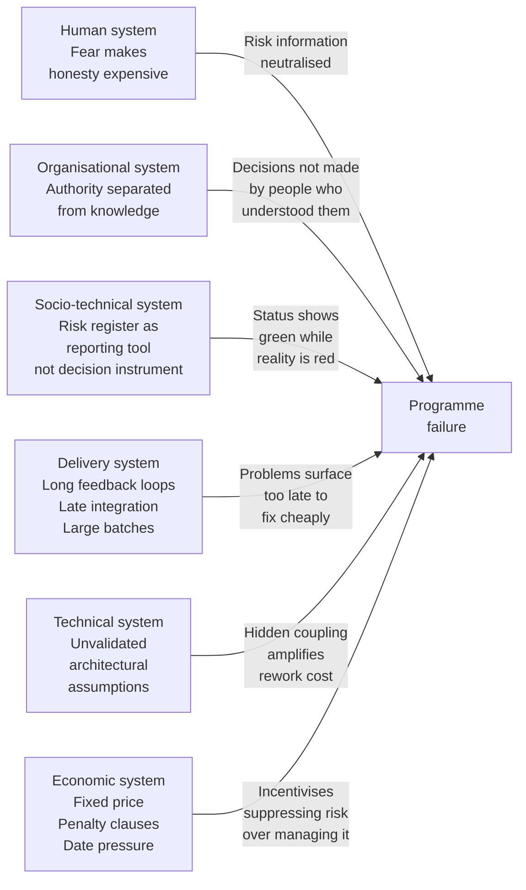

## What the System Did With the Information

The programme in Chapter 1 did not fail because the information was absent. It failed because the system did not know what to do with the information it had.

The lead systems engineer produced an honest three-point estimate. The risk register named three specific, actionable risks. The window for intervention was clearly visible at week three. All of this information existed. It was in the room. It was in the documents. It was in the heads of every engineer on the programme.

And the programme failed anyway.

This is the question that process improvements - better templates, revised escalation protocols, more frequent reviews - never adequately answer. If the information existed, why did the system not act on it? What was it about the way the programme was organised, governed, and structured that caused accurate, timely, actionable information to be received, noted, and not used?

The answer is not a single cause. It is six interacting systems, each of which contributed something to the failure, and none of which can be fixed in isolation without the others reasserting the conditions that produced it.

---

### Thinking in systems

Before naming those six systems, it is worth being precise about what a system is and why the distinction matters.

A system, in the sense used throughout this book, is not a process or a methodology or an organisational chart. It is a set of interacting elements - people, structures, incentives, tools, constraints - that together produce outcomes. The behaviour of a system is not determined by any single element. It emerges from the interactions between elements. Change one element without changing the interactions and the system reasserts itself. The new template gets used in the same way as the old template. The revised escalation protocol gets applied by the same governance culture that ignored the previous one.

This is why the lessons-learned exercise in Chapter 1 produced no lasting change. It identified elements - the risk register format, the escalation protocol, the review frequency - and changed them. It did not change the interactions. The new elements were absorbed by the same system and produced the same outcomes.

Engineering organisations are complex systems. Their behaviour is produced by the interaction of human systems, organisational systems, socio-technical systems, delivery systems, technical systems, and economic systems. None of these can be optimised in isolation without degrading the whole. Understanding how each contributed to the failure in Chapter 1 is the prerequisite for building a framework that addresses them as a coherent whole rather than as a series of independent problems.

---

### The six systems

#### Human systems

Human systems encompass the motivation, trust, incentives, psychological safety, communication patterns, and informal power structures that determine how people actually behave - as opposed to how the organisational chart says they should behave.

In the programme in Chapter 1, the human system was operating under a specific and identifiable constraint: it was not safe to say certain things clearly.

The lead systems engineer produced an honest three-point estimate and a risk register with three red items. That was an act of professional courage in an environment where the commercial commitment had already been made and the expectation of delivery was already established. Most engineers in that position would have felt the pressure to produce a more comfortable number. The fact that an honest assessment was produced at all is evidence that the human system had not entirely collapsed.

But the human system had shaped the response to that honest assessment in a way that neutralised it. The programme board members who noted the risks and moved on were not behaving irrationally. They were behaving in the way that programme boards in their organisation behaved when faced with a risk register that contained uncomfortable information. The cultural norm - ask for mitigation plans, note the risks, move to task status - was the learned response of a human system that had not been designed to make hard decisions uncomfortable to avoid.

The human system had also shaped the behaviour of everyone downstream of the programme board. The engineers who wrote firmware against an ambiguous specification, making a decision rather than escalating indefinitely, were behaving rationally in a system where escalation was slow, uncertain, and unlikely to produce a timely resolution. The programme manager who reported mostly-green task status was behaving rationally in a system that measured task completion and not programme health.

People behave in ways the system makes rational. The human system in Chapter 1 made avoidance rational and honesty expensive. Until that changes, no amount of process improvement will change what the system produces.

#### Organisational systems

Organisational systems include the operating model, governance structures, funding mechanisms, reporting lines, portfolio management, and performance evaluation frameworks that determine who is allowed to decide what, how priorities are set, and what success looks like institutionally.

The organisational system in Chapter 1 had a specific structural flaw that is common across the industry: decision authority was concentrated at a level that lacked operational knowledge, while operational knowledge was concentrated at a level that lacked decision authority.

The programme board had the authority to make the decisions the programme needed - to resolve the hardware-software interface ambiguity with the client, to validate the third-party component independently, to procure the test environment early enough to be useful. The programme board did not have the operational understanding to recognise that those decisions were urgent, that the window for making them was closing, and that not making them was not a neutral act but a choice with a specific and predictable consequence.

The engineering team had that operational understanding. They had named the risks. They had attached timelines to them. They had presented the information in a form that should have been sufficient to generate decisions. The engineering team did not have the authority to make the decisions themselves - the client conversations, the procurement approvals, the architectural trade-offs that required budget and business sign-off were all above their authority level.

This is the authority-experience gap operating at the level of organisational structure. It is not a matter of individual incompetence or bad faith. It is the predictable output of an organisational system that concentrated decision authority in a governance layer insulated from delivery reality.

The performance evaluation framework reinforced this. Programme board members were evaluated on commercial outcomes - the contract was won, the relationship was maintained, the date was held as long as possible. They were not evaluated on whether the governance decisions they made in programme reviews were good decisions. The cost of those decisions - the six weeks of rework, the four-week architecture redesign, the two months of delayed integration testing - was attributed to execution rather than governance. The organisational system ensured that the people who made the decisions that produced the failure never bore the cost of it.

### Socio-technical systems

Socio-technical systems sit at the intersection of people and technology. They include the toolchains, documentation practices, reporting tools, communication platforms, and workflows through which work gets done and information flows.

The risk register in Chapter 1 failed as a socio-technical system. Not because it contained wrong information - it contained correct information - but because it was designed as a reporting tool rather than a decision instrument.

A risk register designed as a reporting tool produces reports. It captures risks, rates them, attaches mitigation plans, and generates a document that can be reviewed in programme governance. It confirms that risk management is happening. It does not generate decisions, because it is not designed to. It does not escalate automatically when a trigger date passes without action. It does not connect a risk item to the programme schedule in a way that makes the impact of non-action visible. It does not distinguish between a risk that has been mitigated and a risk that has been given a mitigation plan that requires a decision nobody has made.

The three red items in Chapter 1 had been given mitigation plans. The mitigation plans required decisions - a client conversation, an independent component evaluation, a procurement approval - that were above the engineering team's authority. Those decisions were not made. The risks remained live. The register showed amber because mitigation plans existed. The system had been designed to produce a status, not to drive a decision.

The task status reporting system had the same property. It was designed to show what had been completed, not to show whether the programme was healthy. Green task completion in a programme with three unresolved red risks and a plan built on best-case assumptions looks the same in a task status report as green task completion in a programme with no significant risks and a realistic plan. The socio-technical system was not designed to surface the difference.

#### Delivery systems

Delivery systems define how work moves from intent to outcome. They include feedback loops, batch sizes, handoffs, validation mechanisms, risk management practices, and release strategies.

The delivery system in Chapter 1 had a feedback loop that was too long and too slow to be useful.

The honest estimate was produced at week three. The first material consequence of the unresolved risks - the six weeks of rework on the firmware written against an ambiguous specification - arrived at month four. The connection between the week-three risk and the month-four consequence was clear in retrospect. It was not visible in the delivery system's feedback loops because those feedback loops were designed around task completion rather than risk materialisation.

The delivery system had also been structured in a way that deferred integration. In complex hardware-firmware-software programmes, integration is where the real risks surface. Hidden dependencies, incompatible assumptions, timing constraints that only become apparent when components operate together - these are not visible in unit development but become visible immediately in integration. Deferring integration to a late phase - as the reverse-engineered plan had done, allocating whatever time remained after the development tasks had been filled - is the delivery system equivalent of deciding not to look at the problem until it is too late to fix it cheaply.

The batch size of the work was also too large. Firmware was being developed against a full, unvalidated specification rather than against a small, validated slice of it. The hardware-software interface ambiguities had not been resolved before development began in earnest. When the ambiguities turned out to matter, the rework was not limited to a small, recently-completed piece of work. It extended across everything that had been built on the ambiguous assumptions.

A delivery system designed for learning - one with short feedback loops, small batch sizes, and early integration - would have surfaced the firmware specification problem in week four rather than month four. At week four, it is a two-week problem. At month four, it is a six-week problem with downstream consequences.

#### Technical and architectural systems

Technical and architectural systems include the software, firmware, hardware, infrastructure, and integration architecture of what is being built. Architecture is not just a technical concern - it encodes assumptions about how change occurs, who owns what, and where failure is tolerated.

The architectural dependency on the third-party software component in Chapter 1 was a technical system risk that had been identified but not managed. The component was a load-bearing element of the architecture. Its suitability had been assumed rather than validated. When the validation finally occurred, the assumption proved wrong and the architectural dependency had to be redesigned.

This is a pattern that appears consistently in programmes that fail. An architectural assumption - that a component is suitable, that an interface is stable, that a dependency can be managed - is made early, before the evidence is available to validate it. The assumption is not flagged as an architectural risk. It is treated as a design decision. When it turns out to be wrong, the redesign cost is classified as a delivery problem rather than an architectural one.

The technical system had also accumulated hidden coupling. The architecture redesign required changes to components that had already been completed and tested - because those components had been built in ways that assumed the validity of the architecture that was being redesigned. That coupling was not visible on the architecture diagram. It was embedded in the implementation. When it surfaced, it expanded the scope of the rework significantly beyond what a surface-level assessment of the architectural change would have suggested.

#### Economic systems

Economic systems include the market and competitive forces, cost structures, regulatory constraints, pricing models, and commercial incentives within which the programme operated.

The economic system had produced the committed date in the first place. The client needed the product by a specific date because their own programme depended on it. The delivering organisation had bid competitively to win the contract and had accepted the date as a commercial necessity. The penalty clauses created a financial incentive to maintain the date even when the honest estimate showed it was unachievable. The fixed-price structure meant that the cost of overruns would be borne by the delivering organisation, creating pressure to minimise reported risk rather than manage actual risk.

These economic incentives were not incidental to the failure. They were structural inputs to it. The commercial director who committed to the date was responding rationally to the economic system. The programme board that held the date despite the risk register was responding rationally to the economic system. The engineering team that was asked to find a way to make the date work was being asked to solve an economic problem with engineering effort - which is not a solvable problem, but is a very common request.

The economic system also shaped the lessons-learned exercise. The cost of the overrun was real and visible - delay penalties, additional resource, client relationship damage. The cost of the governance decisions that produced the overrun - the decision to note the risk register rather than act on it, the decision to confirm the delivery date rather than surface the gap - was invisible in the economic accounting. It had been distributed across the programme as execution costs rather than governance costs. The economic system had no mechanism for attributing the cost of a governance decision to the governance decision.

---

### How the systems interacted

The diagram below shows how the six systems interacted to produce the failure in Chapter 1. Each system contributed something. None of them was sufficient alone. The failure was produced by their interaction.

The important observation is not that any one of these systems caused the failure. It is that each one was necessary. If the human system had been designed to make honesty safe rather than expensive, the risk information would have been acted on rather than noted. If the organisational system had aligned decision authority with delivery knowledge, the programme board would have had the operational understanding to treat the risk register as urgent rather than routine. If the socio-technical system had been designed as a decision instrument rather than a reporting tool, the three red items would have generated escalation rather than mitigation plans. If the delivery system had used short feedback loops and early integration, the firmware specification problem would have surfaced in week four rather than month four. If the technical architecture had treated the third-party dependency as an architectural risk, it would have been validated before the architecture was built around it. If the economic system had attributed the cost of governance decisions to governance rather than execution, the incentive to suppress risk would have been weaker.

Change any one of these systems in isolation and the others reassert themselves. Improve the risk register template without changing the human system and the new template is filed with the same consequences as the old one. Align decision authority with delivery knowledge without changing the economic system and the financial incentives to suppress risk remain. This is why process improvements applied to individual elements consistently fail to change outcomes. The failure is systemic. The response must be too.

---

### What this means for the framework

Part One has described a failure - in Chapter 1, through a specific programme - and explained it - in Chapters 2, 3, and 4, through the belief system, the structural mechanism, and the interacting systems that produce it.

The framework in Part Two is built as a direct response to what Part One has described. Every element of the framework addresses one or more of the six systems identified in this chapter. The principles that open Part Two are not abstract values. They are structural positions designed to address specific failure mechanisms. The governance model, the estimation approach, the risk register treatment, the delivery model, the team design principles - each is the structural response to a named problem.

Chapter 5 completes Part One's diagnosis by describing what happens when the failure cycle runs without interruption - and specifically, what the organisation learns from it, and why what it learns makes the next failure more likely than the last.

