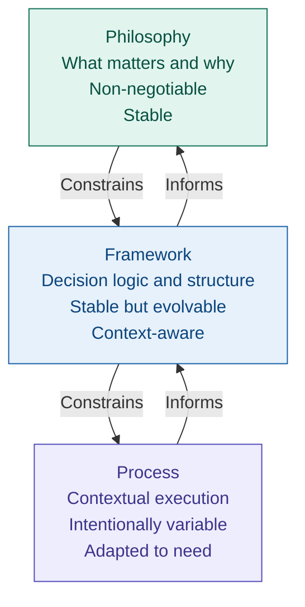

## Engineering Is a Systems Discipline

Part One has described a failure. Not a hypothetical one, not an extreme case, but the specific, common, and entirely preventable failure that plays out across engineering organisations in every sector with a consistency that can only be explained by a shared structural cause.

The cause is not incompetence. It is not bad faith. It is not insufficient process or inadequate tooling or the wrong methodology. It is the systematic disconnection between the people who hold delivery knowledge and the people who hold delivery authority — and the predictable consequences of that disconnection when it is compounded by a belief system that mistakes the symptoms of the problem for its cause and a learning system that draws the wrong lesson from each failure and uses it to make the next one more likely.

Before presenting the framework that addresses this, it is necessary to establish the lens through which the framework is designed and should be read. That lens is systems thinking — and specifically, the application of systems thinking to engineering organisations as the primary unit of analysis for understanding why they behave as they do.

This is not an abstract philosophical choice. It is a practical one. The failure in Chapter 1 was not produced by a single cause. It was produced by six interacting systems, each of which contributed something, and none of which could be addressed in isolation without the others reasserting the conditions that produced the failure. Any framework that addresses individual elements without addressing the interactions between them will produce the same outcome as the lessons-learned exercise: changes that look meaningful on paper and leave the underlying system unchanged.

---

### What a system is

A system, in the sense used throughout this book, is a set of interacting elements that together produce outcomes. The outcomes are not determined by any single element. They emerge from the interactions — the incentives, constraints, feedback loops, and dependencies that connect the elements to each other.

This definition has a specific and important implication: if you want to change the outcomes a system produces, you must change the interactions, not just the elements. Replacing a risk register template does not change the governance culture that treats risk registers as reporting artefacts. Revising an escalation protocol does not change the authority structure that receives escalations and does not act on them. Adding a new programme governance role does not change the incentive structure that rewards the appearance of control over the reality of it.

The corollary is equally important: local optimisation — making any single element of the system perform better in isolation — reliably degrades overall system performance when the interactions are not addressed. The firmware team that optimises its development process without addressing the ambiguous hardware-software interface is optimising locally while the system accumulates risk globally. The programme board that improves its risk register template without changing its decision behaviour is optimising the input while leaving the output unchanged.

Engineering organisations are complex systems. Their behaviour emerges from the interaction of multiple system types — human systems, organisational systems, socio-technical systems, delivery systems, technical systems, and economic systems. No single framework element addresses all of them. But a framework that does not keep all of them in view will consistently find that changes intended to address one system are neutralised by the others.

This is the foundational reason why engineering leadership is a systems discipline. Not because systems thinking is intellectually fashionable, but because the alternative — treating the components of engineering organisations as independent problems to be solved separately — has a long and well-documented record of failure.

---

## The philosophy that constrains the framework

Firmitas is structured in three layers. Understanding the relationship between these layers is essential to using the framework correctly — and to recognising when it is being misused.

The first layer is philosophy. Philosophy defines what matters and why. It establishes the non-negotiable positions — the things that are true about how engineering organisations work, about where knowledge lives, about what leadership means, about what commitments are — from which everything else follows. The philosophy layer does not change with context. It is the stable foundation on which the framework rests.

The second layer is framework. The framework translates philosophy into repeatable structure. It defines the decision logic, the governance mechanisms, the lifecycle shape, the artefact types, and the role boundaries through which the philosophy is applied in practice. The framework is stable but not static — it can evolve as understanding improves, but it does not change casually or under pressure.

The third layer is process. Process defines how work is actually executed in a specific context. It includes the methodologies, ceremonies, tooling choices, cadences, and documentation formats that teams use day to day. Process is intentionally variable — it can and should differ by product type, regulatory context, organisational maturity, and team composition. The only constraint on process is that it must respect the framework and honour the philosophy.

The ordering is non-negotiable. Philosophy constrains framework. Framework constrains process. Process that violates the framework is not Firmitas. Framework elements that contradict the philosophy are not Firmitas. The most common failure mode in framework adoption — applying the process layer without engaging with the philosophy — produces compliance theatre rather than changed outcomes. Teams follow the artefact requirements and the ceremony schedules while the underlying system remains unchanged. The risk register exists but is still a reporting tool. The gate reviews happen but still do not generate decisions. The estimation process produces three-point estimates that are still compressed toward the committed date.

This is Firmitas applied as process rather than understood as philosophy. It will not produce the outcomes the framework is designed for. The chapters that follow are written to prevent that misapplication — by making the philosophy explicit before the framework is presented, and by grounding every framework element in the specific failure mechanism it is designed to address.

---

### The twelve principles

The twelve principles below are the philosophy layer of Firmitas. They are not values or aspirations. They are structural positions — explicit statements about how engineering organisations work and what leadership must do in response.

Each principle has been earned by what Part One described. Each connects directly to one or more of the failure mechanisms, systemic causes, or compounding consequences identified in the preceding five chapters. They are presented in the sequence in which they build on each other — from the foundational lens to the specific structural positions to the human reality that the framework ultimately exists to protect.

---

#### Principle 1: Engineering is a systems discipline

Engineering outcomes are produced by interacting systems, not by isolated individuals, teams, or tools. The behaviour of an engineering organisation emerges from the relationships between its human, organisational, socio-technical, delivery, technical, and economic systems. Optimising any one of these in isolation degrades the whole.

This principle is not a statement about methodology. It is a statement about where to look when things go wrong — and where to intervene when you want them to go differently. Local efficiency that damages system health is failure, even if short-term output increases.

---

#### Principle 2: Engineering exists to deliver outcomes, not outputs — and the difference is always a leadership decision

The engineering function exists to deliver value to the customer and, in doing so, create value for the business — sustainably and repeatedly. Not activity. Not output. Not utilisation. Value is realised only when engineering work solves a real problem, is usable and reliable, and survives contact with the real world.

The difference between outputs and outcomes is not a technical distinction. It is a leadership decision. An organisation that measures velocity, throughput, and milestone completion has chosen to measure outputs. That choice determines what teams optimise for — and what they sacrifice to hit the measures they are evaluated against.

---

#### Principle 3: A commitment not made by those who must keep it is a target with someone else's name on it

Presenting a plan to an engineering team and asking whether it is achievable is not making a commitment. Working backwards from a desired date to construct a plan is not making a commitment. A genuine commitment requires that the people responsible for delivery have set the date, had the risks accepted, had the implications acknowledged, and had the plan built with realistic foundations, honest estimates, and adequate slack.

Everything else is a date with someone else's name on it. When that date is missed, the accountability for missing it belongs with the people who made it — not with the people who inherited it.

---

#### Principle 4: Delivery knowledge lives closest to the work

The people doing the delivery hold the most accurate information about risk, timescale, and feasibility. A system that does not route decisions through that knowledge will systematically make worse decisions than one that does.

This principle has a direct governance implication. Teams closest to the work must own the day-to-day and week-to-week management of delivery without micromanagement, second-guessing, or gates approved by people without the operational knowledge to understand what they are approving. Decision authority must be aligned with delivery knowledge. Where it is not, the system is designed to fail.

---

#### Principle 5: Leadership owns the system, not the intention

Leadership responsibility cannot be delegated. Leaders are accountable for the design of the system, the incentives it creates, the behaviours it rewards, and the outcomes it produces. When teams struggle, the system is misdesigned, constraints are unclear or contradictory, or incentives are misaligned. Blaming individuals for the outputs of a system they did not design and cannot change is a failure of leadership, not diagnosis.

Good intent does not compensate for poor outcomes. Effort does not excuse systemic failure. Activity does not equal progress. Leadership is accountable for what the system produces over time, not for what it intended to produce.

---

#### Principle 6: Decisions are first-class engineering artefacts

Decisions shape systems more than code, hardware, or processes. The decisions made in the first programme review of Chapter 1 — to note the risk register, confirm the delivery date, and move to task status — determined the outcome of the programme more completely than any subsequent technical work.

Significant decisions must be made deliberately, with trade-offs explicit and rationale preserved. This is not documentation for its own sake. It is memory for the system. Undocumented decisions become invisible constraints that decay system coherence over time, that cannot be challenged because they cannot be found, and that must be rediscovered through failure rather than through record.

---

#### Principle 7: Flow matters more than utilisation

Busy systems fail. Full systems cannot adapt. The rate at which value progresses through the entire system — from intent to delivered outcome — is more important than the utilisation rate of any individual team or resource within it.

Queues are risk. Waiting is cost. Work in progress is a liability. Optimising for utilisation at the expense of flow produces systems that appear productive until they are stressed, at which point they fail catastrophically because they have no capacity to absorb variation or respond to the unexpected.

---

#### Principle 8: Slack is not waste — it is the capacity to improve

Slack is not idleness. It is capacity reserved by design to absorb variation, respond to the unexpected, and improve the system without collapsing under the addition of unplanned work. A system with no slack is a system operating at the edge of failure.

Organisations that eliminate slack in pursuit of short-term efficiency trade apparent productivity for long-term fragility. The cost of eliminating slack is not visible immediately. It is paid in the inability to respond to incidents, the deferral of learning, the accumulation of technical debt, and the burnout of the people who compensate with heroics for the capacity the system should have provided structurally.

---

#### Principle 9: Quality is a system property, not an inspection activity

Quality does not emerge from testing at the end of a delivery process. It emerges from the interaction of architecture, feedback loops, testing strategy, incentives, and decision timing throughout the process. Quality engineering is therefore a leadership concern — the conditions that determine whether quality is possible are set by how the system is designed, not by how thoroughly it is inspected afterward.

Late discovery of defects is a signal of systemic failure, not testing weakness. The defect was introduced upstream. The test found it downstream. The relevant question is not whether the test found it, but why the system allowed it to travel so far before it was visible.

---

#### Principle 10: Short-term optimisation is a leadership choice — the cost is real, delayed, and paid by people who had no say in the decision

Every decision to compress scope, reduce resource, defer risk, or sacrifice quality has a cost. That cost does not disappear. It moves — to the people doing the work, to the quality of what is delivered, to the next programme that inherits the consequences, to the operational infrastructure that must be maintained and evolved by teams who were not there when the shortcuts were taken.

Leadership owns that cost whether it acknowledges it or not. The decision to compress the timeline was made in a programme review. The cost was paid in six weeks of firmware rework, four weeks of architecture redesign, two months of delayed integration testing, and eight months of overrun. The people who made the decision and the people who paid the cost were not the same people.

---

#### Principle 11: Failure is information — misattributed failure is poison

When a programme fails and the correct cause is identified, the organisation becomes more capable of preventing the next failure. When a programme fails and the wrong cause is identified, the organisation becomes more likely to fail next time — because it has used the failure to reinforce the conditions that produced it.

Blame is not a learning mechanism. It is the active destruction of the conditions that would have prevented the failure. Post-failure attribution that lands on individuals rather than systems, on execution rather than governance, on the people who held accurate information rather than the people who did not act on it, produces organisations that repeat their failures with increasing efficiency.

---

#### Principle 12: Your people are your most significant investment — trust and respect their judgement or destroy what you spent years building

Engineers are not resources to be allocated or headcount to be managed. They are the carriers of delivery knowledge, technical judgement, and institutional memory that no process, framework, or tool can replicate. The knowledge of why the architecture was designed as it was, what the previous programme taught about integration timing, which risks are real and which are theoretical — this knowledge lives in people. When those people are overridden, ignored, or treated as replaceable, they do not simply disengage. They take with them everything the organisation spent years building.

An organisation that consistently fails to trust and act on the judgement of its engineers does not just waste that investment. It destroys it. The capability to deliver complex programmes well is not a property of the organisation's processes or tools. It is a property of the people who carry it. Treat them accordingly.

---

### How the principles connect to Part One

Each of the twelve principles is a direct structural response to something Part One described.

Principles 1 and 2 establish the lens and the purpose — the systems view and the outcomes orientation — without which the failure in Chapter 1 is illegible. It looks like an execution failure rather than a systems failure. It looks like a delivery problem rather than a value problem.

Principles 3 and 4 address the commitment mechanism and the knowledge gap — the two structural causes identified in Chapters 2 and 3. The commitment that was not theirs. The delivery knowledge that lived with the engineers and could not reach the governance layer.

Principle 5 addresses the governance failure — the programme board that noted the risk register and moved on, that received accurate information and did not act on it, that owned the system that produced the failure without owning the failure.

Principle 6 addresses the specific mechanism by which the failure was perpetuated — the decision to note the risk register rather than act on it was a decision, but it was not treated as one. It had no owner, no rationale, no recorded consequence. It was invisible as a decision and therefore invisible as a cause when the failure arrived.

Principles 7 and 8 address the delivery system failures identified in Chapter 4 — the long feedback loops, the late integration, the full utilisation that left no capacity to absorb the consequences of the risks that materialised.

Principle 9 addresses the quality consequence of the iron triangle being ignored — the silent compression of quality that occurs when time and cost are held fixed against a scope the system cannot deliver to the required standard within the required constraints.

Principle 10 addresses the cost attribution failure identified in Chapter 5 — the displacement of costs onto people who had no say in the decisions that produced them.

Principle 11 addresses the learning failure at the heart of Chapter 5 — the misattribution of failure that produces the wrong lesson and makes the next failure more likely.

Principle 12 addresses the human cost that runs beneath all of the above — the progressive erosion of the conditions that make good engineering possible when the people who carry delivery knowledge are systematically overridden, blamed, and treated as interchangeable.

---

## Part One is complete

The diagnosis is made. The cause has been named. The structural conditions that produce the failure have been described in enough detail that the framework can be presented not as a set of best practices but as a set of structural responses — each connected to a specific failure mechanism, each designed to address not just the symptom but the interaction between systems that produced it.

Part Two begins with the framework's structural logic — the layered model that connects philosophy to framework to process — and then works through each element of the framework in the sequence that corresponds to the failure mechanisms Part One described.

The reader who has followed Part One should arrive at Part Two with a specific question in mind: what would this programme have needed in order to produce a different outcome at week three? Every chapter in Part Two is an answer to some part of that question.

