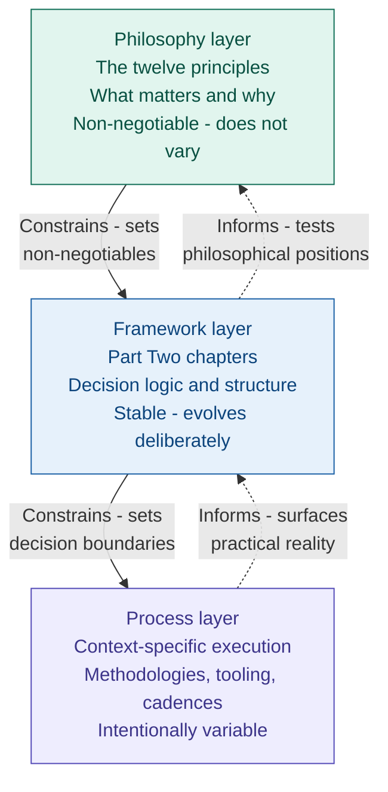

# Part Two: The Framework

Part One described a failure. Specifically, the failure of a system to act on accurate information - to convert what engineers knew into decisions that could have changed the outcome.

Part Two describes the structural response to that failure.

Every chapter that follows is connected to something Part One named. The governance model addresses the programme board that noted the risk register and moved on. The estimation approach addresses the committed date that arrived before the scope was understood. The risk and issues treatment addresses the three red items that required decisions and did not receive them. The delivery model addresses the feedback loops that were too long and the integration that came too late. The people and capability chapters address the engineers whose judgement was overridden and whose knowledge was never fully used.

None of these elements exist in isolation. They are components of a coherent framework built on an explicit philosophy. Understanding the relationship between the philosophy, the framework, and the process choices within it is the prerequisite for using what follows correctly - and for recognising when it is being misused.

That relationship is described below, before the framework chapters begin.

---

**The Layered Model**

Firmitas operates in three distinct but interdependent layers. The ordering of these layers is not a stylistic choice. It is the structural logic that separates Firmitas from every framework that has been adopted, applied mechanically, and produced compliance theatre rather than changed outcomes.

**The philosophy layer**

The philosophy layer defines what matters and why. It contains the non-negotiables - the structural positions about how engineering organisations work, where knowledge lives, what leadership means, and what commitments are. These positions do not change with context. They are the stable foundation on which everything else rests.

The twelve principles in Chapter 6 are the philosophy layer. They constrain everything that follows. Any framework element or process choice that violates them is not Firmitas - regardless of how it is labelled or how closely it resembles the framework in structure.

**The framework layer**

The framework layer translates philosophy into repeatable structure. It defines the decision logic, the governance mechanisms, the lifecycle shape, the artefact types, and the role boundaries through which the philosophy is applied in practice.

The chapters in Part Two describe the framework layer. The framework is stable - it does not change under delivery pressure or commercial convenience. It can evolve deliberately as understanding improves. It does not change casually.

**The process layer**

The process layer defines how work is actually executed in a specific context. It includes methodologies, tooling choices, ceremonies, cadences, and documentation formats. Process is intentionally variable - it should differ by product type, regulatory context, organisational maturity, and team composition.

The only constraint on process is that it must respect the framework and honour the philosophy. A team that uses Kanban rather than Scrum, that writes requirements in structured natural language rather than user stories, that holds weekly risk reviews rather than fortnightly ones - all of this is valid process variation within the framework. A team that reverse-engineers its plan from a committed date, that treats the risk register as a reporting artefact, that defines done as code complete rather than customer-validated outcome - this is process that violates the philosophy, regardless of what methodology label it carries.

**Why the ordering matters**

The most consistent failure mode in framework adoption is inversion of the layers. Organisations install process - the artefacts, the ceremonies, the tooling - without engaging with the philosophy that should constrain it. The result is that the new process is absorbed by the existing system. The risk register template changes. The risk register behaviour does not. The estimation ceremony is introduced. The estimates are still compressed toward committed dates. The gate review is scheduled. The gate still does not generate decisions.

This is not failure of the framework. It is failure to apply the framework - specifically, failure to start with the philosophy layer before building the framework layer, and failure to build the framework layer before varying the process layer.

The chapters that follow assume the philosophy has been engaged with. Chapter 6 established the twelve principles. Every Part Two chapter builds on them. If a Part Two chapter appears to contradict a principle, the chapter is wrong. The principles do not bend.

The solid arrows show constraint - what must be honoured. The dotted arrows show information flow - the practical reality of delivery should inform how the framework evolves, and the experience of applying the framework should test and refine the philosophy over time. But information flows upward. Constraint flows downward. Process that violates the framework is not a signal to change the framework. It is a signal to change the process.

---

## How to read Part Two

Part Two is the majority of the book. It covers eighteen chapters across the full scope of engineering programme delivery - from leadership and governance through estimation, requirements, risk, quality, architecture, teams, and portfolio management to AI and automation.

Each chapter is self-contained enough to be read independently if a specific element is most urgent. The connections back to Part One are present in each chapter as context, not as a prerequisite for understanding.

The sequence of chapters is deliberate. The first six chapters - leadership, delivery knowledge, commitments, risk, requirements, and slack - establish the foundational elements. Everything that follows builds on them. A reader who is working through Part Two in sequence will find that each chapter assumes the preceding ones.

For readers who are using Part Two as a reference rather than reading sequentially, Appendix A contains the twelve principles as a one-page orientation, and Appendix B contains the diagnostic, which will indicate which chapters are most relevant to a specific programme's current condition.
