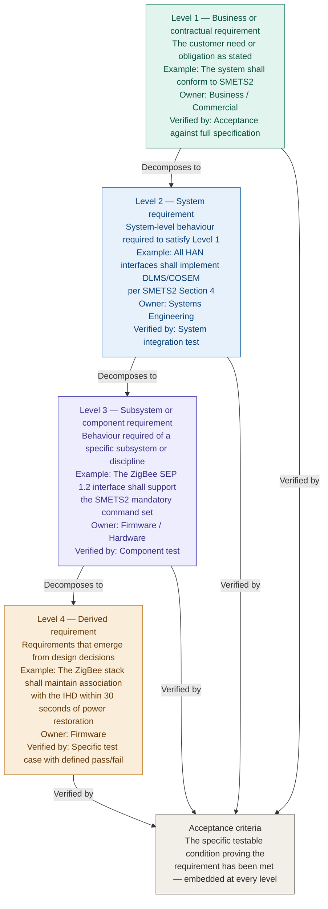

# Firmitas: A Framework for Sustainable Engineering Delivery

**Document:** 13 — Chapter 11: Requirements: From Customer Need to Testable Specification
**Book section:** Part Two — The Framework

---

# Chapter 11 — Requirements: From Customer Need to Testable Specification

Of all the ways an engineering programme can accumulate hidden risk, none is more consistent or more costly than the gap between what the customer needs and what the engineering team believes they have been asked to build.

That gap is a requirements gap. It is produced by requirements that are too vague to be implemented unambiguously, too broad to be tested specifically, too high-level to be actionable without assumptions, or too poorly connected to their source to survive the changes that every programme experiences. It is compounded by the common organisational pattern of separating the people who write requirements from the people who understand the customer need and the people who will implement the requirement — so that by the time a requirement reaches an engineer, it may have passed through several layers of interpretation, each of which introduced a small divergence from the original intent.

Requirements failures do not announce themselves immediately. They accumulate silently, in the assumptions engineers make when a requirement is ambiguous, in the interpretations that differ between the team that wrote the test and the team that wrote the code, in the integration failures that reveal incompatible assumptions about what an interface was supposed to do. By the time the gap is visible, it is expensive. Requirements gaps discovered during integration cost an order of magnitude more to resolve than requirements gaps discovered during specification. Requirements gaps discovered in the field cost an order of magnitude more again.

The investment in requirements engineering — done properly, at the right level of rigour for the product and the programme — is the highest-return risk reduction activity available in engineering delivery. It is also among the most consistently under-resourced, undervalued, and prematurely curtailed activities in the programmes that fail.

---

## The customer and the business

Before addressing how requirements should be written, it is necessary to address where they come from — and specifically, to make explicit a distinction that many programmes obscure.

The customer is not the business.

In most engineering programmes, the requirements are provided by the business — the internal stakeholder, the product manager, the procurement team, or the commercial function that has engaged with the client. The requirements represent the business's understanding of what the customer needs, filtered through commercial priorities, contractual constraints, and the business's own interpretation of the customer's stated requirements.

This filtering is not inherently wrong. The business has context the engineering team does not have — commercial constraints, regulatory obligations, portfolio priorities, client relationship history. But the filtering introduces a risk: the engineering team may be building what the business has specified rather than what the customer actually needs. These are not always the same thing.

When they diverge, the consequences appear at the point of customer contact — in acceptance testing, in field deployment, in the support calls that reveal the gap between what was delivered and what the customer's operation required. At that point, the engineering team has built exactly what the requirements specified. The requirements specified something that did not fully reflect the customer's need. The cost of the gap is real. The attribution is unclear. And the engineering team has no way to advocate for a different outcome because they never had visibility of the customer reality that would have informed a different specification.

Firmitas requires that engineering teams maintain a direct line of sight to the end customer — not mediated entirely by the business. This does not mean that engineers bypass the business relationship or have unsupervised access to clients. It means that the requirements process creates mechanisms for customer reality to inform the specification — through customer involvement in requirements reviews, through user research that precedes requirements writing, through validation activities that test requirements against real customer scenarios before they are baselined.

The practical consequence for requirements quality is significant. An engineer who has seen how the customer actually uses the product — who has watched them interact with the interface, who understands the operational environment, who knows what failure looks like from the customer's perspective — writes different requirements from one who has only read a specification prepared by a commercial team. The requirements are more specific, more operationally grounded, and more likely to result in something the customer can actually use.

Trade-offs made with customer context produce different outcomes from trade-offs made without it. When a feature must be descoped or a quality compromise must be accepted, the engineer who understands customer priorities can make that trade-off in the customer's interest. The engineer who does not know the customer can only make it in the interest of the programme schedule or budget. Those are not the same trade-off, and they do not produce the same result.

---

## Requirements are not one size fits all

The right level of requirements rigour depends on what is being built. This is a principle that is frequently violated in both directions — programmes that apply heavyweight requirements processes to products that do not need them, and programmes that apply user-story-level specification to products that absolutely require more.

For a small increment to an existing software product — a new feature in an established application with well-understood architecture and a stable team — a well-written user story with clear acceptance criteria can satisfy most of the requirements properties that matter. The context is shared. The architecture is known. The customer feedback loop is short. The cost of discovering a requirements gap during development is low.

For a full product — hardware, mechanical, firmware, software, communications, cloud infrastructure, operating in a regulated environment with safety obligations, delivering to a customer with operational dependencies on what is built — user stories are not adequate specification. The system is too complex, the integration dependencies too numerous, the regulatory obligations too specific, and the cost of discovering requirements gaps too high for the informal, iterative approach that works well for simpler products.

The distinction is not about being agile versus being traditional. It is about being appropriate to the complexity and consequence of what is being built. A requirements process that produces ambiguous, catch-all specifications for a complex regulated product is not agile. It is a shortcut with deferred costs.

---

## Properties of a well-written requirement

A requirement is the basic unit of specification. Whether it appears in a formal requirements document, a user story, a system design specification, or an interface control document, the same properties distinguish a requirement that can be built and tested from one that will generate assumptions and ambiguity.

**Unambiguous.** A well-written requirement has one interpretation. Two engineers reading it independently should build the same thing. If two engineers could build materially different implementations and both claim to satisfy the requirement, the requirement is ambiguous. Ambiguous requirements are not incomplete specifications — they are invitations for the implementation to be whatever the engineer decides is reasonable. On a programme with ten engineers and twenty ambiguous requirements, the assumptions may never be aligned. The integration failure that results is a requirements failure, not an integration failure.

**Granular enough to be testable.** Every requirement must have a corresponding pass/fail condition. If a requirement cannot be tested — if there is no observable outcome that would confirm it has been met or demonstrate that it has not — the requirement is not finished. Testability is the most reliable quality gate for requirements, because it forces the question that ambiguity makes it easy to avoid: exactly what must the system do, under exactly what conditions, producing exactly what observable output, within exactly what tolerances?

**Singular.** One requirement, one thing. Compound requirements — "the system shall encrypt data and authenticate users and log all access attempts" — are three requirements presented as one. Compound requirements allow partial compliance. An engineer can satisfy two of the three clauses and legitimately claim the requirement is met unless the requirement has been split. Splitting compound requirements is not pedantry. It is the only way to ensure that every obligation is tracked independently and can be tested individually.

**Attributed.** Every requirement has a source — a customer need, a regulatory obligation, a safety analysis, an architectural constraint, a business rule. Attribution serves two purposes. It enables traceability — the chain from customer need to system behaviour to test evidence that compliance and quality management frameworks require. And it enables change management — when a requirement must be changed, the attribution tells you who owns the source need, what other requirements draw from the same source, and what the impact of the change is across the specification.

**Bounded.** A requirement should state explicitly what is in scope and, where necessary, what is explicitly out of scope. Unbounded requirements are an invitation for scope creep. They are also an invitation for catch-all language — "the system shall handle all relevant error conditions" — that defers the specification decision to the implementer. The implementer will make that decision under delivery pressure, without stakeholder input, and the decision will be invisible in the programme record.

**Verifiable at the right level.** A system requirement is verified by a system test. A software requirement is verified by a software test. A hardware requirement is verified by a hardware qualification test. Requirements written at the wrong level of abstraction either cannot be tested at the appropriate level or generate a cascade of derived requirements that should have been written explicitly rather than implied. The level of a requirement determines how it is verified. Writing requirements at the appropriate level for their intended verification method is not a documentation preference. It is what makes verification possible.

**Agreed by both the stakeholder and the engineer.** A requirement that has been agreed only by the stakeholder who specified it may be commercially accurate but technically undeliverable. A requirement that has been agreed only by the engineer who will implement it may be technically sound but commercially wrong. Both parties must agree before the requirement is baselined — the stakeholder confirms that the requirement captures their need, and the engineer confirms that the requirement is implementable as specified. Any requirement that cannot achieve both signatures has not been finished.

---

## Catch-all requirements and their cost

Catch-all requirements are the most common and most damaging requirements failure mode. They are requirements written at a level of abstraction that appears to specify something while actually deferring all the specification decisions to the implementer.

They are recognisable by their language. Words and phrases that reliably indicate a catch-all requirement include: appropriate, adequate, as required, suitable, as necessary, all relevant, where applicable, to an acceptable standard, and etc. Each of these phrases converts a specification decision into an implementation decision — one that will be made by an engineer, under time pressure, without stakeholder input, in a way that is invisible to the programme record and untraceable to any agreed requirement.

The cost of catch-all requirements is not paid when they are written. It is paid when the implementation decisions they generate turn out to differ from what the stakeholder intended — which is discovered during acceptance testing, during integration, or in the field, at a point when the cost of correction is substantially higher than the cost of writing a proper requirement in the first place.

A simple test for catch-all language: search the requirements document for the words "appropriate," "adequate," "as required," "suitable," and "etc." Count the occurrences. Each one is a requirements gap dressed as a specification. Each one is a decision that has been deferred to someone who should not be making it alone.

---

## The Requirement Breakdown Structure

For complex products — those involving multiple disciplines, regulatory obligations, and significant integration dependencies — requirements cannot be managed as a flat list. They must be structured hierarchically, with clear parent-child relationships that enable traceability, change management, and verification planning.

The Requirement Breakdown Structure is the hierarchy that connects the highest-level contractual or business obligations to the most granular implementable and testable requirements. It is not an optional documentation choice. For complex multi-discipline programmes, it is the mechanism that makes delivery possible — the structure within which every requirement has a home, every obligation is traceable, and every change can be impact-assessed across the full specification.

The hierarchy operates across four levels.

**Level 1 — Business or contractual requirements** are the highest-level obligations — the customer needs, contractual specifications, and regulatory obligations that define what the programme must achieve. They are typically stated at a level of abstraction that is not directly implementable. "The system shall conform to the SMETS2 specification" is a Level 1 requirement. It is correct, complete, and entirely inadequate as a specification for any engineering team. It is a pointer to a body of work that must be decomposed before anything can be built.

**Level 2 — System requirements** define the system-level behaviours and properties required to satisfy the Level 1 obligations. They are the first level at which requirements become specific enough to guide architectural decisions. Each Level 2 requirement must be traceable to a Level 1 requirement — it exists because a Level 1 obligation requires it — and must be verifiable at the system level.

**Level 3 — Subsystem or component requirements** define the specific behaviours required of individual subsystems, components, or disciplines. They are owned by the team responsible for the relevant discipline and are verifiable at the component or subsystem test level. Each Level 3 requirement traces to a Level 2 requirement.

**Level 4 — Derived requirements** are requirements that emerge from design decisions — constraints that are not explicitly stated by the customer or contract but that are necessary to satisfy higher-level requirements given the architectural choices that have been made. They are important and frequently overlooked. An architect who selects a specific communication protocol, a specific memory architecture, or a specific timing model has implicitly committed to a set of derived requirements. If those requirements are not written explicitly, they exist as implicit assumptions — visible to the architect who made the design decision and invisible to everyone else.

Acceptance criteria are not a separate level. They are embedded at every level — the specific, testable conditions that will confirm a requirement has been met. At Level 1, the acceptance criteria may be expressed as acceptance test scenarios. At Level 4, they are specific pass/fail conditions in a test case.

---

## The traceability spine

The Requirement Breakdown Structure is the foundation of requirements traceability — the ability to follow the thread from a customer need all the way to the test evidence that confirms it has been met, and back again.

Traceability serves four purposes, all of them operational rather than bureaucratic.

**Change management.** When a requirement changes — as requirements always do — traceability makes the impact visible. Which higher-level requirement is affected? Which derived requirements need revisiting? Which tests need to be rerun? Which design decisions are invalidated? Without traceability, change impact is assessed by asking the people who remember what they built and why. That knowledge is incomplete, inconsistent, and unavailable when the people who hold it have moved on.

**Verification planning.** Traceability enables verification to be planned systematically — to confirm that every requirement at every level has a test that covers it, that no requirement is untested, and that no test exists without a traceable requirement that justifies it. Without traceability, verification coverage is estimated rather than confirmed. The gaps in coverage are the gaps that produce field failures.

**Compliance evidence.** Most regulated environments require demonstrable traceability from requirements to verification evidence. A programme with a complete Requirement Breakdown Structure and maintained traceability can produce that evidence as a natural output of its normal activities. A programme without it must assemble the evidence retrospectively — an expensive, unreliable, and frequently unsuccessful exercise that becomes the primary source of audit stress.

**Organisational memory.** Requirements traceability preserves the context of why things were built the way they were. When a new team member asks why the system behaves in a way that seems arbitrary or unnecessarily constrained, the answer should be traceable to a requirement — which traces to a Level 1 obligation or a regulatory constraint or a customer need. Without traceability, the answer is often "we've always done it this way" or "I think someone decided that at some point" — which is not an answer, and which cannot be used to evaluate whether the constraint is still necessary as the programme evolves.

---

## The investment argument

Requirements engineering done properly takes time. It requires skilled people — not just technical writers, but people who understand both the customer domain and the technical implementation space well enough to write requirements that are specific, testable, and achievable. It requires stakeholder engagement — the client or business representatives who own the needs must participate in requirements review, not just sign off on a document presented to them. It requires iteration — requirements are not correct the first time, and the process of identifying ambiguities, resolving conflicts, and writing acceptance criteria for difficult requirements takes multiple cycles.

This investment has a cost that is visible immediately and a return that is visible later — which is why it is consistently under-resourced in programmes under schedule pressure.

The return is measured in what does not happen. The integration failure that would have occurred if the interface requirement had remained ambiguous does not occur because the ambiguity was resolved during specification. The six weeks of rework that would have been required when the firmware was written against an incorrect interpretation of the hardware specification is not required because the specification was correct. The acceptance test failure that would have occurred when the client discovered the implementation did not meet their operational need does not occur because the requirements were validated against the customer reality before they were baselined.

These are costs that never appear on a project budget because they never occurred. They are the invisible return on the requirements engineering investment. The programmes that cut requirements engineering to save time and money find out about the return the hard way — when the costs that were avoided by doing it properly materialise as failures during integration, acceptance, or operation.

For a simple product, the investment required is modest. For a complex multi-discipline product — hardware, firmware, software, in a regulated environment, with safety obligations — the investment is substantial. It is also the most significant single factor in whether the programme delivers what was intended, on time and at manageable cost, or spends its later phases recovering from the consequences of specifications that were not clear enough to build from.

Requirements engineering is not overhead. It is the primary act of programme risk reduction. Treat it accordingly.

---

## Requirements management is not one size fits all — but it always has to be clear

The level of formality, the tools used, the documentation structure, and the governance process around requirements will differ by programme type, scale, and regulatory context. A startup building its first mobile application and a tier-one defence contractor building a safety-critical control system will — and should — approach requirements management differently.

What does not differ is the obligation to be clear.

A user story that says "as a user I want to log in so that I can access my account" is adequate for a consumer application with a short feedback loop to real users and a team that can test and iterate quickly. The same format applied to "as a system operator I want the meter to respond to a remote disconnect command" in a smart metering programme is not adequate — not because user stories are a wrong format, but because the behaviour being specified is complex, the consequences of misspecification are significant, the regulatory obligations are specific, and the feedback loop is too long to rely on iteration to surface the gaps.

The question is never "which requirements methodology should we use." The question is "are our requirements clear enough that the engineering team can build exactly what is needed without making specification decisions that belong to the stakeholder, and precise enough that we can test unambiguously whether what has been built meets what was required?"

If the answer is yes, the requirements process is appropriate to the programme. If the answer is no, the process needs to be more rigorous — regardless of how agile or how lean the team's preferred working style is.

---

*End of Chapter 11*
