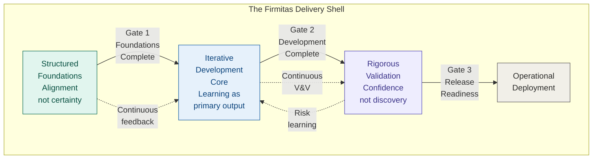
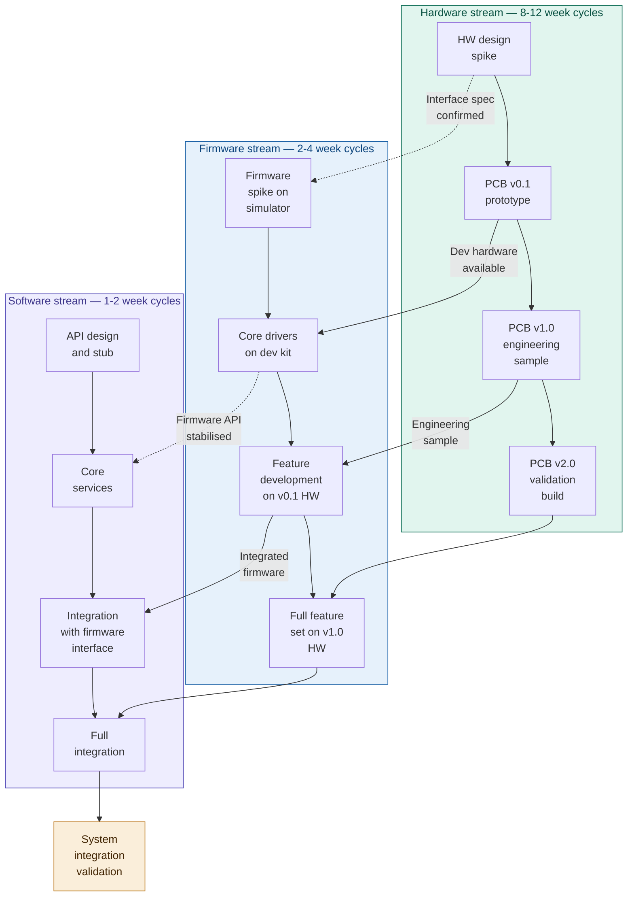
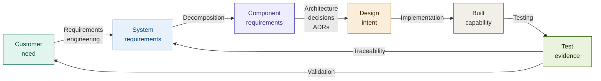

# Firmitas: A Framework for Sustainable Engineering Delivery

**Document:** 16 — Chapter 14: The Delivery Model
**Book section:** Part Two — The Framework

---

# Chapter 14 — The Delivery Model

Every engineering programme operates within a delivery model — a structure that shapes how work is sequenced, how disciplines interact, how decisions are made at key transition points, and how the programme as a whole moves from intent to outcome. Most programmes inherit their delivery model by default: they use the methodology the organisation has always used, or the one the client expects, or the one the team most recently worked within.

The default delivery model is almost never the right one. It is the familiar one.

The programme in Chapter 1 used a delivery model that concentrated integration at the end, deferred validation, and provided no mechanism for surfacing the architectural risks that were visible at week three. The firmware was developed for months against an ambiguous specification. The third-party component was assumed to be suitable without early validation. The test environment was procured too late to be useful during the critical phases. These were not execution failures. They were delivery model failures — the predictable consequences of a structure that deferred feedback and discovery to the point where their cost was highest.

This chapter describes the Firmitas delivery model — not as a prescriptive process to be followed, but as a structural response to the specific failure patterns that delivery models most commonly produce. It is a hybrid model that combines the structure that complex programmes require with the iterative learning that complex programmes need. Neither pure sequential nor pure agile. A delivery shell that uses structured foundations to establish the conditions for delivery, an iterative development core that produces learning as its primary output, and rigorous validation that builds confidence continuously rather than testing everything at the end.

---

## Why pure sequential models fail

Sequential delivery models — waterfall, V-model, stage-gate — provide structure, traceability, and clear phase boundaries. These are real advantages, particularly in regulated and safety-critical environments where evidence of controlled development is a compliance requirement.

Their failure mode is equally consistent. They assume that requirements can be completely specified before design begins, that design can be completed before implementation begins, and that the knowledge required to make good decisions at each phase exists at the point where those decisions must be made. In complex programmes, these assumptions are wrong.

Requirements are never complete at the start of a programme. They are approximately correct, progressively refined, and never fully stable. Design decisions made on the basis of incomplete requirements embed assumptions that will be invalidated as understanding improves. Implementation completed against a design that rests on wrong assumptions requires rework. The rework arrives at the worst possible time — when the programme is under pressure to complete, when the cost of change is highest, and when the governance structure has least tolerance for the honest acknowledgement that earlier decisions need revisiting.

The sequential model also defers integration. In a programme where each phase must be completed before the next begins, integration happens after all the components have been individually developed. The assumptions embedded in each component's development — about interfaces, about timing, about shared behaviour — are not tested against each other until the integration phase. The integration phase is therefore where the programme discovers what the architecture chapter described: the cost of unvalidated assumptions, accumulated across months of independent development, surfacing as integration failures that cannot be resolved quickly.

---

## Why pure agile models fail in complex programmes

Iterative and agile approaches address the sequential model's primary weakness — they incorporate learning loops, produce working software early, and adapt to changing requirements. For software-dominant products with short feedback loops and low-cost change, they work well.

Their failure mode in complex multi-discipline programmes is different and equally consistent. Pure agile assumes that requirements can be discovered through iteration, that architectural decisions can emerge from incremental development, and that the cost of change is low enough that adapting continuously is preferable to investing in upfront understanding.

In programmes that involve hardware, mechanical systems, firmware, and regulated compliance, these assumptions break down. Hardware cannot be iterated rapidly — the cost and lead time of physical design changes are substantially higher than the cost of software changes. Regulatory frameworks require evidence of controlled development that emergent architecture cannot easily provide. Safety-critical systems require formal verification against specified requirements that must be stable enough to verify against.

The specific failure mode of pure agile in complex programmes is architectural drift — the accumulation of design decisions made locally, under sprint pressure, without adequate consideration of their system-level implications. Individual sprints produce working increments. The architecture that accumulates across sprints is incoherent, tightly coupled, and expensive to evolve — because no single iteration was responsible for the whole, and the whole was never deliberately designed.

---

## The Firmitas delivery shell

The Firmitas delivery model addresses the failure modes of both approaches through a delivery shell that provides the structure that complex programmes require while preserving the iterative learning that complex programmes need.

The shell has three phases.

The phases are sequential in the sense that each creates the conditions for the next. They are not sequential in the sense that each must be fully completed before the next begins — feedback flows continuously between phases, and activities within each phase overlap in ways that the programme's specific context will determine.

---

## Phase 1: Structured foundations

### Purpose

The structured foundations phase exists to establish the conditions for delivery. Not certainty — certainty is unavailable at the start of a complex programme and should not be pretended. The goal is alignment: a shared, sufficiently detailed understanding of what is to be built, why it matters, what constraints apply, what risks exist, and what the programme will need in order to proceed.

The foundations phase is not big design up front. It is the minimum investment in shared understanding that makes the iterative core productive rather than chaotic. A programme that enters the iterative core without adequate foundations will spend its early iterations discovering things that could have been known before the first sprint — and the cost of that discovery will be paid in rework rather than in the time the foundations would have required.

### What structured foundations produce

**Understood requirements.** Not complete requirements — complete requirements are a fiction at this stage. Requirements that are clear enough at the system level to guide architectural decisions, and broken down to the subsystem level for the components with the highest architectural impact and the highest delivery risk. The Requirement Breakdown Structure described in Chapter 11 is the instrument. The level of decomposition required depends on the programme's complexity and the cost of discovering requirements gaps during development.

**Established architecture.** Not detailed design — detailed design belongs in the iterative core. The architectural decisions that establish the system's structural boundaries, define the interfaces between disciplines, distribute risk, and determine the framework within which the development teams will work. The decisions that, if made wrong, would require the most expensive corrections later. These decisions must be made before the iterative core begins, because the iterative core will build on them.

**Validated key assumptions.** The architectural assumptions that carry the most risk — the unvalidated third-party dependency, the unconfirmed performance characteristic, the interface whose specification contains ambiguities — must be investigated during the foundations phase. Not exhaustively, but specifically: targeted investigations of the assumptions that would be most expensive to discover as false during the iterative core. The spike, the prototype, the early integration test — these are foundations-phase activities whose purpose is to replace dangerous assumptions with validated understanding.

**A live risk register.** The risks that were identified during the foundations phase, structured as decision requests with owners, trigger dates, and mitigation plans as described in Chapter 10. Not the compliance risk register that exists to satisfy a governance requirement — the management instrument that the programme board will use to govern the programme through its risks and issues rather than through its task status.

**A three-point estimate.** Produced by the people who will do the work, grounded in the scope understanding produced during the foundations phase, structured as best-case, most-likely, and worst-case with explicit conditions and risks attached. The estimate produced during the foundations phase is substantially more reliable than one produced before it — because the cone of uncertainty has narrowed as requirements have been defined and architectural assumptions have been validated.

**Operations involvement.** The operational context established. The teams who will support and operate what is built have been involved in NFR definition, deployment strategy, monitoring requirements, and support model design. Their input has shaped what is being built, not just what will eventually be handed to them.

### Entry criteria

The structured foundations phase begins when the programme has sufficient scope definition to establish what needs to be understood, and sufficient resource to do the understanding work properly. It does not require a complete specification — it requires enough to begin. The specific entry threshold will vary by programme, but in general: a clear statement of what the programme is for, the key stakeholders and their primary needs, the major constraints (regulatory, commercial, technical), and a preliminary identification of the programme's highest-risk areas.

### Exit criteria

The structured foundations phase is complete — and the programme is ready to enter the iterative development core — when:

The requirements are clear at the system level and decomposed to the level where the development teams can begin work on the highest-priority items without making specification decisions that belong to the stakeholder.

The architecture establishes clear boundaries and interfaces between disciplines, the key architectural risks have been investigated, and the most significant unvalidated assumptions have been addressed.

The risk register is live, owned, and connected to the programme plan. The three red items — or their equivalent on this programme — have named owners with authority and trigger dates that are being actively managed.

The three-point estimate has been produced, presented to programme governance, and accepted — meaning the conditions attached to the estimate have been acknowledged and the decisions the risks require have been assigned.

The programme governance structure has been confirmed to operate by exception through the risk and issues register, not through task status reporting.

If these conditions are not met, the programme is not ready to enter the iterative core. Entering before they are met is not an acceleration. It is the importation of foundational uncertainty into the development phase, where it will surface as rework rather than as resolved questions.

---

## Phase 2: The iterative development core

### Purpose

The iterative development core is where the system is built. Its primary output is not features or components — it is learning. Every iteration should produce validated understanding of something that was uncertain — that a design approach works, that a performance characteristic is achievable, that an interface functions as specified, that a risk identified during the foundations phase has been resolved or requires escalation.

This is the phase that agile methods are best suited to within the delivery shell. The structure established during the foundations phase — the architectural boundaries, the interface definitions, the requirements decomposition — provides the framework within which iterative development can operate productively. Teams have enough shared understanding to work without constant coordination. They have clear boundaries that tell them what is within their scope and what is not. They have interface definitions that allow them to develop against stable contracts without requiring the teams on the other side of the interface to have completed their work.

### What the iterative core produces

Each iteration produces a small vertical slice through the system — a piece of working, integrated, tested functionality that has been demonstrated against real acceptance criteria. Not a component in isolation. Not a feature that has been unit-tested but not integrated. A slice through the architecture that has been tested across the boundaries it depends on and has produced learning that can be used to update the programme's understanding of what is still to come.

The iterative core is also where the risk register is actively worked. Each iteration should retire at least one risk — by validating an assumption, resolving a dependency, completing an investigation, or demonstrating that a technical approach achieves what the programme needs it to achieve. Iterations that produce features without retiring risks are not producing the programme's most valuable output.

### Cross-discipline synchronisation

The most practically challenging aspect of the iterative development core in complex multi-discipline programmes is synchronisation across disciplines that operate on different cadences. Software teams can iterate in days or weeks. Firmware teams may have longer cycles due to hardware dependencies. Hardware teams operate on weeks-to-months cycles driven by PCB fabrication, component procurement, and physical build times. Mechanical teams may have even longer cycles for tooling and manufacturing.

These cadences cannot be reconciled into a single sprint rhythm. Requiring hardware teams to work in two-week sprints is not agile. It is the imposition of a software development cadence on a discipline for which it is inappropriate. Requiring software teams to synchronise with hardware build cycles wastes the advantage that software's lower change cost provides.

The resolution is not a unified cadence but a structured synchronisation model — a set of integration points at which the outputs of different discipline streams are brought together for cross-boundary validation.

The synchronisation model has three properties. Each stream develops at its natural cadence — hardware on hardware timescales, firmware and software on software timescales. Integration points occur when both sides of an interface have something to integrate against — not on a calendar schedule but at the natural points where one stream's output becomes the other's input. And the integration is real — actual components, on actual hardware, testing actual interfaces — not simulated or deferred.

The programme in Chapter 1 did not have a synchronisation model. Firmware was developed against a software model of the hardware while the hardware was being designed. When the hardware arrived, the firmware assumptions about the interface diverged from what the hardware actually provided. Early synchronisation — using the hardware specification to drive an early firmware spike, then an integration point as soon as development hardware was available — would have surfaced this divergence in weeks rather than months.

### What done means in a cross-discipline programme

In software-only development, done is relatively well defined — the feature works, the tests pass, the acceptance criteria are met. In a cross-discipline programme, done must be defined in terms of the integration state of the work, not just the completion state of individual components.

A firmware component that passes all its unit tests but has never been integrated with the hardware it runs on is not done. A software service that passes all its service tests but has never been integrated with the firmware interface it depends on is not done. Done, in the Firmitas sense, means integrated and tested across the boundaries that matter — not every possible boundary, but the boundaries that carry the highest integration risk for the programme at this stage.

This definition of done drives the early integration discipline that the delivery model requires. Teams that can claim done without integration will defer integration. Teams for whom done requires integration will integrate early — and will surface the problems that early integration is designed to find at the point where they are cheapest to address.

### Architectural integrity during iteration

The iterative core is where architectural drift most commonly occurs — where local decisions made under sprint pressure accumulate into structural debt that makes future development progressively more expensive. Chapter 13 described the mechanisms. The delivery model's response to this is specific.

Architectural guardrails — the principles, patterns, and boundaries established during the structured foundations phase — are not optional within the iterative core. They are the framework within which iteration operates. A development decision that violates a guardrail is not a pragmatic adaptation to delivery pressure. It is a governance decision that requires explicit review — an Architecture Decision Record that explains why the guardrail is being revisited, what the trade-offs are, and whether the revision is accepted by the governance layer that owns the architectural framework.

This does not slow development. It provides the visibility that allows the governance layer to maintain architectural coherence without micromanaging development decisions. The teams develop within the guardrails. When they encounter a guardrail that the new information they have suggests should be revised, they raise it through the ADR process. The revision is either accepted — with the rationale recorded — or declined — with the reasoning explained. Neither outcome requires a governance meeting. Both outcomes are visible and traceable.

### Entry criteria

The iterative development core begins when the structured foundations phase exit criteria have been met. The programme has understood requirements, an established architecture, a validated set of key assumptions, a live risk register, and a three-point estimate that programme governance has genuinely accepted — including the conditions and risks.

### Exit criteria

The iterative development core is complete when:

All planned capability has been implemented and tested to the level required for system-level validation.

All significant risks identified during the foundations phase have been retired or have been escalated and accepted as residual risks with defined management plans.

The system has been integrated across all significant discipline boundaries and the integration failures that those integration points revealed have been resolved.

The acceptance criteria for all baselined requirements have been demonstrated in a representative environment.

The documentation — ADRs, interface control documents, operational runbooks, requirement traceability — is complete, current, and accurate.

Operations teams have been progressively involved through the iterative core and are ready to support the transition to live operation.

---

## Phase 3: Rigorous validation

### Purpose

Rigorous validation is not a testing phase. Testing occurs continuously throughout the iterative core. Rigorous validation is the phase in which the programme builds the evidence base that the system performs as required under real or representative operational conditions, and that the accumulated evidence meets the programme's quality, compliance, and regulatory obligations.

The distinction matters. A programme that defers all validation to a late phase is not practicing rigorous validation. It is practicing discovery — finding out late what should have been confirmed early. Rigorous validation, in the Firmitas sense, is the culmination of a continuous validation process that has been running since the foundations phase, producing progressive confidence rather than binary pass/fail at the end.

### What rigorous validation produces

**System-level evidence.** Demonstration that the integrated system meets its acceptance criteria under representative conditions. Not component-level test results — system-level behaviour, across the full integration surface, under the conditions the system will experience in operation.

**Compliance evidence.** The traceability from requirements through design decisions through test evidence that regulated programmes require. Not assembled retrospectively for the audit — generated continuously through the programme's operation and compiled here into the formal assurance record. For programmes operating under IEC 62304, IEC 61508, ISO 9001, or equivalent standards, this evidence is the deliverable that enables certification or regulatory acceptance.

**Operational readiness evidence.** Demonstration that the system can be deployed, monitored, and supported in its operational environment. That the runbooks are accurate. That the diagnostic capabilities are sufficient. That the deployment process is reliable. That the operations team understands the system well enough to support it without depending on the delivery team.

**A residual risk position.** A formal statement of the risks that the programme has not been able to fully retire, the basis for accepting them, and the conditions under which they would require escalation post-deployment. Every programme deploys with some residual risk. The question is whether that risk is known, bounded, and consciously accepted — or unknown and accumulating.

### Entry and exit criteria

The rigorous validation phase begins when the iterative development core exit criteria have been met. It does not begin because a calendar date has been reached. If the development core exit criteria have not been met, the programme is not ready for validation — and proceeding regardless is not confidence. It is the systematic generation of validation failures that will need to be resolved before the validation can complete.

The rigorous validation phase is complete — and the programme is ready for the Gate 3 release readiness decision — when:

All system-level acceptance criteria have been demonstrated against baselined requirements with documented evidence.

Compliance evidence is complete, traceable, and has been reviewed by the appropriate quality or regulatory authority.

Operational readiness has been confirmed by the operations team, not declared by the delivery team.

The residual risk position has been reviewed, accepted by the governance layer with authority to accept it, and documented.

No open issues exist that would prevent safe, reliable, and compliant operation.

---

## Gates as decision points

The three gates in the delivery shell are not approval ceremonies. They are decision points — moments at which the programme's readiness to proceed to the next phase is evaluated against evidence, and a genuine decision is made to proceed, pause, or change direction.

Gate 1 — Foundations Complete — is the decision that the programme has established the conditions for productive iterative development. The evidence is the foundations phase deliverables: requirements state, architectural establishment, key assumptions validated, risk register operational, estimate accepted.

Gate 2 — Development Complete — is the decision that the iterative development core has produced the integrated, tested capability that the validation phase will build its evidence case on. The evidence is the development core exit criteria: capability implemented and tested, risks retired, integration validated, acceptance criteria demonstrated.

Gate 3 — Release Readiness — is the decision that the system is ready for operational deployment. The evidence is the validation phase deliverables: system-level acceptance, compliance evidence, operational readiness, residual risk position.

Each gate is a genuine risk and commitment decision. Proceeding through a gate means accepting that the evidence presented is sufficient to take on the commitments of the next phase. A gate that is approved because the date has been reached rather than because the evidence is sufficient is not a governance decision. It is the transfer of risk to the people who will discover the consequences.

A gate can and should stop a programme when the evidence does not support proceeding. A programme that has never had a gate stop it is a programme whose gates are not functioning as decision points.

---

## The traceability spine

The delivery model produces a body of evidence that connects the customer need to the delivered outcome. This traceability spine is not a separate documentation exercise. It is the natural output of a programme that has been run with the disciplines described in this book.

Every requirement traces to the customer need that generated it. Every design decision traces to the requirements it addresses and is captured in an ADR. Every component of the built system traces to the design intent it implements. Every test traces to the acceptance criteria it demonstrates. The chain is complete, navigable in both directions, and current — because it has been maintained throughout the programme rather than assembled at the end.

This traceability spine serves four purposes, each of which has been described in earlier chapters. Change management — when a requirement changes, the impact is visible across the full chain. Verification coverage — no requirement exists without a test that demonstrates it has been met. Compliance evidence — the chain from customer need to test evidence is the artefact that regulated programmes require. Organisational memory — the chain preserves the reasoning that connects what was built to why it was needed, available to future teams who must evolve what the programme delivered.

---

## The delivery model in the programme of Chapter 1

The failures of Chapter 1 read differently against the delivery model.

The unvalidated hardware-software interface assumption would have been addressed during the structured foundations phase. The interface would have been defined to the level required for independent development on both sides before the iterative core began. The ambiguities would have been resolved — or explicitly flagged as open questions that the foundations phase had not yet resolved and that the gate 1 decision would need to address.

The unvalidated third-party component would have been treated as a key assumption requiring investigation during the foundations phase. A targeted integration spike would have been scheduled as a foundations-phase activity. The validation would have been completed before the architecture was committed to the component. If validation revealed problems, the architecture would have been revised during the foundations phase, at the lowest possible cost.

The test environment would have been on the critical path from day one — not because a project plan said so, but because the delivery model establishes that rigorous validation requires a validated test environment, and that operational readiness is a gate 3 criterion that depends on the test environment being available in time to be used.

The programme board would have governed through the risk register, not through task status. The three red items at week three would have been decision requests that the programme board could not leave the meeting without addressing. The window to change the outcome would not have closed unnoticed.

This is not a guarantee of success. Complex programmes encounter problems that no delivery model can fully anticipate. What the delivery model provides is the structural conditions under which problems surface early, when they are manageable, rather than late, when they are not.

---

*End of Chapter 14*
