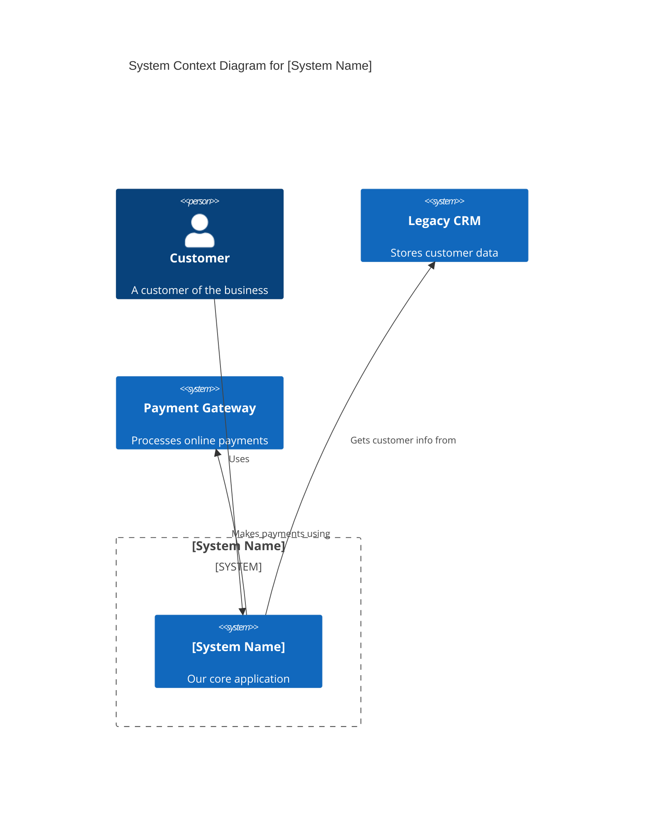
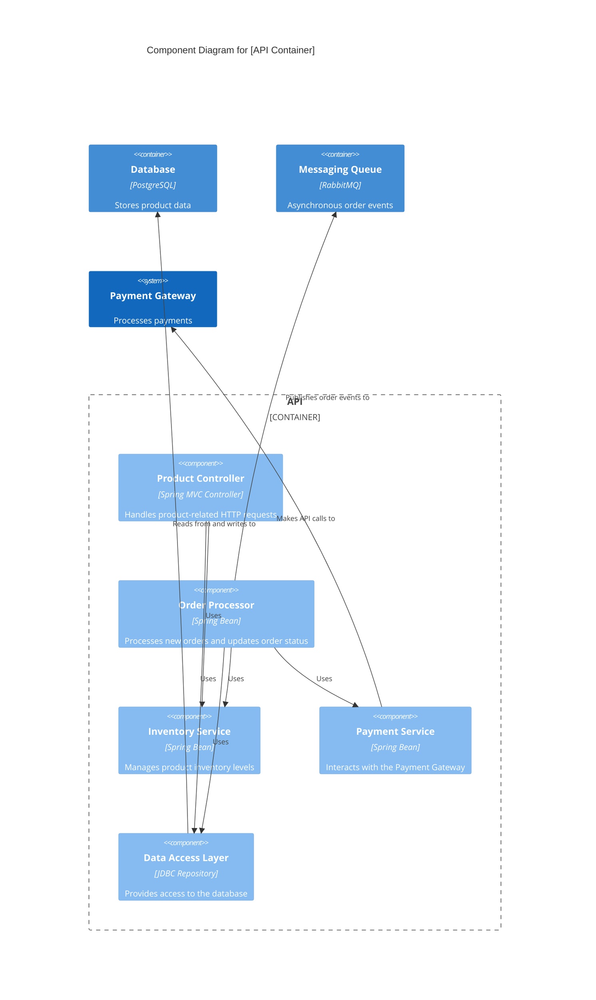
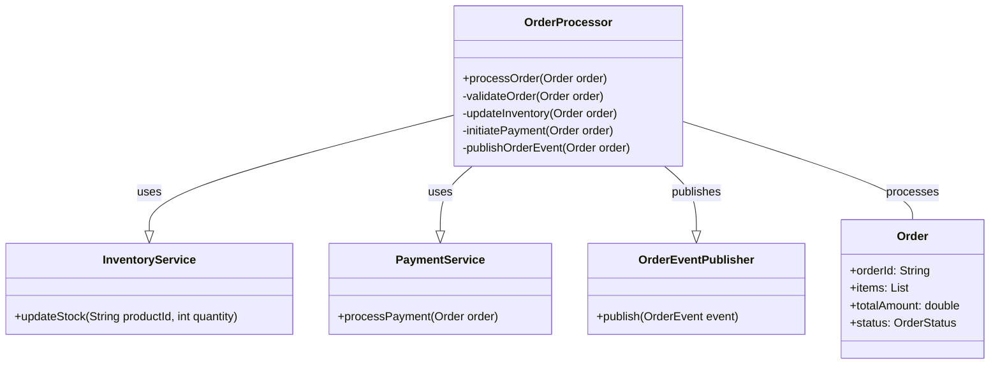

# 🗺️ C4 Model Diagrams: [System/Product Name]

This document provides templates and guidelines for creating C4 Model diagrams for the [System/Product Name]. The C4 model helps us to describe our software architecture at different levels of detail, from a high-level system context to detailed code structure.

---

## 1. Introduction

### 1.1 Purpose

The purpose of this document is to define a consistent approach for creating and maintaining C4 Model diagrams within our documentation. These diagrams serve to:
* Provide a shared understanding of the system architecture for all stakeholders.
* Support design discussions and decision-making.
* Facilitate onboarding of new team members.
* Ensure architectural alignment with requirements and business goals.

### 1.2 C4 Model Overview

The C4 model (Context, Containers, Components, Code) is a set of hierarchical diagrams for visualising software architecture.

* **Context Diagram (Level 1):** Shows the system in its environment, with users and other systems.
* **Container Diagram (Level 2):** Zooms in on the system, showing the major technological containers (e.g., web app, mobile app, database, microservices).
* **Component Diagram (Level 3):** Zooms in on a container, showing the components within it and their interactions.
* **Code Diagram (Level 4):** Zooms in on a complex component, showing the classes/functions within it.

### 1.3 Tooling

We recommend using [Mermaid](https://mermaid.js.org/) or [PlantUML](https://plantuml.com/) for embedding diagrams directly into Markdown files, enabling a "Docs as Code" approach where diagrams are version-controlled alongside text.

## 2. Context Diagram (Level 1)

**Purpose:** To show the system being built and its relationships with users and other systems. It's a high-level map of the system's place in the world.

**Guidelines:**
* Show the main system as a central box.
* Identify primary user roles.
* Identify external systems that interact with your system.
* Keep it simple and focused on high-level interactions.

**Mermaid Example:**


## 3. Container Diagram (Level 2)

**Purpose:** To zoom into the system and show the major "containers" (applications, data stores, microservices) that make up the system.

**Guidelines:**

* Show the main system boundary.

* Identify each container (e.g., web application, mobile app, API, database, message queue).

* Show the technology choice for each container.

* Illustrate the communication paths between containers.

**Mermaid Example:**

```mermiad
C4Container
    title Container Diagram for [System Name]

    System_Boundary(system_name, "[System Name]") {
        Container(web_app, "Web Application", "C#, ASP.NET Core MVC", "Allows customers to view products and place orders")
        Container(api, "API", "Java, Spring Boot", "Provides product and order management functionality")
        Container(database, "Database", "PostgreSQL", "Stores product catalog, customer data, and orders")
        Container(messaging_queue, "Messaging Queue", "RabbitMQ", "Asynchronous communication for order processing")
    }

    System(payment_gateway, "Payment Gateway", "Processes online payments")
    System(email_service, "Email Service", "Sends email notifications")

    Rel(web_app, api, "Makes API calls to", "JSON/HTTPS")
    Rel(api, database, "Reads from and writes to", "JDBC")
    Rel(api, messaging_queue, "Publishes messages to", "AMQP")
    Rel(messaging_queue, email_service, "Sends order confirmations to")
    Rel(api, payment_gateway, "Integrates with")
```

## 4. Component Diagram (Level 3)

**Purpose:** To zoom into a single container and show the components within it.

**Guidelines:**

* Show the boundary of the selected container.

* Identify each component (a cohesive group of related functionality).

* Show the communication paths between components.

* Describe the responsibilities of each component.

**Mermaid Example:**



## 5. Code Diagram (Level 4)

**Purpose:** To zoom into a single component and show the individual classes, interfaces, or functions that make it up.

**Guidelines:**

* Show the boundary of the selected component.

* Identify key classes, interfaces, or functions.

* Illustrate their relationships (e.g., inheritance, composition, method calls).

* This level is often best generated directly from code using tools, but can be sketched for critical components.

**Mermaid Example (Simplified Class Diagram):**



## 6. Diagramming Best Practices

* **Consistency:** Use consistent naming conventions, colours (if supported by tool), and shapes.

* **Clarity:** Keep diagrams uncluttered. Focus on the essential elements for the current abstraction level.

* **Version Control:** Store diagram source code (e.g., Mermaid/PlantUML syntax) in your Git repository alongside your documentation.

* **Automation:** Explore tools that can generate diagrams directly from code or configuration where possible.

* **Context:** Always provide a brief explanation for each diagram, stating its purpose and what it depicts.

* **Linking:** Link diagrams to relevant requirements, ADRs, or other detailed design documents.

## 7. Maintenance

C4 diagrams are living documents. They should be updated whenever the architecture changes significantly. Integrate their review into your regular development and architectural governance processes.

## 8. References

* [The C4 Model Official Website](https://c4model.com/ "null")

* \[Mermaid Documentation]\(https\://mermaid.js
