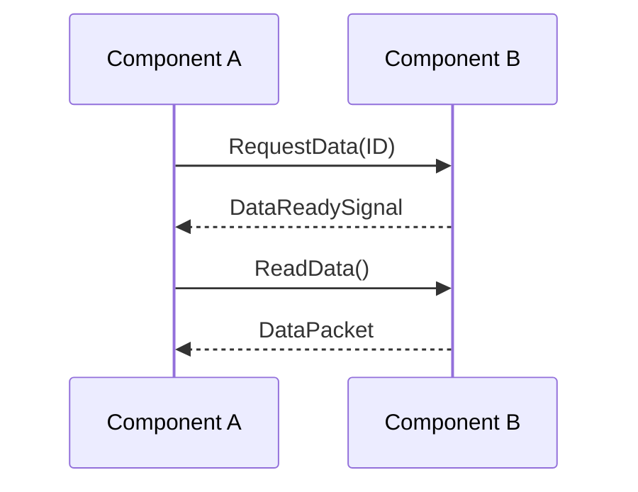

# 🤝 Interface Control Document (ICD): [Interface Name/Connecting Components]

This document defines the interface between [Component A Name] and [Component B Name], or between [System Name] and [External System Name]. It specifies the characteristics, protocols, and data formats necessary for these entities to interact correctly and reliably.

---

## 1. Introduction

### 1.1 Purpose

The purpose of this ICD is to formally define the interface between [Component A Name] and [Component B Name]. It aims to:
* Provide a clear, unambiguous specification for both interface providers and consumers.
* Ensure compatibility and interoperability between the interconnected entities.
* Facilitate independent development and testing of components.
* Serve as a baseline for change management and impact analysis.

### 1.2 Scope

This ICD covers the [briefly describe the specific interface, e.g., "data exchange over SPI bus," "REST API for user authentication," "electrical signals for motor control"]. It defines the interface characteristics, but not the internal implementation details of the components themselves.

### 1.3 Definitions and Acronyms

[List any interface-specific terms, definitions, or acronyms.]

## 2. Interface Overview

### 2.1 Interface Diagram / Context

[Provide a high-level diagram (e.g., using Mermaid or PlantUML) showing the two (or more) components involved and the interface between them.]

### 2.2 Interface Description

Briefly describe the overall purpose and nature of this interface. What is its primary function?

### 2.3 Interface Type

\[e.g., Electrical, Mechanical, Software API, Network Protocol, Data Format]

## 3. Functional Interface Requirements

These define *what* the interface enables in terms of data exchange, commands, and responses.

* **\[ICD-FUN-001]** \[Component A] shall send \[Data Packet X] to \[Component B] upon \[Event Y].

  * *Data Format:* \[Reference Section 4.1]

  * *Timing:* \[Reference Section 4.2]

* **\[ICD-FUN-002]** \[Component B] shall respond with \[Status Z] within \[Time T] after receiving \[Command C].

* ...

## 4. Detailed Interface Specification

This section provides the precise, granular details of the interface.

### 4.1 Data Formats / Message Structures (Software/Firmware)

\[Define the structure, types, and ranges of all data elements exchanged across the interface. Use tables, JSON schemas, or other clear formats.]

* **Message Name: \[Message Type A]** | Field Name | Data Type | Size (bits/bytes) | Range/Values | Description | |------------|-----------|-------------------|--------------|-------------| | `header` | `uint16` | 16 | 0-65535 | Message header | | `payload` | `byte[]` | Variable | | Message payload | | `checksum` | `uint8` | 8 | 0-255 | CRC checksum |

### 4.2 Communication Protocols (Software/Firmware)

\[Specify the communication protocol(s) used (e.g., SPI, I2C, UART, Ethernet, REST, MQTT). Include details like baud rates, clock speeds, addressing, error handling, and handshake procedures.]

* **Protocol:** \[e.g., SPI]

* **Mode:** \[e.g., Master/Slave, Mode 0]

* **Clock Speed:** \[e.g., 10 MHz max]

* **Data Order:** \[e.g., MSB first]

* **Error Handling:** \[e.g., CRC, NACK]

### 4.3 Electrical Characteristics (Hardware)

\[Specify voltage levels, current limits, pin assignments, signal types, impedance, etc.]

* **Pin Assignments:**

  * Pin 1: VCC (3.3V)

  * Pin 2: GND

  * Pin 3: DATA (GPIO, Bi-directional)

* **Voltage Levels:** \[e.g., 0V-3.3V TTL]

* **Current Limits:** \[e.g., Max sink/source 10mA per pin]

### 4.4 Mechanical Characteristics (Hardware)

\[Specify physical dimensions, connector types, mounting points, tolerances, etc.]

* **Connector Type:** \[e.g., JST GH 4-pin]

* **Mounting Points:** \[e.g., 4x M2 screws, 10mm x 10mm pattern]

### 4.5 Timing Diagrams (if applicable)

\[Provide timing diagrams for critical sequences or handshakes.]

## 5. Non-Functional Interface Requirements

These define quality attributes related to the interface itself.

### 5.1 Performance

* **\[ICD-NFR-PERF-001]** The interface shall have a maximum latency of \[X] ms for \[Operation Y].

* **\[ICD-NFR-PERF-002]** The interface shall support a data throughput of \[Z] Mbps.

### 5.2 Reliability & Error Handling

* **\[ICD-NFR-REL-001]** The interface shall detect \[Type of Error, e.g., "checksum mismatches"] and \[Action, e.g., "retransmit the packet"].

* **\[ICD-NFR-REL-002]** The interface shall recover from \[Failure Mode, e.g., "temporary loss of connection"] within \[Time T].

### 5.3 Security (if applicable)

* **\[ICD-NFR-SEC-001]** All communication over this interface shall be \[e.g., "encrypted using TLS 1.2"].

* **\[ICD-NFR-SEC-002]** The interface shall require \[e.g., "mutual authentication"].

## 6. Change Management

\[How will changes to this ICD be managed? Refer to ADRs or a formal change control process.]

* All changes to this ICD must be reviewed and approved by \[relevant stakeholders/roles].

* Significant changes will be documented via an ADR.

## 7. Traceability

This section notes how this ICD links to higher-level requirements and how its implementation will be verified.

* **Traces from:** \[e.g., SYS-INT-001 (System-Level Interface Requirement)]

* **Traces to:** \[e.g., Component A Design Doc, Component B Design Doc, Integration Test Plan]

## 8. Approvals

\[Sign-off section for key stakeholders.]

